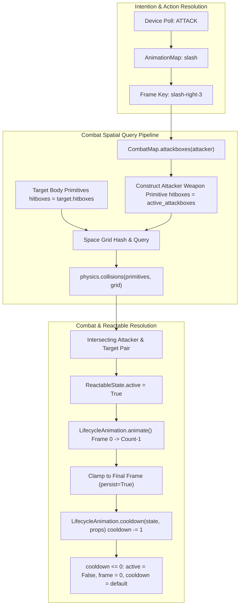

#### Refactor: Phase 02.06 - Effects

**Overview**

Refactor the Effect Asset hierarchy by decoupling animation lifecycle mechanics from functional simulation instances. Replace the `temporary` and `persistent` instances with functional variants (`passive`, `hazard`, `collectable`, `reactable`), introduce `LifecycleProperties` to govern frame updates, and implement a unified `LifecycleAnimation` strategy.

##### Analysis 

The current architecture in `src/app/config/enums.py` and `src/app/models/properties.py` partitions Effects by their animation behavior (`temporary` vs. `persistent`) rather than their functional role within the world simulation. This creates an architectural bottleneck:

1. **Category vs. Instance Inversion:** Across all other categories (`objects`, `sheets`, `cursors`), `instance` defines the domain model and gameplay mechanics (`doors` -> `DoorMechanics`, `crates` -> `MotionMechanics`, `chests` -> `ContainerState`). For `effects`, instances currently reflect animation lifespans, leaving no clean mechanism to distinguish between an ambient visual (water ripple), a damaging tile (lava), a world pickup (spinning coin), or an interactive entity (furnace).
2. **Permutational Explosion:** Forcing the lifecycle into the `instance` taxonomy requires $N \times M$ classes (`HazardContinuous`, `HazardPeriodic`, `HazardTemporary`, `PassiveContinuous`, etc.), violating DRY and fracturing Board queries.
3. **The Recommended Architecture:** Partition `AssetInstances` of category `effects` strictly by their **functional role** (`passive`, `hazard`, `collectable`, `reactable`), and shift animation duration and pacing into a unified `LifecycleProperties` model on `EffectProperties`. All Effect instances then consume a single, deterministic `LifecycleAnimation` strategy.


**1. Lifecycle Specification (`EffectProperties`)**

Lifecycle attributes belong in static configuration (`src/assets/effects/main.yaml`) as properties. Frame pacing and repetition rely on three parameters:

* `type`: `continuous | periodic | temporary`
* `delay`: Game ticks per frame advancement (analogous to Sheet `Action.delay`).
* `frequency`: Total cycle duration in ticks for `periodic` effects (encompassing both active animation and idle duration).
* `persist`: Optional boolean for `temporary` effects. When `True`, the effect clamps to its final frame instead of self-terminating.

```python
@dataclass(slots=True)
class LifecycleProperties:
    type: str  # continuous | periodic | temporary
    delay: int = 1
    frequency: int = 0
    persist: bool = False

@dataclass(slots=True)
class EffectProperties(AssetProperties):
    dimensions: Dimensions
    count: int
    lifecycle: LifecycleProperties
    mass: int = -1
    hitboxes: Optional[List[Hitbox]] = field(default_factory=list)

```

**2. Deterministic `LifecycleAnimation`**

By leveraging `state.animation.tick` alongside `state.animation.frame`, all three lifecycles execute within a single stateless animation component with zero runtime heap allocation:

```python
class LifecycleAnimation(Animation):
    def animate(self, state: AssetState, properties: EffectProperties) -> AssetState:
        lifecycle = properties.lifecycle
        anim = state.animation
        anim.tick += 1

        if lifecycle.type == "continuous":
            if anim.tick >= lifecycle.delay:
                anim.tick = 0
                anim.frame = (anim.frame + 1) % properties.count

        elif lifecycle.type == "temporary":
            if anim.frame < properties.count:
                if anim.tick >= lifecycle.delay:
                    anim.tick = 0
                    anim.frame += 1

        elif lifecycle.type == "periodic":
            active_duration = properties.count * lifecycle.delay
            if anim.tick < active_duration:
                anim.frame = anim.tick // lifecycle.delay
            else:
                anim.frame = 0  # Resting / idle frame
            
            if anim.tick >= max(lifecycle.frequency, active_duration):
                anim.tick = 0
                anim.frame = 0

        return state

```

**3. Functional State Taxonomy**

| Effect Instance | State Model | Required Attributes | Consuming System |
| --- | --- | --- | --- |
| `passive` | `AnimatorState` | `position, layer, depth, height, animation` | `AnimationMechanics` |
| `hazard` | `HazardState` | `position, layer, depth, height, animation, damage: (amount, duration, reaction)` | `CombatMechanics` |
| `collectable` | `CollectableState` | `position, layer, depth, height, animation, loot: str, quantity: int` | `InteractionMechanics` |
| `reactable` | `ReactableState` | `position, layer, depth, height, animation, action: str, cooldown: int` | `InteractionMechanics` |


##### Goal: Schema and Hierarchy Restructuring

Migrate Effect instances in `app.config.enums.AssetInstances` from temporal definitions to functional roles. Update `PropertiesSchema` and `StateSchema` to support typed metadata for hazard damage, inventory pickup payloads, and interaction triggers.

##### Goal: Unified Animation Engine

Implement `LifecycleAnimation` in `app.assets.animations.core` to resolve `continuous`, `periodic`, and `temporary` cycles using internal tick accumulators. Deprecate `TemporaryAnimation` and `PersistentAnimation`.

##### Goal: Engine Lifecycle & Garbage Collection Integration

Update `RemoveMechanics` to query expired temporary effects across any functional instance whose `animation.frame >= properties.count` (when `persist == False`). Align `Cradle` spawning routines to instantiate properly typed functional states.

##### Tasks

**1. Task: Asset Taxonomy and Property Models Refactor**

*Objective*: Update the enums and property models to support functional Effect instances and lifecycle configurations.

* [x] Subtask: Replace `PERSISTENT` and `TEMPORARY` in `AssetInstances` with `PASSIVE`, `HAZARD`, `COLLECTABLE`, and `INTERACTABLE`.
* [x] Subtask: Define `LifecycleProperties` in `app.models.properties` with `type`, `delay`, `frequency`, and `persist` attributes.
* [x] Subtask: Update `EffectProperties` to include `lifecycle`, `mass`, and optional `hitboxes`.
* [x] Subtask: Update `EffectPropertyInstances` in `PropertiesSchema` to index `passive`, `hazard`, `collectable`, and `reactable`.

**2. Task: Functional State Models Implementation**

*Objective*: Create typed state models in `app.models.state.objects` for non-passive effects.

* [x] Subtask: Define `HazardState` containing a typed `damage` payload (`amount`, `duration`, `reaction`).
* [x] Subtask: Define `CollectableState` containing `loot` and `quantity` fields.
* [x] Subtask: Define `ReactableState` containing `action` trigger requirements and `cooldown`.
* [x] Subtask: Register new state models to `StateRecipe` and the loader type adaptors.

**3. Task: LifecycleAnimation Strategy Implementation**

*Objective*: Implement a unified animation strategy replacing `TemporaryAnimation` and `PersistentAnimation`.

* [x] Subtask: Implement `LifecycleAnimation` in `app.assets.animations.core` supporting continuous, periodic, and temporary behaviors.
* [x] Subtask: Register `LifecycleAnimation` in `app.services.generators.factory.Factory` under `AnimationRecipe.LIFECYCLE`.
* [x] Subtask: Update `default.yaml` recipe configurations to map all Effect instances to `FrameRecipe.ITERABLE` and `AnimationRecipe.LIFECYCLE`.

**4. Task: Engine Mechanics and Cradle Alignment**

*Objective*: Adapt lifecycle garbage collection, spawning, and mechanics to the new Effect hierarchy.

* [x] Subtask: Refactor `RemoveMechanics` in `app.game.logic.mechanics.core` to inspect `board.categories(AssetCategories.EFFECTS)` for expired temporary effects.
* [~] Subtask: Refactor `Cradle.spawn_temporary` to `Cradle.spawn_effect`, accepting the target instance type and instantiating `AnimatorState` or its subclasses instead of `PositionalState`.
* [x] Subtask: Update `SpawnableGroup` to index spawnable effects under functional categories.
* [x] Subtask: Ensure `board.serialize()` continues to cleanly skip transient effect states while preserving world hazards if configured.

---

##### Test: Spinning Dummy Attack Test

**Goal**: Deploy a Spinning Dummy Reactable onto the Board. Have it react to Player's attack by animating.

**Notes**

Probably at the point where Equipment hitboxes need further definition. 

There is probably no slick or clever around hitbox enumerations. They will need to be hardcoded into the configuration or properties somewhere. They will need to be dependent on frames, e.g. attack hitboxes apply during a specific frame, so

```yaml
equipment:
  weapons:
    shortsword:
      dimensions:
        w: 64
        l: 64
      hitboxes: 
        - frame: 0
          position:
            x:
            y:
          dimensions:
            l: 
            w:
      actions: lpc-slash
      stack:
        - shortsword
```

Probably need a Python wrapper around Cython hitbox to flag hitboxes for certain frames.

Problem: Each Action has a different amount of frames.

So weapon hitboxes need keyed to the entire (action, direction, frame) hierarchy. It would almost make sense to include the hitbox mapping in the actions configuration, except they are specific to each particular piece of equipment.

Thought: Equipment could key its hitbox to a (action, direction, frame) mapping for quick lookup:

```yaml
equipment:
  weapons:
    shortsword:
      dimensions:
        w: 64
        l: 64
      hitboxes: 
        <action>-<direction>-<frame>:
          - position:
                x:
                y:
            dimensions:
                l: 
                w:
      actions: lpc-slash
      stack:
        - shortsword
```

Consideration: attack hitboxes are not necessarily present in every frame, so this may be the optimal solution.

###### Initial State

**Configurations**

```yaml
actions:
  - id: extemded-walk
    data:
      walk:
        count: 11
        directions:
          up:
            row: 0
          left:
            row: 1
          down:
            row: 2
          right:
            row: 3
  - id: simple-walk
    data:
      walk:
        count: 6
        directions:
          up:
            row: 0
          left:
            row: 1
          down:
            row: 2
          right:
            row: 3
  - id: lpc-walk
    data:
      walk:
        count: 9
        delay: 3
        directions: 
          up:
            row: 8
          left:
            row: 9
          down: 
            row: 10
          right:
            row: 11
  - id: lpc-thrust
    data:
      thrust:
        count: 8
        directions:
          up:
            row: 4
          left:
            row: 5
          down:
            row: 6
          right:
            row: 7
  - id: lpc-slash
    data:
      slash:
        count: 6
        delay: 3
        directions:
          up:
            row: 12
          left:
            row: 13
          down:
            row: 14
          right:
            row: 15
  - id: lpc-shoot
    data:
      shoot:
        count: 13
        directions:
          up:
            row: 16
          left:
            row: 17
          down:
            row: 18
          right:
            row: 19
  - id: lpc-cast
    data:
      cast:
        count: 7
        directions:
          up:
            row: 0
          left:
            row: 1
          down:
            row: 2
          right:
            row: 3
  - id: lpc-full
    data:
      cast:
        count: 7
        directions:
          up:
            row: 0
          left:
            row: 1
          down:
            row: 2
          right:
            row: 3
      thrust:
        count: 8
        directions:
          up:
            row: 4
          left:
            row: 5
          down:
            row: 6
          right:
            row: 7
      walk:
        count: 9
        delay: 3
        directions: 
          up:
            row: 8
          left:
            row: 9
          down: 
            row: 10
          right:
            row: 11
      slash:
        count: 6
        delay: 3
        directions:
          up:
            row: 12
          left:
            row: 13
          down:
            row: 14
          right:
            row: 15
      shoot:
        count: 13
        directions:
          up:
            row: 16
          left:
            row: 17
          down:
            row: 18
          right:
            row: 19
      die:
        count: 6
        directions:
          up:
            row: 20
```

**Properties**

```yaml
sheets:
  weapons:
    shortsword:
      dimensions:
        w: 64
        l: 64
      hitboxes: null
      actions: lpc-slash
      stack:
        - shortsword
effects:
  reactables:
    spinning-dummy:
      count: 8
      dimensions:
        w: 64
        l: 64
      lifecycle: 
        type: temporary
        persist: True
      hitboxes: null
      mass: 0

```

**State File**

```yaml
effects:
  reactables:
    - id: spinning-dummy
      name: test-dummy
      layer: '0'
      position:
        x: 100
        y: 50
      intention: attack
sheets:
  players: 
    - id: player
      name: player
      layer: '0'
      depth: 0
      position:
        x: 10
        y: 80
      meters:
        health: 
          current: 50
          maximum: 100
        magic: 
          current: 100
          maximum: 100
      character:
        strength: 5
        defense: 5
        speed: 100
        impulse: 25
      mutators:
        parameters:
          action:
            radius: 30
      inventory: 
        pack: null
        pouch: null
        equipment:
          armor: null
          tool: null
          utility: null
          weapon: shortsword
          shield: buckler
        wallet: 0
```

##### Analysis

**1. The Reactable Reaction & Reset Loop**

An reactable effect like `spinning-dummy` is deployed with `active = False`, mapped to `LifecycleProperties(type="temporary", persist=True, delay=3)`.

* **The Missing Reset Trigger:** When `persist: True` is configured on a temporary lifecycle, the animation clamps to the final frame. For a sparring dummy, clamping permanently halts future interactions unless a mechanism resets `state.active = False` and `state.animation.frame = 0`. `ReactableState` already defines a `cooldown: int = 60` attribute. The engine currently lacks an update step to decrement this cooldown and reset the trigger once the temporary animation finishes.

**2. Equipment Attack Hitbox Architecture**

Sheet properties currently declare static `hitboxes: null` across all equipment. LPC weapon strikes are dynamic: attack hitboxes exist only during specific swing/thrust frames and extend beyond the character’s base $64 \times 64$ canvas.

* **Composite Key Lookup vs. Nested Hierarchies:** A 3-level nested dictionary (`actions -> directions -> frames -> hitboxes`) introduces dictionary traversal overhead in the inner tick. A composite string key (`--`) matching the format already utilized by `StateFrame` and `Registry` allows an immediate $O(1)$ dictionary lookup:

```python
frame_key = f"{anim.action}-{anim.direction}-{anim.frame}"
active_hitboxes = weapon_props.hitboxes.get(frame_key, [])
```

* **Frame Absence as a Hitbox Filter:** If a frame key is absent from the mapping, `active_hitboxes` evaluates to empty (`[]`). This eliminates the need for arbitrary Boolean flags: a weapon only has physical presence when its current frame explicitly defines geometric bounds.
* **Broad-Phase Culling Mismatch:** `SpatialMechanic.collisions()` calls `asset.primitive(i)`, which extracts `asset.hitboxes` (the base sprite body). If a shortsword or spear hitbox extends 20 pixels beyond the character's boundary, the broad-phase spatial hash will discard the collision candidate before the narrow phase evaluates weapon reach. When an entity is in an `ATTACK` intention, the broad-phase primitive must encompass the union of the sprite footprint and its maximum weapon extent.

#### Refactor: Phase 02.06.02: Equipment Hitbox Architecture

**Overview**

Define and integrate frame-specific equipment hitboxes across Sheet properties, serialization schemas, and spatial mechanics. Enable dynamic combat reach calculations without mutating core sprite bounding boxes during non-attack states.

##### Goal: Schema and Property Model Integration

Update `SheetProperties` and `PropertiesSchema` to support a typed dictionary of Hitbox lists keyed by composite frame identifiers (`--`).

```python
@dataclass(slots=True)
class SheetProperties(AssetProperties):
    dimensions: Dimensions
    stack: List[str] = field(default_factory=list)
    mass: int = 0
    hitboxes: Optional[List[Hitbox]] = field(default_factory=list)
    attackboxes: Optional[Dict[str, Hitbox]] = field(default_factory=dict)
    actions: Union[str, Dict[Actions, Action]] = field(default_factory=dict)
```

##### Goal: Combat Reach Broad-Phase Expansion

Update `CombatMechanics` to query composite equipment hitboxes based on `(action, direction, frame)`. For entities in the `ATTACK` intention, dynamically construct an encompassing primitive bounding box that passes broad-phase spatial grid hashing.

##### Goal: Equipment Hitbox Architecture Specifications

To keep configuration concise and eliminate deep nesting, equipment YAML configurations should declare hitboxes using the canonical frame key format already enforced by `StateFrame`:

```yaml
sheets:
  weapons:
    shortsword:
      dimensions:
        w: 64
        l: 64
      actions: lpc-slash
      stack:
        - shortsword
      hitboxes:
        slash-up-2:
          - position: { x: 16, y: 0 }
            dimensions: { w: 32, l: 24 }
        slash-down-2:
          - position: { x: 16, y: 40 }
            dimensions: { w: 32, l: 24 }
        slash-left-2:
          - position: { x: 0, y: 16 }
            dimensions: { w: 24, l: 32 }
        slash-right-2:
          - position: { x: 40, y: 16 }
            dimensions: { w: 24, l: 32 }

```

In `CombatMechanics`:

```python
anim = attacker.state.animation
weapon_key = attacker.state.inventory.equipment.weapon
weapon_props = board.equipment.weapons.get(weapon_key)

if weapon_props and isinstance(weapon_props.hitboxes, dict):
    frame_key = f"{anim.action}-{anim.direction}-{anim.frame}"
    active_hitboxes = weapon_props.hitboxes.get(frame_key, [])
else:
    active_hitboxes = attacker.hitboxes
```

This ensures that on windup frames (`frame 0`, `frame 1`), `active_hitboxes` is empty, natively preventing early hits without requiring special frame-checking logic in `CombatMechanics`. When the strike reaches `frame 2`, the hitbox becomes active, broad-phase evaluates the expanded boundary, narrow-phase detects overlap, and the dummy's `active` flag triggers.

!!! note
  Altered to `attackboxes`

##### Tasks

**1. Task: Equipment Hitbox Schema & Adapters**

*Objective*: Define and validate composite frame hitbox structures in property schemas.

* [x] Subtask: Update `SheetProperties` in `app.models.properties` to allow `attackboxes` as `Dict[str, List[Hitbox]]` for equipment instances.
* [x] Subtask: Configure `shortsword` properties in `src/assets/sheets/main.yaml` with explicit hitboxes for `slash` active frames (frames 2 and 3 across all four directions).

**2. Task: Combat Mechanics Spatial Query Refactor**

*Objective*: Integrate frame-keyed weapon hitboxes into broad-phase and narrow-phase collision checks.

* [x] Subtask: Implement helper `CombatMap.attackboxes())` to resolve the active frame hitbox list
* [x] Subtask: Construct an encompassing primitive hitbox covering entity body plus weapon reach for all attackers passed to `self.collisions()`.
* [x] Subtask: Ensure narrow-phase `geometry.intersects()` receives only the active frame's weapon hitboxes.

**3. Task: Reactable Reset and Cooldown Cycle**

*Objective*: Implement cooldown tracking and state reset for triggered reactables.

* [x] Subtask: Add cooldown tick processing to `AnimationMechanics`.
* [x] Subtask: When `cooldown <= 0` following an active temporary animation, reset `state.active = False`, `state.animation.frame = 0`, and restore the base cooldown.

##### Test: Current Results

**RESULT**: No Reactable animation triggered upon player getting as close to the test-dummy as possible and attacking from the left (e.g., facing right). 

**Latest Equipment Properties**

```yaml
sheets:
  weapons:
    shortsword:
      dimensions:
        w: 64
        l: 64
      hitboxes: null
      attackboxes: 
        slash-up-3:
          - position:
              x: 5
              y: 39
            dimensions:
              w: 13
              l: 4
        slash-up-4:
          - position:
              x: 34
              y: 14
            dimensions:
              w: 20
              l: 20
        slash-up-5:
          - position:
              x: 50
              y: 16
            dimensions:
              w: 7
              l: 24
        slash-left-3:
          - position:
              x: 11
              y: 44
            dimensions:
              w: 8
              l: 20
        slash-left-4:
          - position:
              x: 0 
              y: 31
            dimensions:
              w: 14
              l: 14
        slash-left-5:
          - position:
              x: 0
              y: 18
            dimensions:
              w: 16
              l: 17
        slash-down-3:
          - position:
              x: 15
              y: 45
            dimensions:
              w: 24
              l: 6
        slash-down-4:
          - position:
              x: 37
              y: 44
            dimensions:
              w: 16
              l: 17
        slash-down-5:
          - position:
              x: 51
              y: 42
            dimensions:
              w: 9
              l: 20
        slash-right-3:
          - position:
              x: 46
              y: 44
            dimensions:
              w: 7
              l: 20
        slash-right-4:
          - position:
              x: 50
              y: 31
            dimensions:
              w: 14
              l: 14
        slash-right-5:
          - position:
              x: 48
              y: 18
            dimensions:
              w: 16
              l: 17
      actions: lpc-slash
      stack:
        - shortsword
```

**Game Logs**

```bash
(.venv) grant@skynet:~/Projects/ontology$ python src/cli.py --dump-state start world-01
2026-09-16 11:49:59,753 - INFO - __main__ - Starting CLI with command: 'start' for board: 'world-01'
2026-09-16 11:49:59,754 - INFO - __main__ - Igniting engine for live execution...
2026-09-16 11:49:59,754 - INFO - app.services.orchestration.constructors - Loading YAML data for target state: world-01 ...
2026-09-16 11:49:59,754 - INFO - app.config.loader - Loading YAML property schemas...
2026-09-16 11:49:59,961 - INFO - app.config.loader - Loading YAML configurations...
2026-09-16 11:50:00,145 - INFO - app.config.loader - Loading YAML state configurations from /home/grant/Projects/ontology/src/data/state/world-01 ...
2026-09-16 11:50:00,220 - INFO - app.services.orchestration.constructors - Initializing SDL and Cython rendering subsystems...
2026-09-16 11:50:00,504 - INFO - app.services.orchestration.constructors - Constructing Empty Board and Migrator subsystem...
2026-09-16 11:50:00,504 - INFO - app.game.board - Initializing Board with 0 incoming assets.
2026-09-16 11:50:00,505 - INFO - app.game.board - Board completely hydrated and initialized.
2026-09-16 11:50:00,505 - INFO - app.services.orchestration.constructors - Initializing Registry...
2026-09-16 11:50:00,523 - INFO - app.services.orchestration.constructors - Injecting Generators and Devices into Board...
2026-09-16 11:50:00,524 - INFO - app.services.orchestration.constructors - Building rendering pipelines, mechanics, and UI...
2026-09-16 11:50:00,524 - INFO - app.game.screen - Initializing Screen (Viewport: 480x480 |Board: 480x480)
2026-09-16 11:50:00,535 - INFO - app.services.orchestration.constructors - Engine successfully assembled.
2026-09-16 11:50:00,536 - INFO - app.game.engine - Entering Game Loop...
libpng warning: iCCP: known incorrect sRGB profile
libpng warning: iCCP: known incorrect sRGB profile
libpng warning: iCCP: known incorrect sRGB profile
libpng warning: iCCP: known incorrect sRGB profile
libpng warning: iCCP: known incorrect sRGB profile
libpng warning: iCCP: known incorrect sRGB profile
libpng warning: iCCP: known incorrect sRGB profile
libpng warning: iCCP: known incorrect sRGB profile
libpng warning: iCCP: known incorrect sRGB profile
libpng warning: iCCP: known incorrect sRGB profile
libpng warning: iCCP: known incorrect sRGB profile
libpng warning: iCCP: known incorrect sRGB profile
libpng warning: iCCP: known incorrect sRGB profile
libpng warning: iCCP: known incorrect sRGB profile
libpng warning: iCCP: known incorrect sRGB profile
libpng warning: iCCP: known incorrect sRGB profile
libpng warning: iCCP: known incorrect sRGB profile
libpng warning: iCCP: known incorrect sRGB profile
libpng warning: iCCP: known incorrect sRGB profile
libpng warning: iCCP: known incorrect sRGB profile
2026-09-16 11:50:08,028 - INFO - app.services.orchestration.migrator - Migrator starting hydration for target state: world-01
2026-09-16 11:50:08,056 - INFO - app.config.loader - Loading YAML state configurations from /home/grant/Projects/ontology/src/data/state/world-01 ...
2026-09-16 11:50:08,337 - INFO - app.services.generators.perimeter - Calculating dynamic perimeter boundaries for layer: 0
2026-09-16 11:50:08,352 - INFO - app.services.generators.perimeter - Derived simply-connected hull containing 4 edges.
2026-09-16 11:50:08,352 - INFO - app.services.generators.perimeter - Calculating dynamic perimeter boundaries for layer: brick-house-compose-layer
2026-09-16 11:50:08,353 - INFO - app.services.generators.perimeter - Derived simply-connected hull containing 8 edges.
2026-09-16 11:50:08,353 - INFO - app.game.menus.controllers.load - Hydration complete. Reallocating rendering canvases...
2026-09-16 11:50:08,354 - INFO - app.game.screen - Rebaking Screen canvases for new world state...
2026-09-16 11:50:08,443 - INFO - app.game.screen - Initializing Screen (Viewport: 480x480 |Board: 480x480)
2026-09-16 11:50:10,677 - INFO - app.game.logic.mechanics.intentional.player - [TELEMETRY] Intention: ATTACK | Resolved Action: slash
2026-09-16 11:50:10,677 - INFO - app.game.logic.mechanics.intentional.player - [TELEMETRY] Equipment State: Weapon: shortsword | Armor: None | Shield: buckler | Tool: None
2026-09-16 11:50:10,678 - INFO - app.game.logic.mechanics.spatial.combat - attackboxes: None
2026-09-16 11:50:10,678 - INFO - app.assets.frames.core - SpriteFrame generated keys: [('player-slash-right-0', 0, 0), ('shortsword-slash-right-0', 0, 0), ('buckler-slash-right-0', 0, 0)]
2026-09-16 11:50:10,700 - INFO - app.game.logic.mechanics.intentional.player - [TELEMETRY] Intention: ATTACK | Resolved Action: slash
2026-09-16 11:50:10,700 - INFO - app.game.logic.mechanics.intentional.player - [TELEMETRY] Equipment State: Weapon: shortsword | Armor: None | Shield: buckler | Tool: None
2026-09-16 11:50:10,701 - INFO - app.game.logic.mechanics.spatial.combat - attackboxes: None
2026-09-16 11:50:10,703 - INFO - app.assets.frames.core - SpriteFrame generated keys: [('player-slash-right-1', 0, 0), ('shortsword-slash-right-1', 0, 0), ('buckler-slash-right-1', 0, 0)]
2026-09-16 11:50:10,717 - INFO - app.game.logic.mechanics.intentional.player - [TELEMETRY] Intention: ATTACK | Resolved Action: slash
2026-09-16 11:50:10,717 - INFO - app.game.logic.mechanics.intentional.player - [TELEMETRY] Equipment State: Weapon: shortsword | Armor: None | Shield: buckler | Tool: None
2026-09-16 11:50:10,718 - INFO - app.game.logic.mechanics.spatial.combat - attackboxes: None
2026-09-16 11:50:10,718 - INFO - app.assets.frames.core - SpriteFrame generated keys: [('player-slash-right-1', 0, 0), ('shortsword-slash-right-1', 0, 0), ('buckler-slash-right-1', 0, 0)]
2026-09-16 11:50:10,733 - INFO - app.game.logic.mechanics.intentional.player - [TELEMETRY] Intention: ATTACK | Resolved Action: slash
2026-09-16 11:50:10,734 - INFO - app.game.logic.mechanics.intentional.player - [TELEMETRY] Equipment State: Weapon: shortsword | Armor: None | Shield: buckler | Tool: None
2026-09-16 11:50:10,734 - INFO - app.game.logic.mechanics.spatial.combat - attackboxes: None
2026-09-16 11:50:10,735 - INFO - app.assets.frames.core - SpriteFrame generated keys: [('player-slash-right-2', 0, 0), ('shortsword-slash-right-2', 0, 0), ('buckler-slash-right-2', 0, 0)]
2026-09-16 11:50:10,750 - INFO - app.game.logic.mechanics.intentional.player - [TELEMETRY] Intention: ATTACK | Resolved Action: slash
2026-09-16 11:50:10,750 - INFO - app.game.logic.mechanics.intentional.player - [TELEMETRY] Equipment State: Weapon: shortsword | Armor: None | Shield: buckler | Tool: None
2026-09-16 11:50:10,750 - INFO - app.game.logic.mechanics.spatial.combat - attackboxes: None
2026-09-16 11:50:10,751 - INFO - app.assets.frames.core - SpriteFrame generated keys: [('player-slash-right-3', 0, 0), ('shortsword-slash-right-3', 0, 0), ('buckler-slash-right-3', 0, 0)]
2026-09-16 11:50:10,766 - INFO - app.game.logic.mechanics.intentional.player - [TELEMETRY] Intention: ATTACK | Resolved Action: slash
2026-09-16 11:50:10,767 - INFO - app.game.logic.mechanics.intentional.player - [TELEMETRY] Equipment State: Weapon: shortsword | Armor: None | Shield: buckler | Tool: None
2026-09-16 11:50:10,767 - INFO - app.game.logic.mechanics.spatial.combat - attackboxes: [{'position': {'x': 46, 'y': 44}, 'dimensions': {'w': 7, 'l': 20}}]
2026-09-16 11:50:10,768 - INFO - app.assets.frames.core - SpriteFrame generated keys: [('player-slash-right-3', 0, 0), ('shortsword-slash-right-3', 0, 0), ('buckler-slash-right-3', 0, 0)]
2026-09-16 11:50:10,784 - INFO - app.game.logic.mechanics.intentional.player - [TELEMETRY] Intention: ATTACK | Resolved Action: slash
2026-09-16 11:50:10,785 - INFO - app.game.logic.mechanics.intentional.player - [TELEMETRY] Equipment State: Weapon: shortsword | Armor: None | Shield: buckler | Tool: None
2026-09-16 11:50:10,786 - INFO - app.game.logic.mechanics.spatial.combat - attackboxes: [{'position': {'x': 50, 'y': 31}, 'dimensions': {'w': 14, 'l': 14}}]
2026-09-16 11:50:10,786 - INFO - app.assets.frames.core - SpriteFrame generated keys: [('player-slash-right-4', 0, 0), ('shortsword-slash-right-4', 0, 0), ('buckler-slash-right-4', 0, 0)]
2026-09-16 11:50:10,801 - INFO - app.game.logic.mechanics.intentional.player - [TELEMETRY] Intention: ATTACK | Resolved Action: slash
2026-09-16 11:50:10,802 - INFO - app.game.logic.mechanics.intentional.player - [TELEMETRY] Equipment State: Weapon: shortsword | Armor: None | Shield: buckler | Tool: None
2026-09-16 11:50:10,802 - INFO - app.game.logic.mechanics.spatial.combat - attackboxes: [{'position': {'x': 50, 'y': 31}, 'dimensions': {'w': 14, 'l': 14}}]
2026-09-16 11:50:10,805 - INFO - app.assets.frames.core - SpriteFrame generated keys: [('player-slash-right-5', 0, 0), ('shortsword-slash-right-5', 0, 0), ('buckler-slash-right-5', 0, 0)]
2026-09-16 11:50:10,817 - INFO - app.game.logic.mechanics.intentional.player - [TELEMETRY] Intention: ATTACK | Resolved Action: slash
2026-09-16 11:50:10,818 - INFO - app.game.logic.mechanics.intentional.player - [TELEMETRY] Equipment State: Weapon: shortsword | Armor: None | Shield: buckler | Tool: None
2026-09-16 11:50:10,818 - INFO - app.game.logic.mechanics.spatial.combat - attackboxes: [{'position': {'x': 48, 'y': 18}, 'dimensions': {'w': 16, 'l': 17}}]
2026-09-16 11:50:10,819 - INFO - app.assets.frames.core - SpriteFrame generated keys: [('player-slash-right-5', 0, 0), ('shortsword-slash-right-5', 0, 0), ('buckler-slash-right-5', 0, 0)]
2026-09-16 11:50:17,499 - INFO - app.game.engine - Avg FPS: 35.4 |Avg UPS: 59.9
2026-09-16 11:50:18,100 - INFO - app.game.logic.mechanics.intentional.player - [TELEMETRY] Intention: ATTACK | Resolved Action: slash
2026-09-16 11:50:18,101 - INFO - app.game.logic.mechanics.intentional.player - [TELEMETRY] Equipment State: Weapon: shortsword | Armor: None | Shield: buckler | Tool: None
2026-09-16 11:50:18,101 - INFO - app.game.logic.mechanics.spatial.combat - attackboxes: None
2026-09-16 11:50:18,102 - INFO - app.assets.frames.core - SpriteFrame generated keys: [('player-slash-right-0', 0, 0), ('shortsword-slash-right-0', 0, 0), ('buckler-slash-right-0', 0, 0)]
2026-09-16 11:50:18,116 - INFO - app.game.logic.mechanics.intentional.player - [TELEMETRY] Intention: ATTACK | Resolved Action: slash
2026-09-16 11:50:18,117 - INFO - app.game.logic.mechanics.intentional.player - [TELEMETRY] Equipment State: Weapon: shortsword | Armor: None | Shield: buckler | Tool: None
2026-09-16 11:50:18,117 - INFO - app.game.logic.mechanics.spatial.combat - attackboxes: None
2026-09-16 11:50:18,118 - INFO - app.assets.frames.core - SpriteFrame generated keys: [('player-slash-right-1', 0, 0), ('shortsword-slash-right-1', 0, 0), ('buckler-slash-right-1', 0, 0)]
2026-09-16 11:50:18,133 - INFO - app.game.logic.mechanics.intentional.player - [TELEMETRY] Intention: ATTACK | Resolved Action: slash
2026-09-16 11:50:18,134 - INFO - app.game.logic.mechanics.intentional.player - [TELEMETRY] Equipment State: Weapon: shortsword | Armor: None | Shield: buckler | Tool: None
2026-09-16 11:50:18,136 - INFO - app.game.logic.mechanics.spatial.combat - attackboxes: None
2026-09-16 11:50:18,137 - INFO - app.assets.frames.core - SpriteFrame generated keys: [('player-slash-right-1', 0, 0), ('shortsword-slash-right-1', 0, 0), ('buckler-slash-right-1', 0, 0)]
2026-09-16 11:50:18,150 - INFO - app.game.logic.mechanics.intentional.player - [TELEMETRY] Intention: ATTACK | Resolved Action: slash
2026-09-16 11:50:18,151 - INFO - app.game.logic.mechanics.intentional.player - [TELEMETRY] Equipment State: Weapon: shortsword | Armor: None | Shield: buckler | Tool: None
2026-09-16 11:50:18,151 - INFO - app.game.logic.mechanics.spatial.combat - attackboxes: None
2026-09-16 11:50:18,152 - INFO - app.assets.frames.core - SpriteFrame generated keys: [('player-slash-right-2', 0, 0), ('shortsword-slash-right-2', 0, 0), ('buckler-slash-right-2', 0, 0)]
2026-09-16 11:50:18,166 - INFO - app.game.logic.mechanics.intentional.player - [TELEMETRY] Intention: ATTACK | Resolved Action: slash
2026-09-16 11:50:18,167 - INFO - app.game.logic.mechanics.intentional.player - [TELEMETRY] Equipment State: Weapon: shortsword | Armor: None | Shield: buckler | Tool: None
2026-09-16 11:50:18,168 - INFO - app.game.logic.mechanics.spatial.combat - attackboxes: None
2026-09-16 11:50:18,168 - INFO - app.assets.frames.core - SpriteFrame generated keys: [('player-slash-right-3', 0, 0), ('shortsword-slash-right-3', 0, 0), ('buckler-slash-right-3', 0, 0)]
2026-09-16 11:50:18,183 - INFO - app.game.logic.mechanics.intentional.player - [TELEMETRY] Intention: ATTACK | Resolved Action: slash
2026-09-16 11:50:18,184 - INFO - app.game.logic.mechanics.intentional.player - [TELEMETRY] Equipment State: Weapon: shortsword | Armor: None | Shield: buckler | Tool: None
2026-09-16 11:50:18,185 - INFO - app.game.logic.mechanics.spatial.combat - attackboxes: [{'position': {'x': 46, 'y': 44}, 'dimensions': {'w': 7, 'l': 20}}]
2026-09-16 11:50:18,186 - INFO - app.assets.frames.core - SpriteFrame generated keys: [('player-slash-right-3', 0, 0), ('shortsword-slash-right-3', 0, 0), ('buckler-slash-right-3', 0, 0)]
2026-09-16 11:50:18,200 - INFO - app.game.logic.mechanics.intentional.player - [TELEMETRY] Intention: ATTACK | Resolved Action: slash
2026-09-16 11:50:18,201 - INFO - app.game.logic.mechanics.intentional.player - [TELEMETRY] Equipment State: Weapon: shortsword | Armor: None | Shield: buckler | Tool: None
2026-09-16 11:50:18,202 - INFO - app.game.logic.mechanics.spatial.combat - attackboxes: [{'position': {'x': 50, 'y': 31}, 'dimensions': {'w': 14, 'l': 14}}]
2026-09-16 11:50:18,204 - INFO - app.assets.frames.core - SpriteFrame generated keys: [('player-slash-right-4', 0, 0), ('shortsword-slash-right-4', 0, 0), ('buckler-slash-right-4', 0, 0)]
2026-09-16 11:50:18,217 - INFO - app.game.logic.mechanics.intentional.player - [TELEMETRY] Intention: ATTACK | Resolved Action: slash
2026-09-16 11:50:18,217 - INFO - app.game.logic.mechanics.intentional.player - [TELEMETRY] Equipment State: Weapon: shortsword | Armor: None | Shield: buckler | Tool: None
2026-09-16 11:50:18,218 - INFO - app.game.logic.mechanics.spatial.combat - attackboxes: [{'position': {'x': 50, 'y': 31}, 'dimensions': {'w': 14, 'l': 14}}]
2026-09-16 11:50:18,218 - INFO - app.assets.frames.core - SpriteFrame generated keys: [('player-slash-right-5', 0, 0), ('shortsword-slash-right-5', 0, 0), ('buckler-slash-right-5', 0, 0)]
2026-09-16 11:50:18,233 - INFO - app.game.logic.mechanics.intentional.player - [TELEMETRY] Intention: ATTACK | Resolved Action: slash
2026-09-16 11:50:18,234 - INFO - app.game.logic.mechanics.intentional.player - [TELEMETRY] Equipment State: Weapon: shortsword | Armor: None | Shield: buckler | Tool: None
2026-09-16 11:50:18,234 - INFO - app.game.logic.mechanics.spatial.combat - attackboxes: [{'position': {'x': 48, 'y': 18}, 'dimensions': {'w': 16, 'l': 17}}]
2026-09-16 11:50:18,235 - INFO - app.assets.frames.core - SpriteFrame generated keys: [('player-slash-right-5', 0, 0), ('shortsword-slash-right-5', 0, 0), ('buckler-slash-right-5', 0, 0)]
^C2026-09-16 11:50:19,801 - INFO - __main__ - Game engine loop interrupted by user.
2026-09-16 11:50:19,801 - INFO - __main__ - Generating state dump...
2026-09-16 11:50:19,988 - INFO - __main__ - State dump successfully written to /home/grant/Projects/ontology/20260916_115019.state-dump.md
2026-09-16 11:50:20,459 - INFO - __main__ - CLI processes completed.
```

**State Dump (Relevant Bits)**

```markdown

## test-dummy

- **Taxonomy:**
  - Category: `effects`
  - Instance: `reactables`
  - ID: `spinning-dummy`
- **Components:**
  - Animation: `<class 'app.assets.animations.core.LifecycleAnimation'>`
  - Frame: `<class 'app.assets.frames.core.IterableFrame'>`
- **Properties:**
  - Dimensions:
    - Width: 64
    - Length: 64
  - Mass: 0
  - Lifecycle: Lifecycle(type=<Lifecycles.TEMPORARY: 'temporary'>, delay=1, frequency=0, cooldown=0, persist=True)
  - Count: 8
- **State:**
  - Layer: `0`
  - Depth: 0
  - Position: (100, 50)
  - Active: `False`
  - Animation:
    - Action: `walk`
    - Direction: `down`
    - Frame: 0
    - Tick: 0
  - Intention: `attack`


## player

- **Taxonomy:**
  - Category: `sheets`
  - Instance: `players`
  - ID: `player`
- **Components:**
  - Animation: `<class 'app.assets.animations.core.SpriteAnimation'>`
  - Frame: `<class 'app.assets.frames.core.SpriteFrame'>`
- **Properties:**
  - Dimensions:
    - Width: 64
    - Length: 64
  - Mass: 7
  - Stack:
    - `human-male-ivory`
    - `feet-boots-black`
    - `legs-robe-black`
    - `torso-shirt-male-black`
    - `toros-cape-black`
    - `head-glasses`
    - `head-beard-white`
    - `hair-curls-white`
    - `head-wizard-hat-moon`
  - Hitboxes:
    - Position: (23, 34) | Dimensions: w: 18, l: 15
  - Actions:
    - `cast`:
      - Count: 7
      - Delay: 1
      - Directions:
        - `Directions.UP`: row 0
        - `Directions.LEFT`: row 1
        - `Directions.DOWN`: row 2
        - `Directions.RIGHT`: row 3
    - `thrust`:
      - Count: 8
      - Delay: 1
      - Directions:
        - `Directions.UP`: row 4
        - `Directions.LEFT`: row 5
        - `Directions.DOWN`: row 6
        - `Directions.RIGHT`: row 7
    - `walk`:
      - Count: 9
      - Delay: 3
      - Directions:
        - `Directions.UP`: row 8
        - `Directions.LEFT`: row 9
        - `Directions.DOWN`: row 10
        - `Directions.RIGHT`: row 11
    - `slash`:
      - Count: 6
      - Delay: 3
      - Directions:
        - `Directions.UP`: row 12
        - `Directions.LEFT`: row 13
        - `Directions.DOWN`: row 14
        - `Directions.RIGHT`: row 15
    - `shoot`:
      - Count: 13
      - Delay: 1
      - Directions:
        - `Directions.UP`: row 16
        - `Directions.LEFT`: row 17
        - `Directions.DOWN`: row 18
        - `Directions.RIGHT`: row 19
    - `die`:
      - Count: 6
      - Delay: 1
      - Directions:
        - `Directions.UP`: row 20
- **State:**
  - Layer: `0`
  - Depth: 0
  - Position: (59, 42)
  - Velocity: (0.0, 0.0)
  - Animation:
    - Action: `walk`
    - Direction: `right`
    - Frame: 0
    - Tick: 0
  - Character:
    - Strength: 5
    - Defense: 5
    - Speed: 100
    - Impulse: 25
  - Meters:
    - Health: 50 / 100
    - Magic: 100 / 100
  - Inventory:
    - Wallet: 0
    - Equipment:
      - Weapon: `shortsword`
      - Shield: `buckler`
  - Goal:
    - Position: (59, 42)
  - Mutators:
    - Triggers:
      - Animated: False
      - Frightened: False
      - Dead: False
      - Vision: False
    - Parameters:
      - Fear:
        - Radius: 30
        - Limit: 0.5
        - Enemy: 5
      - Vision:
        - Radius: 30
      - Action:
        - Radius: 30
  - Intention: `idle`
```

###### Analysis

**1. Broad/Narrow Phase Isolation Failure in `CombatMechanics`**

In `CombatMechanics.update`, the system evaluates melee collisions using:

```python
melee_assets = [a for a, hb in melee_attackers]
colliding_pairs = self.collisions(melee_assets + targets)
```

`SpatialMechanic.collisions(assets)` delegates directly to `physics.collisions(primitive_data, self.grid)`:

```python
primitive_data = [asset.primitive(i) for i, asset in enumerate(assets)]
```

* `asset.primitive(i)` defaults strictly to `asset.hitboxes`—the entity's physical torso.
* The player is at `(59, 42)` with hitbox `(23, 34, w=18, l=15)`. Absolute player body bounds are $x \in [82, 100]$, $y \in [76, 91]$.
* `test-dummy` is at `(100, 50)` with dimensions `(64, 64)`. Absolute dummy bounds are $x \in [100, 164]$, $y \in [50, 114]$.
* `physics.collisions` does not merely execute broad-phase grid hashing; step 3 of `physics.collisions` immediately executes narrow-phase `geometry.intersects` against the hitboxes passed in `primitive_data`.
* In `geometry.intersects`, horizontal overlap requires $x_1 < x_2 + w_2 \land x_1 + w_1 > x_2$. Evaluating $x_1 + w_1 > x_2$ yields $100 > 100$, which evaluates to `False`.
* `physics.collisions` discards the pair during narrow-phase culling before `CombatMechanics` ever inspects `active_hitboxes`. Even though the active shortsword attackbox on `slash-right-3` reaches $x \in [105, 112]$ (deep inside the dummy), the inner loop iterating over `colliding_pairs` never executes.

**2. Unsafe Traversal in `CombatMap.attackboxes`**

In `app/game/logic/modules/maps/combat.py`:

```python
weapon_key = sprite.inventory.equipment.weapon
return equipment.weapons.get(weapon_key, {}).attackboxes.get(frame_key)

```

If an entity attacks unarmed (`weapon_key = None`) or equips an item lacking attackboxes, `equipment.weapons.get(None, {})` returns `{}`. Calling `{}.attackboxes` raises an unhandled `AttributeError`.

###### Design



**Decoupling Weapon Reach from Body Geometry**

An entity's physical collision body (`asset.hitboxes`) and weapon reach (`attackboxes`) serve mutually exclusive functions:

1. `CollisionMechanics` operates on physical bodies to maintain kinematic boundaries and prevent overlap.
2. `CombatMechanics` must operate on the geometric union of the active attackboxes during windup/strike/recovery frames.

When querying broad and narrow phase combat collisions, attackers must not be passed into `self.collisions()` using default body hitboxes. Instead:

* If an attacker's `active_hitboxes` is empty (`None` or `[]` during windup or recovery frames), they must be excluded from combat collision candidate lists entirely.
* If `active_hitboxes` exists, construct the attacker's primitive tuple by passing `hitboxes=active_hitboxes` directly into `attacker.primitive(index, hitboxes=active_hitboxes)`.
* This allows `physics.collisions` to evaluate the actual weapon footprint against the target's body hitbox in C memory, eliminating the requirement for a redundant secondary Python-level `geometry.intersects()` call.

**Reactable State Lifecycle**

Reactables are props that respond to specific character intentions (`INTERACT` or `ATTACK`). Their lifecycle flow must remain deterministic and stateless:

* **Trigger**: When an interaction or attack intersects a Reactable whose configured trigger matches the source intention, the system sets `state.active = True`.
* **Execution**: While `state.active == True`, `LifecycleAnimation.animate()` advances frames according to `lifecycle.delay`.
* **Persistence**: For `persist: True` effects (like sparring dummies or switches), the animation clamps at `properties.count - 1`.
* **Cooldown & Reset**: Once clamped, `LifecycleAnimation.cooldown(state, properties)` decrements `state.cooldown`. When `state.cooldown <= 0`, it resets `state.active = False`, `state.animation.frame = 0`, `state.animation.tick = 0`, and restores `state.cooldown` from configuration.

##### Bug B008: CombatMechanics Body-Hitbox Broad/Narrow Phase Culling Mismatch

**STATUS**: OPEN
**SEVERITY**: High

**Description**

`CombatMechanics.update` passes `melee_assets + targets` into `self.collisions()`. `SpatialMechanic.collisions` generates primitives using default entity body hitboxes (`asset.hitboxes`). Because `CollisionMechanics` prevents solid bodies from overlapping, an attacker standing adjacent to a target never registers a torso-to-torso collision ($x_1 + w_1 \le x_2$). `physics.collisions` discards the candidate pair during narrow-phase checking, preventing the secondary weapon-reach check (`geometry.intersects` with `active_hitboxes`) from ever executing.

**Steps to Replicate**

1. Deploy a player with `shortsword` at position `(59, 42)` on layer `0`.
2. Deploy a reactable `test-dummy` with dimensions `(64, 64)` at position `(100, 50)`.
3. Set player intention to `ATTACK` facing `RIGHT`.
4. Observe that `CombatMechanics` outputs `attackboxes` during frames 3–5, but logs zero collision pairs and leaves `test-dummy.state.active = False`.

**Proposed Remediation**

In `CombatMechanics.update`, construct attacker primitives using `attacker.primitive(i, hitboxes=attackboxes)`. Filter out any attacker whose current frame has no active attackboxes before querying the spatial grid. Pass attacker primitives and target primitives into collision detection so narrow-phase evaluates weapon reach directly.

#### Refactor: Phase 02.06.03: Combat Spatial Resolution

**Overview**

Align equipment attackbox schemas, spatial reach detection, and reactable animation lifecycles. Ensure equipment hitboxes instantiate strictly as Cython `Hitbox` objects, decouple weapon reach from torso collision geometry in `CombatMechanics`, and repair reactable cooldown resetting in `AnimationMechanics`.


##### Goal: Independent Combat Spatial Hashing

Refactor `CombatMechanics` to eliminate dependencies on character torso hitboxes. Dynamically build attacker primitives using active frame attackboxes, hash them against target body hitboxes in `libs.core.math.space.Space`, and directly evaluate reach collisions in Cython.

##### Goal: Reactable State Reset & Cooldown Loop

Correct the invocation signature of `LifecycleAnimation.cooldown` in `AnimationMechanics`. Normalize `cooldown` defaults between `LifecycleProperties` and `ReactableState` to ensure repeatable interaction triggers without state corruption.

##### Tasks

**1. Task: Schema Normalization & Adapter Coercion**

*Objective*: Ensure attackbox definitions instantiate strictly as Cython `Hitbox` models across all equipment properties.

* [x] Subtask: Update `SheetProperties.attackboxes` in `app/models/properties.py` to `Optional[Dict[str, List[Hitbox]]]`.
* [x] Subtask: Validate that `app/config/loader.py` recursively instantiates `PydanticHitbox` instances across the `attackboxes` mapping.
* [!: Dependent on Phase Completion] Subtask: Add unit tests in `tests/unit/test_libs_graphics_registry.py` confirming loaded equipment attackboxes are instances of `libs.core.models.Hitbox`.

**2. Task: Combat Spatial Query Overhaul**

*Objective*: Decouple combat reach evaluation from physical entity torso bounds.

* [x] Subtask: Refactor `CombatMap.attackboxes` with defensive checks for unarmed sprites and null weapon attackbox mappings, returning `List[Hitbox]`.
* [ ] Subtask: In `CombatMechanics.update`, filter out attackers where `active_hitboxes` is empty or `None`.
* [ ] Subtask: Construct attacker primitives using `attacker.primitive(i, hitboxes=active_hitboxes)` and target primitives using `target.primitive(j)`.
* [ ] Subtask: Query `physics.collisions` exclusively between active weapon primitives and valid target body primitives, bypassing the torso-to-torso broad-phase check.
* [ ] Subtask: Trigger `target.state.active = True` when a reactable target intersects an active attackbox.

**3. Task: Lifecycle Cooldown & Reactable State Alignment**

*Objective*: Ensure persistent temporary effects reset cleanly after animation cycles.

* [x] Subtask: Fix `AnimationMechanics.update` to pass `(effect.state, effect.properties)` to `effect.animation.cooldown()`.
* [x] Subtask: Align `LifecycleProperties.cooldown` and `ReactableState.cooldown` defaults so expired reactables reset to their configured base interval.
* [ ] Subtask: Verify that on animation clamp, `state.cooldown` decrements to `0`, resetting `state.active = False` and `state.animation.frame = 0`.

**4. Task: Spinning Dummy Attack Regression Test**

*Objective*: Confirm player attack triggers the reactable animation and resets cleanly.

* [!: User Task] Subtask: Execute `cli.py start world-01` and verify `player` slashing rightward activates `test-dummy`.
* [!: User Task] Subtask: Verify `test-dummy` cycles through frames `0` to `7` and clamps on frame `7`.
* [!: User Task] Subtask: Verify cooldown decrements from `60` to `0`, restoring `test-dummy` to frame `0` and `active = False`.