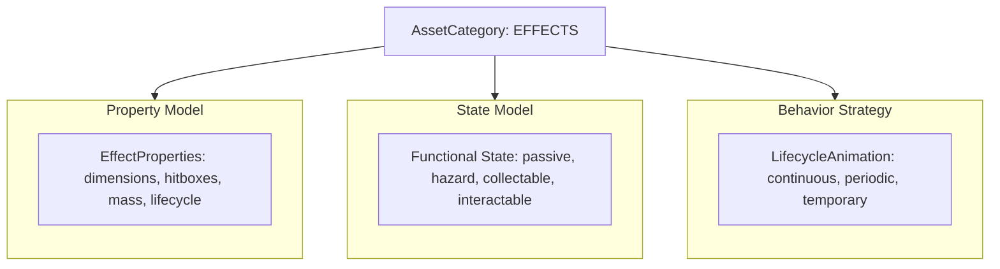

#### Refactor: Phase 02.06 - Effects

**Overview**

Refactor the Effect Asset hierarchy by decoupling animation lifecycle mechanics from functional simulation instances. Replace the `temporary` and `persistent` instances with functional variants (`passive`, `hazard`, `collectable`, `interactable`), introduce `LifecycleProperties` to govern frame updates, and implement a unified `LifecycleAnimation` strategy.

##### Analysis 

The current architecture in `src/app/config/enums.py` and `src/app/models/properties.py` partitions Effects by their animation behavior (`temporary` vs. `persistent`) rather than their functional role within the world simulation. This creates an architectural bottleneck:

1. **Category vs. Instance Inversion:** Across all other categories (`objects`, `sheets`, `cursors`), `instance` defines the domain model and gameplay mechanics (`doors` -> `DoorMechanics`, `crates` -> `MotionMechanics`, `chests` -> `ContainerState`). For `effects`, instances currently reflect animation lifespans, leaving no clean mechanism to distinguish between an ambient visual (water ripple), a damaging tile (lava), a world pickup (spinning coin), or an interactive entity (furnace).
2. **Permutational Explosion:** Forcing the lifecycle into the `instance` taxonomy requires $N \times M$ classes (`HazardContinuous`, `HazardPeriodic`, `HazardTemporary`, `PassiveContinuous`, etc.), violating DRY and fracturing Board queries.
3. **The Recommended Architecture:** Partition `AssetInstances` of category `effects` strictly by their **functional role** (`passive`, `hazard`, `collectable`, `interactable`), and shift animation duration and pacing into a unified `LifecycleProperties` model on `EffectProperties`. All Effect instances then consume a single, deterministic `LifecycleAnimation` strategy.



**1. Lifecycle Specification (`EffectProperties`)**

Lifecycle attributes belong in static configuration (`src/assets/effects/main.yaml`) as properties. Frame pacing and repetition rely on three parameters:

* `type`: `continuous | periodic | temporary`
* `delay`: Game ticks per frame advancement (analogous to Sheet `Action.delay`).
* `frequency`: Total cycle duration in ticks for `periodic` effects (encompassing both active animation and idle duration).
* `persist`: Optional boolean for `temporary` effects. When `True`, the effect clamps to its final frame instead of self-terminating.

```python
@dataclass(slots=True)
class LifecycleProperties:
    type: str  # continuous | periodic | temporary
    delay: int = 1
    frequency: int = 0
    persist: bool = False

@dataclass(slots=True)
class EffectProperties(AssetProperties):
    dimensions: Dimensions
    count: int
    lifecycle: LifecycleProperties
    mass: int = -1
    hitboxes: Optional[List[Hitbox]] = field(default_factory=list)

```

**2. Deterministic `LifecycleAnimation`**

By leveraging `state.animation.tick` alongside `state.animation.frame`, all three lifecycles execute within a single stateless animation component with zero runtime heap allocation:

```python
class LifecycleAnimation(Animation):
    def animate(self, state: AssetState, properties: EffectProperties) -> AssetState:
        lifecycle = properties.lifecycle
        anim = state.animation
        anim.tick += 1

        if lifecycle.type == "continuous":
            if anim.tick >= lifecycle.delay:
                anim.tick = 0
                anim.frame = (anim.frame + 1) % properties.count

        elif lifecycle.type == "temporary":
            if anim.frame < properties.count:
                if anim.tick >= lifecycle.delay:
                    anim.tick = 0
                    anim.frame += 1

        elif lifecycle.type == "periodic":
            active_duration = properties.count * lifecycle.delay
            if anim.tick < active_duration:
                anim.frame = anim.tick // lifecycle.delay
            else:
                anim.frame = 0  # Resting / idle frame
            
            if anim.tick >= max(lifecycle.frequency, active_duration):
                anim.tick = 0
                anim.frame = 0

        return state

```

**3. Functional State Taxonomy**

| Effect Instance | State Model | Required Attributes | Consuming System |
| --- | --- | --- | --- |
| `passive` | `AnimatorState` | `position, layer, depth, height, animation` | `AnimationMechanics` |
| `hazard` | `HazardState` | `position, layer, depth, height, animation, damage: (amount, duration, reaction)` | `CombatMechanics` |
| `collectable` | `CollectableState` | `position, layer, depth, height, animation, loot: str, quantity: int` | `InteractionMechanics` |
| `interactable` | `InteractableState` | `position, layer, depth, height, animation, action: str, cooldown: int` | `InteractionMechanics` |


##### Goal: Schema and Hierarchy Restructuring

Migrate Effect instances in `app.config.enums.AssetInstances` from temporal definitions to functional roles. Update `PropertiesSchema` and `StateSchema` to support typed metadata for hazard damage, inventory pickup payloads, and interaction triggers.

##### Goal: Unified Animation Engine

Implement `LifecycleAnimation` in `app.assets.animations.core` to resolve `continuous`, `periodic`, and `temporary` cycles using internal tick accumulators. Deprecate `TemporaryAnimation` and `PersistentAnimation`.

##### Goal: Engine Lifecycle & Garbage Collection Integration

Update `RemoveMechanics` to query expired temporary effects across any functional instance whose `animation.frame >= properties.count` (when `persist == False`). Align `Cradle` spawning routines to instantiate properly typed functional states.

##### Tasks

**1. Task: Asset Taxonomy and Property Models Refactor**

*Objective*: Update the enums and property models to support functional Effect instances and lifecycle configurations.

* [x] Subtask: Replace `PERSISTENT` and `TEMPORARY` in `AssetInstances` with `PASSIVE`, `HAZARD`, `COLLECTABLE`, and `INTERACTABLE`.
* [x] Subtask: Define `LifecycleProperties` in `app.models.properties` with `type`, `delay`, `frequency`, and `persist` attributes.
* [x] Subtask: Update `EffectProperties` to include `lifecycle`, `mass`, and optional `hitboxes`.
* [x] Subtask: Update `EffectPropertyInstances` in `PropertiesSchema` to index `passive`, `hazard`, `collectable`, and `interactable`.

**2. Task: Functional State Models Implementation**

*Objective*: Create typed state models in `app.models.state.objects` for non-passive effects.

* [x] Subtask: Define `HazardState` containing a typed `damage` payload (`amount`, `duration`, `reaction`).
* [x] Subtask: Define `CollectableState` containing `loot` and `quantity` fields.
* [x] Subtask: Define `InteractableState` containing `action` trigger requirements and `cooldown`.
* [x] Subtask: Register new state models to `StateRecipe` and the loader type adaptors.

**3. Task: LifecycleAnimation Strategy Implementation**

*Objective*: Implement a unified animation strategy replacing `TemporaryAnimation` and `PersistentAnimation`.

* [x] Subtask: Implement `LifecycleAnimation` in `app.assets.animations.core` supporting continuous, periodic, and temporary behaviors.
* [x] Subtask: Register `LifecycleAnimation` in `app.services.generators.factory.Factory` under `AnimationRecipe.LIFECYCLE`.
* [x] Subtask: Update `default.yaml` recipe configurations to map all Effect instances to `FrameRecipe.ITERABLE` and `AnimationRecipe.LIFECYCLE`.

**4. Task: Engine Mechanics and Cradle Alignment**

*Objective*: Adapt lifecycle garbage collection, spawning, and mechanics to the new Effect hierarchy.

* [x] Subtask: Refactor `RemoveMechanics` in `app.game.logic.mechanics.core` to inspect `board.categories(AssetCategories.EFFECTS)` for expired temporary effects.
* [~] Subtask: Refactor `Cradle.spawn_temporary` to `Cradle.spawn_effect`, accepting the target instance type and instantiating `AnimatorState` or its subclasses instead of `PositionalState`.
* [x] Subtask: Update `SpawnableGroup` to index spawnable effects under functional categories.
* [ ] Subtask: Ensure `board.serialize()` continues to cleanly skip transient effect states while preserving world hazards if configured.

---

##### Test: Spinning Dummy Attack Test

**Goal**: Deploy a Spinning Dummy Interactable onto the Board. Have it react to Player's attack by animating.

**Notes**

Probably at the point where Equipment hitboxes need further definition. 

There is probably no slick or clever around hitbox enumerations. They will need to be hardcoded into the configuration or properties somewhere. They will need to be dependent on frames, e.g. attack hitboxes apply during a specific frame, so

```yaml
equipment:
  weapons:
    shortsword:
      dimensions:
        w: 64
        l: 64
      hitboxes: 
        - frame: 0
          position:
            x:
            y:
          dimensions:
            l: 
            w:
      actions: lpc-slash
      stack:
        - shortsword
```

Probably need a Python wrapper around Cython hitbox to flag hitboxes for certain frames.

Problem: Each Action has a different amount of frames.

So weapon hitboxes need keyed to the entire (action, direction, frame) hierarchy. It would almost make sense to include the hitbox mapping in the actions configuration, except they are specific to each particular piece of equipment.

Thought: Equipment could key its hitbox to a (action, direction, frame) mapping for quick lookup:

```yaml
equipment:
  weapons:
    shortsword:
      dimensions:
        w: 64
        l: 64
      hitboxes: 
        <action>-<direction>-<frame>:
          - position:
                x:
                y:
            dimensions:
                l: 
                w:
      actions: lpc-slash
      stack:
        - shortsword
```

Consideration: attack hitboxes are not necessarily present in every frame, so this may be the optimal solution.

###### Initial State

**Configurations**

```yaml
actions:
  - id: extemded-walk
    data:
      walk:
        count: 11
        directions:
          up:
            row: 0
          left:
            row: 1
          down:
            row: 2
          right:
            row: 3
  - id: simple-walk
    data:
      walk:
        count: 6
        directions:
          up:
            row: 0
          left:
            row: 1
          down:
            row: 2
          right:
            row: 3
  - id: lpc-walk
    data:
      walk:
        count: 9
        delay: 3
        directions: 
          up:
            row: 8
          left:
            row: 9
          down: 
            row: 10
          right:
            row: 11
  - id: lpc-thrust
    data:
      thrust:
        count: 8
        directions:
          up:
            row: 4
          left:
            row: 5
          down:
            row: 6
          right:
            row: 7
  - id: lpc-slash
    data:
      slash:
        count: 6
        delay: 3
        directions:
          up:
            row: 12
          left:
            row: 13
          down:
            row: 14
          right:
            row: 15
  - id: lpc-shoot
    data:
      shoot:
        count: 13
        directions:
          up:
            row: 16
          left:
            row: 17
          down:
            row: 18
          right:
            row: 19
  - id: lpc-cast
    data:
      cast:
        count: 7
        directions:
          up:
            row: 0
          left:
            row: 1
          down:
            row: 2
          right:
            row: 3
  - id: lpc-full
    data:
      cast:
        count: 7
        directions:
          up:
            row: 0
          left:
            row: 1
          down:
            row: 2
          right:
            row: 3
      thrust:
        count: 8
        directions:
          up:
            row: 4
          left:
            row: 5
          down:
            row: 6
          right:
            row: 7
      walk:
        count: 9
        delay: 3
        directions: 
          up:
            row: 8
          left:
            row: 9
          down: 
            row: 10
          right:
            row: 11
      slash:
        count: 6
        delay: 3
        directions:
          up:
            row: 12
          left:
            row: 13
          down:
            row: 14
          right:
            row: 15
      shoot:
        count: 13
        directions:
          up:
            row: 16
          left:
            row: 17
          down:
            row: 18
          right:
            row: 19
      die:
        count: 6
        directions:
          up:
            row: 20
```

**Properties**

```yaml
sheets:
  armor:
    leather:
      dimensions:
        w: 64
        l: 64
      actions: lpc-full
      hitboxes: null
      stack:
        - leather-gloves
        - leather-kilt
        - leather-sandals
    plate:
      dimensions:
        w: 64
        l: 64
      actions: lpc-full
      hitboxes: null
      stack:
        - plate-boots
        - plate-chest
        - plate-gloves
        - plate-greaves
        - plate-helmet
        - plate-shoulders
  shields:
    buckler:
      dimensions:
        w: 64
        l: 64
      actions: lpc-full
      hitboxes: null
      stack:
        - buckler
  tools:
    axe:
      dimensions:
        w: 64
        l: 64
      actions: lpc-slash
      hitboxes: null
      stack:
        - axe
    shovel:
      dimensions:
        w: 64
        l: 64
      actions: lpc-thrust
      stack:
        - shovel
    pickaxe:
      dimensions:
        w: 64
        l: 64
      actions: lpc-thrust
      hitboxes: null
      stack:
        - pickaxe
  utilities:
    lantern:
      dimensions:
        w: 64
        l: 64
      actions: lpc-full
      hitboxes: null
      stack:
        - lantern
  weapons:
    dagger:
      dimensions:
        w: 64
        l: 64
      hitboxes: null
      actions: lpc-slash
      stack:
        - dagger
    shortsword:
      dimensions:
        w: 64
        l: 64
      hitboxes: null
      actions: lpc-slash
      stack:
        - shortsword
    longsword:
      dimensions:
        w: 64
        l: 64
      hitboxes: null
      actions: lpc-slash
      stack:
        - longsword
    spear:
      dimensions:
        w: 64
        l: 64
      hitboxes: null
      actions: lpc-thrust
      stack:
        - spear
    longbow:
      dimensions:
        w: 64
        l: 64
      hitboxes: null
      actions: lpc-shoot
      stack:
        - longbow
    crossbow:
      dimensions:
        w: 64
        l: 64
      hitboxes: null
      actions: lpc-cast
      stack:
        - warhammer
effects:
  interactables:
    spinning-dummy:
      count: 8
      dimensions:
        w: 64
        l: 64
      lifecycle: 
        type: temporary
        persist: True
      hitboxes: null
      mass: 0

```

**State File**

```yaml
effects:
  interactables:
    - id: spinning-dummy
      name: test-dummy
      layer: '0'
      position:
        x: 100
        y: 50
      intention: attack
sheets:
  players: 
    - id: player
      name: player
      layer: '0'
      depth: 0
      position:
        x: 10
        y: 80
      meters:
        health: 
          current: 50
          maximum: 100
        magic: 
          current: 100
          maximum: 100
      character:
        strength: 5
        defense: 5
        speed: 100
        impulse: 25
      mutators:
        parameters:
          action:
            radius: 30
      inventory: 
        pack: null
        pouch: null
        equipment:
          armor: null
          tool: null
          utility: null
          weapon: shortsword
          shield: buckler
        wallet: 0
```

##### Analysis

**1. The Interactable Reaction & Reset Loop**

An interactable effect like `spinning-dummy` is deployed with `active = False`, mapped to `LifecycleProperties(type="temporary", persist=True, delay=3)`.

* **The Missing Reset Trigger:** When `persist: True` is configured on a temporary lifecycle, the animation clamps to the final frame. For a sparring dummy, clamping permanently halts future interactions unless a mechanism resets `state.active = False` and `state.animation.frame = 0`. `InteractableState` already defines a `cooldown: int = 60` attribute. The engine currently lacks an update step to decrement this cooldown and reset the trigger once the temporary animation finishes.

**2. Equipment Attack Hitbox Architecture**

Sheet properties currently declare static `hitboxes: null` across all equipment. LPC weapon strikes are dynamic: attack hitboxes exist only during specific swing/thrust frames and extend beyond the character’s base $64 \times 64$ canvas.

* **Composite Key Lookup vs. Nested Hierarchies:** A 3-level nested dictionary (`actions -> directions -> frames -> hitboxes`) introduces dictionary traversal overhead in the inner tick. A composite string key (`--`) matching the format already utilized by `StateFrame` and `Registry` allows an immediate $O(1)$ dictionary lookup:

```python
frame_key = f"{anim.action}-{anim.direction}-{anim.frame}"
active_hitboxes = weapon_props.hitboxes.get(frame_key, [])
```

* **Frame Absence as a Hitbox Filter:** If a frame key is absent from the mapping, `active_hitboxes` evaluates to empty (`[]`). This eliminates the need for arbitrary Boolean flags: a weapon only has physical presence when its current frame explicitly defines geometric bounds.
* **Broad-Phase Culling Mismatch:** `SpatialMechanic.collisions()` calls `asset.primitive(i)`, which extracts `asset.hitboxes` (the base sprite body). If a shortsword or spear hitbox extends 20 pixels beyond the character's boundary, the broad-phase spatial hash will discard the collision candidate before the narrow phase evaluates weapon reach. When an entity is in an `ATTACK` intention, the broad-phase primitive must encompass the union of the sprite footprint and its maximum weapon extent.

**3. Cradle Instantiation Alignment**

`Cradle.spawn_collectable` and `Cradle.spawn_hazard` contain stubbed `state = "TODO"` assignments, and `spawn_interactable` is missing entirely. Because `Cradle` handles runtime asset creation for mechanics (such as drops from destroyed entities or spawned combat effects), it must instantiate fully typed state models (`CollectableState`, `HazardState`, `InteractableState`) inheriting from `EffectState`.

##### Bug B011: SpatialMechanic Broad-Phase Discards Extended Weapon Hitboxes

**STATUS**: OPEN

**SEVERITY**: MEDIUM

**Description**

`SpatialMechanic.collisions()` calls `asset.primitive(i)`, which extracts `self.hitboxes` (the base physical body). In `CombatMechanics`, weapon hitboxes can extend beyond this boundary. If the attacker's body does not overlap the target's body, the Cython broad-phase spatial hash discards the candidate pair, preventing `geometry.intersects()` from ever evaluating the weapon hitbox reach.

**Steps to Replicate**

1. Equip a weapon with a hitbox extending 30 pixels beyond the sprite frame.
2. Position the player so only the weapon hitbox overlaps a target entity.
3. Execute an attack. The collision is not detected because `SpatialMechanic.collisions()` prunes the pair in broad-phase.

**Proposed Remediation**

In `CombatMechanics`, calculate an expanded primitive for attackers encompassing the union of the sprite and active weapon hitboxes prior to passing candidates to `self.collisions()`.

#### Refactor: Phase 02.06.02: Equipment Hitbox Architecture

**Overview**

Define and integrate frame-specific equipment hitboxes across Sheet properties, serialization schemas, and spatial mechanics. Enable dynamic combat reach calculations without mutating core sprite bounding boxes during non-attack states.

##### Goal: Schema and Property Model Integration

Update `SheetProperties` and `PropertiesSchema` to support a typed dictionary of Hitbox lists keyed by composite frame identifiers (`--`).

```python
# Composite Frame Hitbox Schema
EquipmentHitboxMap = Dict[str, List[Hitbox]]

@dataclass(slots=True)
class SheetProperties(AssetProperties):
    dimensions: Dimensions
    stack: List[str] = field(default_factory=list)
    mass: int = 0
    hitboxes: Optional[Union[List[Hitbox], EquipmentHitboxMap]] = field(default_factory=list)
    actions: Union[str, Dict[Actions, Action]] = field(default_factory=dict)
```

##### Goal: Combat Reach Broad-Phase Expansion

Update `CombatMechanics` to query composite equipment hitboxes based on `(action, direction, frame)`. For entities in the `ATTACK` intention, dynamically construct an encompassing primitive bounding box that passes broad-phase spatial grid hashing.

### Goal: Equipment Hitbox Architecture Specifications

To keep configuration concise and eliminate deep nesting, equipment YAML configurations should declare hitboxes using the canonical frame key format already enforced by `StateFrame`:

```yaml
sheets:
  weapons:
    shortsword:
      dimensions:
        w: 64
        l: 64
      actions: lpc-slash
      stack:
        - shortsword
      hitboxes:
        slash-up-2:
          - position: { x: 16, y: 0 }
            dimensions: { w: 32, l: 24 }
        slash-down-2:
          - position: { x: 16, y: 40 }
            dimensions: { w: 32, l: 24 }
        slash-left-2:
          - position: { x: 0, y: 16 }
            dimensions: { w: 24, l: 32 }
        slash-right-2:
          - position: { x: 40, y: 16 }
            dimensions: { w: 24, l: 32 }

```

In `CombatMechanics`:

```python
anim = attacker.state.animation
weapon_key = attacker.state.inventory.equipment.weapon
weapon_props = board.equipment.weapons.get(weapon_key)

if weapon_props and isinstance(weapon_props.hitboxes, dict):
    frame_key = f"{anim.action}-{anim.direction}-{anim.frame}"
    active_hitboxes = weapon_props.hitboxes.get(frame_key, [])
else:
    active_hitboxes = attacker.hitboxes
```

This ensures that on windup frames (`frame 0`, `frame 1`), `active_hitboxes` is empty, natively preventing early hits without requiring special frame-checking logic in `CombatMechanics`. When the strike reaches `frame 2`, the hitbox becomes active, broad-phase evaluates the expanded boundary, narrow-phase detects overlap, and the dummy's `active` flag triggers.

##### Tasks

**1. Task: Equipment Hitbox Schema & Adapters**

*Objective*: Define and validate composite frame hitbox structures in property schemas.

* [ ] Subtask: Update `SheetProperties` in `app.models.properties` to allow `hitboxes` as `Dict[str, List[Hitbox]]` for equipment instances.
* [ ] Subtask: Configure `shortsword` properties in `src/assets/sheets/main.yaml` with explicit hitboxes for `slash` active frames (frames 2 and 3 across all four directions).
* [ ] Subtask: Verify Pydantic TypeAdapters in `app.config.loader` cleanly parse composite string keys into Cython `Hitbox` objects.

**2. Task: Combat Mechanics Spatial Query Refactor**

*Objective*: Integrate frame-keyed weapon hitboxes into broad-phase and narrow-phase collision checks.

* [ ] Subtask: Implement helper `CombatMechanics._active_hitboxes(entity, equipment)` to resolve the active frame hitbox list, defaulting to `entity.hitboxes` if unarmed or unmapped.
* [ ] Subtask: Construct an encompassing primitive hitbox covering entity body plus weapon reach for all attackers passed to `self.collisions()`.
* [ ] Subtask: Ensure narrow-phase `geometry.intersects()` receives only the active frame's weapon hitboxes.

**3. Task: Interactable Reset and Cooldown Cycle**

*Objective*: Implement cooldown tracking and state reset for triggered interactables.

* [ ] Subtask: Add cooldown tick processing to `InteractionMechanics` or `CombatMechanics` for `InteractableState`.
* [ ] Subtask: When `cooldown <= 0` following an active temporary animation, reset `state.active = False`, `state.animation.frame = 0`, and restore the base cooldown.
