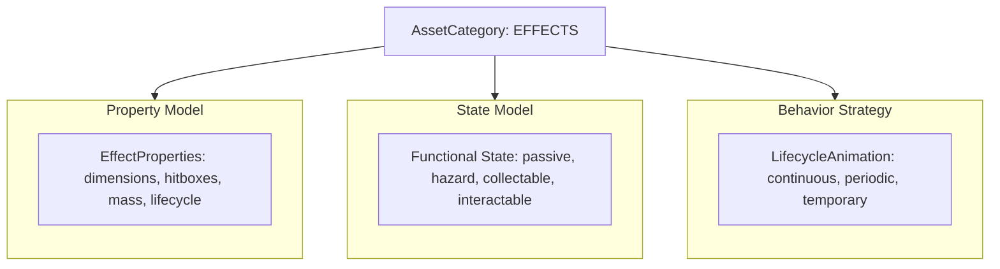

#### Refactor: Phase 02.06 - Effects

**Overview**

Refactor the Effect Asset hierarchy by decoupling animation lifecycle mechanics from functional simulation instances. Replace the `temporary` and `persistent` instances with functional variants (`passive`, `hazard`, `collectable`, `interactable`), introduce `LifecycleProperties` to govern frame updates, and implement a unified `LifecycleAnimation` strategy.

##### Analysis 

The current architecture in `src/app/config/enums.py` and `src/app/models/properties.py` partitions Effects by their animation behavior (`temporary` vs. `persistent`) rather than their functional role within the world simulation. This creates an architectural bottleneck:

1. **Category vs. Instance Inversion:** Across all other categories (`objects`, `sheets`, `cursors`), `instance` defines the domain model and gameplay mechanics (`doors` -> `DoorMechanics`, `crates` -> `MotionMechanics`, `chests` -> `ContainerState`). For `effects`, instances currently reflect animation lifespans, leaving no clean mechanism to distinguish between an ambient visual (water ripple), a damaging tile (lava), a world pickup (spinning coin), or an interactive entity (furnace).
2. **Permutational Explosion:** Forcing the lifecycle into the `instance` taxonomy requires $N \times M$ classes (`HazardContinuous`, `HazardPeriodic`, `HazardTemporary`, `PassiveContinuous`, etc.), violating DRY and fracturing Board queries.
3. **The Recommended Architecture:** Partition `AssetInstances` of category `effects` strictly by their **functional role** (`passive`, `hazard`, `collectable`, `interactable`), and shift animation duration and pacing into a unified `LifecycleProperties` model on `EffectProperties`. All Effect instances then consume a single, deterministic `LifecycleAnimation` strategy.



**1. Lifecycle Specification (`EffectProperties`)**

Lifecycle attributes belong in static configuration (`src/assets/effects/main.yaml`) as properties. Frame pacing and repetition rely on three parameters:

* `type`: `continuous | periodic | temporary`
* `delay`: Game ticks per frame advancement (analogous to Sheet `Action.delay`).
* `frequency`: Total cycle duration in ticks for `periodic` effects (encompassing both active animation and idle duration).
* `persist`: Optional boolean for `temporary` effects. When `True`, the effect clamps to its final frame instead of self-terminating.

```python
@dataclass(slots=True)
class LifecycleProperties:
    type: str  # continuous | periodic | temporary
    delay: int = 1
    frequency: int = 0
    persist: bool = False

@dataclass(slots=True)
class EffectProperties(AssetProperties):
    dimensions: Dimensions
    count: int
    lifecycle: LifecycleProperties
    mass: int = -1
    hitboxes: Optional[List[Hitbox]] = field(default_factory=list)

```

**2. Deterministic `LifecycleAnimation`**

By leveraging `state.animation.tick` alongside `state.animation.frame`, all three lifecycles execute within a single stateless animation component with zero runtime heap allocation:

```python
class LifecycleAnimation(Animation):
    def animate(self, state: AssetState, properties: EffectProperties) -> AssetState:
        lifecycle = properties.lifecycle
        anim = state.animation
        anim.tick += 1

        if lifecycle.type == "continuous":
            if anim.tick >= lifecycle.delay:
                anim.tick = 0
                anim.frame = (anim.frame + 1) % properties.count

        elif lifecycle.type == "temporary":
            if anim.frame < properties.count:
                if anim.tick >= lifecycle.delay:
                    anim.tick = 0
                    anim.frame += 1

        elif lifecycle.type == "periodic":
            active_duration = properties.count * lifecycle.delay
            if anim.tick < active_duration:
                anim.frame = anim.tick // lifecycle.delay
            else:
                anim.frame = 0  # Resting / idle frame
            
            if anim.tick >= max(lifecycle.frequency, active_duration):
                anim.tick = 0
                anim.frame = 0

        return state

```

**3. Functional State Taxonomy**

| Effect Instance | State Model | Required Attributes | Consuming System |
| --- | --- | --- | --- |
| `passive` | `AnimatorState` | `position, layer, depth, height, animation` | `AnimationMechanics` |
| `hazard` | `HazardState` | `position, layer, depth, height, animation, damage: (amount, duration, reaction)` | `CombatMechanics` |
| `collectable` | `CollectableState` | `position, layer, depth, height, animation, loot: str, quantity: int` | `InteractionMechanics` |
| `interactable` | `InteractableState` | `position, layer, depth, height, animation, action: str, cooldown: int` | `InteractionMechanics` |


##### Goal: Schema and Hierarchy Restructuring

Migrate Effect instances in `app.config.enums.AssetInstances` from temporal definitions to functional roles. Update `PropertiesSchema` and `StateSchema` to support typed metadata for hazard damage, inventory pickup payloads, and interaction triggers.

##### Goal: Unified Animation Engine

Implement `LifecycleAnimation` in `app.assets.animations.core` to resolve `continuous`, `periodic`, and `temporary` cycles using internal tick accumulators. Deprecate `TemporaryAnimation` and `PersistentAnimation`.

##### Goal: Engine Lifecycle & Garbage Collection Integration

Update `RemoveMechanics` to query expired temporary effects across any functional instance whose `animation.frame >= properties.count` (when `persist == False`). Align `Cradle` spawning routines to instantiate properly typed functional states.

##### Tasks

**1. Task: Asset Taxonomy and Property Models Refactor**

*Objective*: Update the enums and property models to support functional Effect instances and lifecycle configurations.

* [x] Subtask: Replace `PERSISTENT` and `TEMPORARY` in `AssetInstances` with `PASSIVE`, `HAZARD`, `COLLECTABLE`, and `INTERACTABLE`.
* [x] Subtask: Define `LifecycleProperties` in `app.models.properties` with `type`, `delay`, `frequency`, and `persist` attributes.
* [x] Subtask: Update `EffectProperties` to include `lifecycle`, `mass`, and optional `hitboxes`.
* [x] Subtask: Update `EffectPropertyInstances` in `PropertiesSchema` to index `passive`, `hazard`, `collectable`, and `interactable`.

**2. Task: Functional State Models Implementation**

*Objective*: Create typed state models in `app.models.state.objects` for non-passive effects.

* [ ] Subtask: Define `HazardState` containing a typed `damage` payload (`amount`, `duration`, `reaction`).
* [ ] Subtask: Define `CollectableState` containing `loot` and `quantity` fields.
* [ ] Subtask: Define `InteractableState` containing `action` trigger requirements and `cooldown`.
* [ ] Subtask: Register new state models to `StateRecipe` and the loader type adaptors.

**3. Task: LifecycleAnimation Strategy Implementation**

*Objective*: Implement a unified animation strategy replacing `TemporaryAnimation` and `PersistentAnimation`.

* [ ] Subtask: Implement `LifecycleAnimation` in `app.assets.animations.core` supporting continuous, periodic, and temporary behaviors.
* [ ] Subtask: Register `LifecycleAnimation` in `app.services.generators.factory.Factory` under `AnimationRecipe.LIFECYCLE`.
* [ ] Subtask: Update `default.yaml` recipe configurations to map all Effect instances to `FrameRecipe.ITERABLE` and `AnimationRecipe.LIFECYCLE`.

**4. Task: Engine Mechanics and Cradle Alignment**

*Objective*: Adapt lifecycle garbage collection, spawning, and mechanics to the new Effect hierarchy.

* [ ] Subtask: Refactor `RemoveMechanics` in `app.game.logic.mechanics.core` to inspect `board.categories(AssetCategories.EFFECTS)` for expired temporary effects.
* [ ] Subtask: Refactor `Cradle.spawn_temporary` to `Cradle.spawn_effect`, accepting the target instance type and instantiating `AnimatorState` or its subclasses instead of `PositionalState`.
* [ ] Subtask: Update `SpawnableGroup` to index spawnable effects under functional categories.
* [ ] Subtask: Ensure `board.serialize()` continues to cleanly skip transient effect states while preserving world hazards if configured.