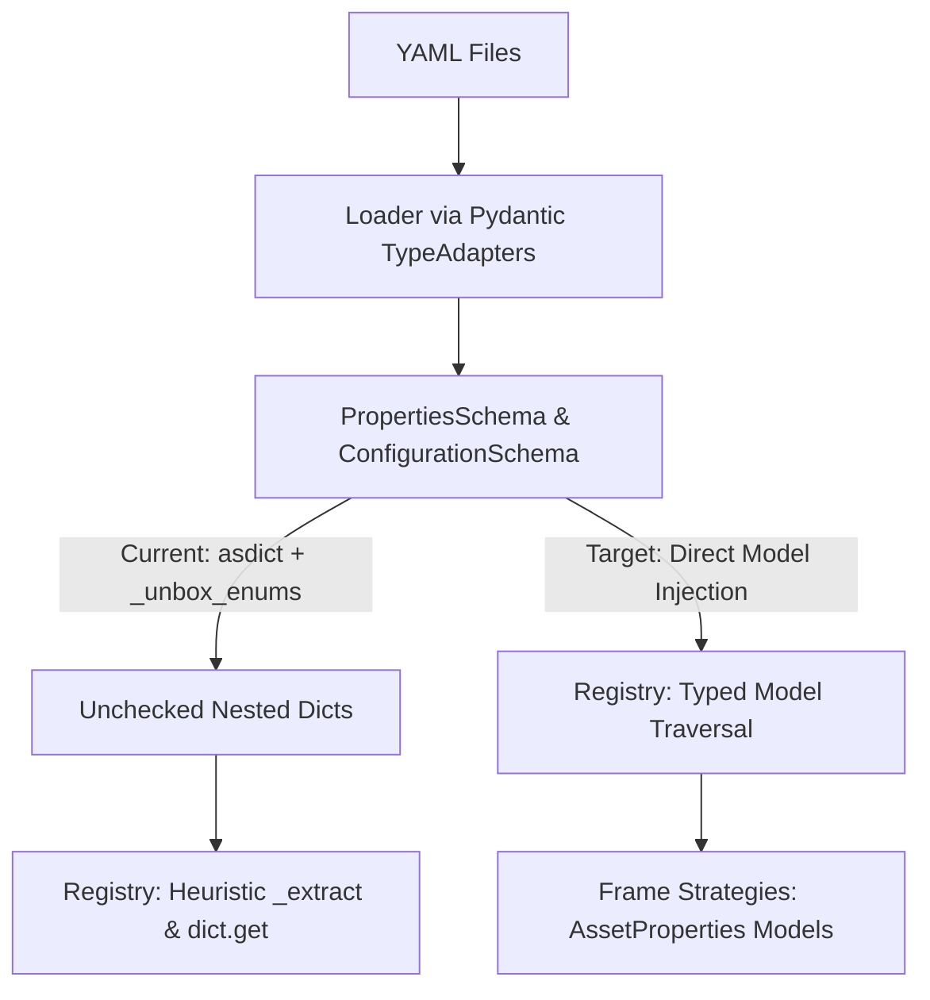

#### Achieve: Goal 09 - Registry Data Structures

**Overview**

The Registry was one of the first components of the application written. It was written to use dictionaries to hydrate its caches. However, the application now uses strict data models validated against Pydantic TypeAdapters at runtime. 

Analyze the problem of refactoring the Registry to use the application native data models rather than Dictionaries. Propose a task list and get user approval before implementation.

The current architecture exhibits a sharp structural boundary between the application orchestration layer and the graphics registry. During Phase 1 boot, `Loader` validates all YAML configurations into strictly typed, slot-optimized Pydantic models (`PropertiesSchema`, `ConfigurationSchema`, `StateSchema`). However, `Builder.build_registry()` immediately destabilizes these guarantees by executing `dataclasses.asdict()` and `_unbox_enums()`, stripping type safety and forcing `Registry` in `libs/graphics/registry.pyx` to crawl arbitrary dictionary hierarchies via heuristic type checks (`_extract()`).

Refactoring the `Registry` to consume application-native data models aligns the graphics subsystem with the rest of the engine, eliminates redundant runtime serialization, removes dictionary duck-typing, and establishes end-to-end model integrity.

##### Architectural Analysis

The lifecycle friction originates in `src/app/services/orchestration/builder.py` and terminates in `src/libs/graphics/registry.pyx`:



1. **Elimination of Structural Guesswork (`_extract`)**: `Registry._stack()` and `Registry._index()` currently iterate over arbitrary dictionary keys using `_extract()`, inspecting whether nested values satisfy `isinstance(v, dict)`. In the native schema, `self.properties.sheets` is explicitly bounded by `SheetPropertyInstances`. Only sheet assets declare `stack: List[str]`. Traversal can be executed directly across known dataclass fields without dynamic type introspection.
2. **Frame Strategy Cohesion**: In `src/app/assets/base.py`, `Frame.index()` is typed as `properties: Dict[str, Any]`. In the concrete frame strategies, indexing logic expects either dictionary lookups (`properties["dimensions"]["w"]`) or model attributes (`properties.dimensions.w`). Standardizing `Frame.index(id: str, properties: AssetProperties)` enforces uniform attribute access across all asset categories (`TileProperties`, `ObjectProperties`, `SheetProperties`, etc.).
3. **Typography Ingestion**: `FontProperties` defines explicit fields for styling (`size`, `alignment`, `bold`, `italics`, `underline`, `strikethrough`, `margins`, `color`, and `outline`). `_sys_load_font()` currently issues defensive `.get()` calls with redundant fallback defaults. Passing `FontProperties` directly into `_sys_load_font` simplifies font compilation down to direct attribute reads.
4. **Enum Unboxing Deprecation**: Because all application enums inherit from `(str, Enum)`, string comparisons and key accesses against `Actions`, `Directions`, and `AssetCategories` resolve naturally without requiring recursive unboxing traversals.

##### Goal: Native Model Hydration for Graphics Registry

Update `Registry.__init__` to accept `properties: PropertiesSchema`, `recipes: RecipeConfiguration`, and `typography: Dict[str, FontProperties]`. Refactor internal caching routines (`_stack`, `_index`, `_load_font`) to traverse dataclass fields directly. Update the `Frame.index()` interface and all concrete frame strategies to consume `AssetProperties`.

```python
# Target Registry Signature & Hydration Pattern
cdef class Registry:
    cdef public object properties   # PropertiesSchema
    cdef public object recipes      # RecipeConfiguration
    cdef public dict typography     # Dict[str, FontProperties]

    def __init__(self, object properties, object recipes, dict typography=None):
        self.properties = properties
        self.recipes = recipes
        self.typography = typography or {}
        ...

    def _stack(self):
        # Direct inspection of Sheet properties; no duck-typing or _extract needed
        for sheet_field in dataclasses.fields(self.properties.sheets):
            sheet_dict = getattr(self.properties.sheets, sheet_field.name, {})
            for item_id, item_props in sheet_dict.items():
                if item_props.stack:
                    self._stacks[item_id] = item_props.stack
                    self._pending_assets.append(item_id)
                    self.maximum += 1

```

##### Tasks

**1. Task: Refactor Registry Model Ingestion in Cython**

*Objective*: Update `libs/graphics/registry.pyx` to accept and store native model instances rather than primitive dictionaries.

* [x] Subtask: Update `Registry.__init__` signature to accept `PropertiesSchema`, `RecipeConfiguration`, and `Dict[str, FontProperties]`.
* [x] Subtask: Refactor `Registry._stack()` to iterate over `self.properties.sheets` dataclass fields directly, removing `_extract()` and `isinstance(v, dict)` checks.
* [x] Subtask: Refactor `Registry._index()` to query category attributes on `self.properties` and `self.recipes`, passing typed `AssetProperties` to `frame_worker.index()`.
* [x] Subtask: Remove the `_extract()` generator function from `libs/graphics/registry.pyx`.

**2. Task: Standardize Frame Strategy Interface and Implementations**

*Objective*: Transition all `Frame.index` implementations from dictionary subscripting to typed `AssetProperties` attribute access.

* [x] Subtask: Update the abstract `Frame.index(id: str, properties: AssetProperties)` signature in `src/app/assets/base.py`.
* [x] Subtask: Update `SingleFrame.index()` to access `properties.dimensions.w` and `properties.dimensions.l`.
* [x] Subtask: Update `IterableFrame.index()` to read `properties.count` and `properties.dimensions`.
* [x] Subtask: Update `IndexFrame.index()` to access `properties.frames` and `properties.dimensions`.
* [x] Subtask: Update `StateFrame.index()` and `SpriteFrame.index()` to read `properties.actions` and `properties.dimensions`.

**3. Task: Refactor Font Loading Pipeline**

*Objective*: Ingest `FontProperties` models directly in font rasterization and style compilation.

* [x] Subtask: Update `_sys_load_font(filepath: str, style: FontProperties)` in `libs/graphics/registry.pyx` to read attributes directly (`style.size`, `style.bold`, `style.color.r`, etc.).
* [x] Subtask: Update outline parsing to read `style.outline.width` and `style.outline.color` directly without defensive type guards.
* [x] Subtask: Update `Registry._load_font()` to pass the `FontProperties` dataclass directly from `self.typography`.

**4. Task: Deprecate Dictionary Unboxing in Builder**

*Objective*: Simplify `app.services.orchestration.builder.Builder` by removing intermediate conversion routines.

* [x] Subtask: Remove `Builder._unbox_enums()` from `src/app/services/orchestration/builder.py`.
* [x] Subtask: Simplify `Builder.build_registry()` to instantiate `Registry` with `self.context.properties`, `self.context.configurations.recipes`, and `self.context.properties.fonts`.
* [x] Subtask: Verify `_resolve_actions()` retains its pre-hydration mutation on `self.context.properties.sheets` prior to `build_registry()`.

**5. Task: Test Suite Alignment and Validation**

*Objective*: Ensure all unit tests reflect the new data structure contracts and confirm zero behavioral regression.

* [x] Subtask: Update `tests/unit/test_libs_graphics_registry.py` fixtures to supply mock `PropertiesSchema`, `RecipeConfiguration`, and `FontProperties` dataclasses.
* [x] Subtask: Verify frame crop index generation matches expected `(item_id, sx, sy, w, l)` tuples across all asset categories.
* [x] Subtask: Execute full test suite (`pytest`) to confirm boot, hydration, and rendering pipelines pass cleanly.