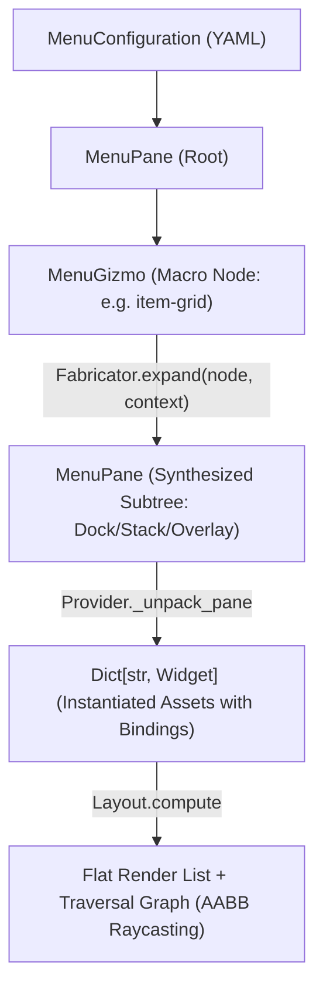

#### Refactor: Phase 04.05 - Gizmos

**Goal**: Similar (but distinct) to Compositions, there needs to be a way of unpacking reusable menu components into flat lists of Widgets for rendering. A pre-defined configuration of Widgets will be called a *Gizmo*.

**Use Case**: The InventoryController will require a configuration of Widgets (a Gizmo) for listing an arbitrary number of items from different fields of the Inventory (`pouch`, `pack`). 

**Overview**

Implement the Gizmo configuration macro system within `app.services.generators.menus.fabricator` to support dynamic, multi-widget UI components (such as item grids and equipment slots) for `InventoryController` and `ExchangeController`. Gizmos dynamically generate declarative `MenuPane` and `MenuWidget` subtrees from runtime collection data, preserving the zero-allocation rendering pipeline and offloading positioning and traversal graph generation entirely to `Layout`.

##### Working Updates: 06-widgets#gizmos

A Gizmo is a declarative macro node within a Menu configuration tree. Gizmos bridge static UI layout structures with variable runtime collection data (e.g., inventory slots, trade grids, crafting lists).

```yaml
gizmos:
  <gizmo-name>:
    id: <gizmo-template-id>
    bind:
      schema: collection
      target:
        source: context.<path>.<collection>
    capacity: <int>
    columns: <int>
    gap: <int>
    pane: <pane-asset-id>
    button: <button-asset-id>
```

**Gizmo Compositions**

Widgets adhere strictly to single-texture rendering. Composite controls (e.g., an equipment slot consisting of a button frame and an item graphic) are composed using `Layout.OVERLAY` within a parent `Pane`:

1. The parent `Pane` allocates the layout cell dimensions (e.g., $40 \times 40$).
2. Child 1 (`Button`) renders the interactive background and captures traversal focus.
3. Child 2 (`Icon`) centers natively on top of the button, binding to the item texture key.

---

##### Architectural Assessment

In the world simulation, `Decomposer` does not invent ad-hoc asset classes; it reads a blueprint from `/src/data/config/compositions/` and expands deployed pseudo-state into standard `Asset` instances that the `Board` consumes uniformly.

For menus, a Gizmo represents a dynamic UI pattern—such as an inventory grid, equipment rack, or shop listing—where the number of rendered controls depends on dynamic collection lengths in `MenuContext`.



Synthesizing a `MenuPane` subtree prior to layout resolution provides distinct architectural advantages:

* **Zero Duplication of Spatial Geometry**: `Layout._layout_dock`, `_layout_stack`, and `_layout_overlay` handle child positioning identically for static and dynamic menus.
* **Unified Traversal Topology**: `Layout._build_graph` evaluates all active button hitboxes uniformly via AABB ray-casting, eliminating manual adjacency-graph wiring.
* **Decal Composition via Overlays**: An inventory slot consists of an outer `transparent-slot` pane with `Layout.OVERLAY`, holding a `slot` button background and an inner centered `icon` widget. Expanding to `MenuPane` trees preserves this rendering hierarchy naturally.

**1. Pseudo-State & Windowed Bindings**

In Compositions, pseudo-state resolves spatial translations and binds relative references (`bind(root.layer)`). In Gizmos, "pseudo-state" resolves **collection slicing and slot index mapping**.

When an inventory holds 24 items but the Gizmo pane only has 8 physical slots:

* **The Windowed State**: The Menu Context or Controller maintains a paging offset ($O \in [0, N]$).
* **Slot Mapping**: Slot $i \in [0, 7]$ maps to index $k = O + i$ in `context.inventory.<field>`.
* **State Superposition**:
* If $k < \text{len}(\text{collection})$: The slot button status is set to `IDLE`, its select binding is wired to item $k$, and the child icon binds to `collection[k]`.
* If $k \ge \text{len}(\text{collection})$: The slot is empty. The button status is set to `DISABLED` (intraversable), and the icon displays a blank/empty frame.

**2. Traversal & Edge Scrolling Mechanics**

Implicit edge-scrolling during traversal risks fighting with `Layout._build_graph` because off-screen items have no spatial bounding boxes.

The engine architecture already implements a clean, tested pattern in `ScrollController` via explicit selection commands (`SCROLLUP`, `SCROLLDOWN`). For Gizmos:

1. **Explicit Navigation Buttons**: The Gizmo macro optionally appends pagination controls (`arrow-up` / `arrow-down` buttons) alongside the grid. Selecting an arrow fires `scrolldown`/`scrollup` on the controller, incrementing the window offset and emitting an `UpdateEvent`.
2. **Deterministic Focus Recovery**: When an update event re-slices the collection, the active focus defaults safely to the first available active slot in the new page.

##### Goal: Gizmo Configuration Models & Macro Expansion

Extend `app.models.config.menus` with a `MenuGizmo` configuration node. Implement `Fabricator` to expand `MenuGizmo` specifications into concrete `MenuPane` hierarchies before `Provider` performs ECS widget instantiation.

```python
@dataclass(slots=True, frozen=True)
class MenuGizmo:
    id: str
    name: str
    bind: MenuBinding
    capacity: int
    columns: int
    gap: int = 5
    pane: str = "transparent-slot"
    button: str = "slot"
```

##### Goal: Windowed Collection Bindings & Pseudo-State

Implement `CollectionBinding` in `app.game.menus.bindings` to manage dynamic index resolution, pagination offsets, and empty-slot suppression, allowing slots to evaluate `context.<path>.<collection>[offset + i]` dynamically.

##### Goal: InventoryController Integration

Implement `InventoryController` to manage Gizmo pagination offsets, item equipping/inspecting commands, and dispatching `UpdateEvent` payloads to refresh slot textures when the inventory state mutates.

##### Tasks

**1. Task: Schematize MenuGizmo & Extend Menu AST**

*Objective*: Allow Menu configurations to declare dynamic Gizmo macros alongside standard Panes and Widgets.

* [x] Subtask: Add `MenuGizmo` dataclass to `app.models.config.menus`.
* [x] Subtask: Update `MenuPane.children` type signature to `List[Union[MenuPane, MenuWidget, MenuGizmo]]`.
* [x] Subtask: Add Pydantic schema validation for Gizmo properties (`capacity`, `columns`, `pane_id`, `button_id`).

**2. Task: Implement GizmoGenerator Service**

*Objective*: Build the expansion generator that transforms `MenuGizmo` nodes into standard `MenuPane` subtrees.

* [x] Subtask: Implement `app.services.generators.menus.Fabricator`.
* [x] Subtask: Build grid subdivision logic to partition `capacity` across `columns` using nested `dock` and `stack` panes.
* [x] Subtask: Generate `transparent-slot` overlay panes with child `buttons` and `icons` with deterministic IDs (`<name>-slot-<i>`, `<name>-icon-<i>`).
* [x] Subtask: Integrate `Fabricator` into `Provider._unpack_node` so expansion occurs seamlessly during Menu hydration.

**3. Task: Implement CollectionBinding & Slot Paging**

*Objective*: Connect individual slot buttons and icons to underlying collection elements.

* [x] Subtask: Create `CollectionBinding` subclass in `app.game.menus.bindings.collection`.
* [x] Subtask: Implement index-slice bounds checks returning empty strings and `DISABLED` statuses for vacant slots.
* [x] Subtask: Register `collection` schema in `app.services.generators.binder.Binder`.

**4. Task: Implement InventoryController**

*Objective*: Manage selection events, pagination shifts, and item mutations for the player inventory.

* [x] Subtask: Implement `app.game.menus.controllers.inventory.InventoryController`.
* [x] Subtask: Implement `select()` to process slot clicks and emit `UpdateEvent` on scroll actions.
* [!: Dependent on Phase Completion] Subtask: Write unit tests covering Gizmo AST expansion, grid layout computation, and slot traversal graph generation.

##### User Review

Gizmos are rendering! However, the layout is messed up. The arrows are rendering on top of the grid. See state dump below.

**Inventory Menu State Dump**

```markdown
# Ontology Menu Dump

- **Board:** default
- **Timestamp:** 20260917_203703

---

# Menus

## Menu: inventory

- **ID:** `inventory`
- **Focus:** `inventory-scroll-down`
- **Context:** `InventoryContext(inventory=Inventory(pack=None, pouch=None, equipment=Equipment(armor=None, weapon='shortsword', tool=None, utility=None, shield='buckler'), wallet=0))`
- **Controller:** `<app.game.menus.controllers.inventory.InventoryController object at 0x10a837d70>`
- **Navigation Graph:**
  - `inventory-pack-grid-slot-0`:
    - Traversal.SOUTH: `inventory-pack-grid-slot-4`
    - Traversal.EAST: `inventory-pack-grid-slot-1`
  - `inventory-pack-grid-slot-1`:
    - Traversal.SOUTH: `inventory-scroll-down`
    - Traversal.NORTH: `inventory-scroll-up`
    - Traversal.EAST: `inventory-scroll-up`
    - Traversal.WEST: `inventory-pack-grid-slot-0`
  - `inventory-pack-grid-slot-2`:
    - Traversal.SOUTH: `inventory-pack-grid-slot-6`
    - Traversal.EAST: `inventory-pack-grid-slot-3`
    - Traversal.WEST: `inventory-scroll-up`
  - `inventory-pack-grid-slot-3`:
    - Traversal.SOUTH: `inventory-pack-grid-slot-7`
    - Traversal.WEST: `inventory-pack-grid-slot-2`
  - `inventory-pack-grid-slot-4`:
    - Traversal.NORTH: `inventory-pack-grid-slot-0`
    - Traversal.EAST: `inventory-pack-grid-slot-5`
  - `inventory-pack-grid-slot-5`:
    - Traversal.NORTH: `inventory-scroll-down`
    - Traversal.EAST: `inventory-scroll-down`
    - Traversal.WEST: `inventory-pack-grid-slot-4`
  - `inventory-pack-grid-slot-6`:
    - Traversal.NORTH: `inventory-pack-grid-slot-2`
    - Traversal.EAST: `inventory-pack-grid-slot-7`
    - Traversal.WEST: `inventory-scroll-down`
  - `inventory-pack-grid-slot-7`:
    - Traversal.NORTH: `inventory-pack-grid-slot-3`
    - Traversal.WEST: `inventory-pack-grid-slot-6`
  - `inventory-scroll-up`:
    - Traversal.SOUTH: `inventory-pack-grid-slot-1`
    - Traversal.EAST: `inventory-pack-grid-slot-2`
    - Traversal.WEST: `inventory-pack-grid-slot-1`
  - `inventory-scroll-down`:
    - Traversal.SOUTH: `inventory-pack-grid-slot-5`
    - Traversal.NORTH: `inventory-pack-grid-slot-1`
    - Traversal.EAST: `inventory-pack-grid-slot-2`
    - Traversal.WEST: `inventory-pack-grid-slot-1`

### Widgets

#### inventory-menu (`neutral`)

- **Taxonomy:**
  - ID: `neutral`
  - Name: `inventory-menu`
  - Category: `widgets`
  - Instance: `panes`
- **Properties:**
  - Dimensions:
    - Width: 318
    - Length: 180
- **Component Classes:**
  - Frame: `SingleFrame`
  - Animation: `NoAnimation`
- **Calculated Values:**
  - Computed Keys: `[('neutral', 0, 0)]`
- **State:**
  - Class: `PaneState`
  - Position: (81, 120)
  - Layout: `Layouts.DOCK`
  - Alignment: `Alignments.CENTER`
  - Gap: 10
  - Margins: 10

#### inventory-pack-grid (`transparent-slot`)

- **Taxonomy:**
  - ID: `transparent-slot`
  - Name: `inventory-pack-grid`
  - Category: `widgets`
  - Instance: `panes`
- **Properties:**
  - Dimensions:
    - Width: 40
    - Length: 40
- **Component Classes:**
  - Frame: `SingleFrame`
  - Animation: `NoAnimation`
- **Calculated Values:**
  - Computed Keys: `[('transparent-slot', 0, 0)]`
- **State:**
  - Class: `PaneState`
  - Position: (195, 190)
  - Layout: `Layouts.STACK`
  - Alignment: `Alignments.START`
  - Gap: 5
  - Margins: 0

#### inventory-pack-grid-row-0 (`transparent-slot`)

- **Taxonomy:**
  - ID: `transparent-slot`
  - Name: `inventory-pack-grid-row-0`
  - Category: `widgets`
  - Instance: `panes`
- **Properties:**
  - Dimensions:
    - Width: 40
    - Length: 40
- **Component Classes:**
  - Frame: `SingleFrame`
  - Animation: `NoAnimation`
- **Calculated Values:**
  - Computed Keys: `[('transparent-slot', 0, 0)]`
- **State:**
  - Class: `PaneState`
  - Position: (195, 190)
  - Layout: `Layouts.DOCK`
  - Alignment: `Alignments.START`
  - Gap: 5
  - Margins: 0

#### inventory-pack-grid-slot-0-pane (`transparent-slot`)

- **Taxonomy:**
  - ID: `transparent-slot`
  - Name: `inventory-pack-grid-slot-0-pane`
  - Category: `widgets`
  - Instance: `panes`
- **Properties:**
  - Dimensions:
    - Width: 40
    - Length: 40
- **Component Classes:**
  - Frame: `SingleFrame`
  - Animation: `NoAnimation`
- **Calculated Values:**
  - Computed Keys: `[('transparent-slot', 0, 0)]`
- **State:**
  - Class: `PaneState`
  - Position: (195, 190)
  - Layout: `Layouts.OVERLAY`
  - Alignment: `Alignments.CENTER`
  - Gap: 0
  - Margins: 0

#### inventory-pack-grid-slot-0 (`slot`)

- **Taxonomy:**
  - ID: `slot`
  - Name: `inventory-pack-grid-slot-0`
  - Category: `widgets`
  - Instance: `buttons`
- **Properties:**
  - Dimensions:
    - Width: 40
    - Length: 40
- **Component Classes:**
  - Frame: `TraversalFrame`
  - Animation: `TraversalAnimation`
- **Calculated Values:**
  - Computed Keys: `[('slot-idle', 0, 0)]`
- **Binding:**
  - Class: `SelectBinding`
  - Target: `{'selection': 'slot', 'selector': 'inventory-pack-grid-icon-0', 'source': 'context.inventory.pack', 'index': '0'}`
  - Selection: `slot`
  - Selector: `inventory-pack-grid-icon-0`
  - Context: `InventoryContext(inventory=Inventory(pack=None, pouch=None, equipment=Equipment(armor=None, weapon='shortsword', tool=None, utility=None, shield='buckler'), wallet=0))`
- **State:**
  - Class: `TraversalState`
  - ID: `slot`
  - Depth: 0
  - Position: (195, 190)
  - Status: `idle`
  - Animation:
    - Action: `idle`
    - Direction: `down`
    - Frame: 0
    - Tick: 1

#### inventory-pack-grid-icon-0 (`weapons`)

- **Taxonomy:**
  - ID: `weapons`
  - Name: `inventory-pack-grid-icon-0`
  - Category: `widgets`
  - Instance: `icons`
- **Properties:**
  - Dimensions:
    - Width: 32
    - Length: 32
- **Component Classes:**
  - Frame: `IndexFrame`
  - Animation: `NoAnimation`
- **Calculated Values:**
  - Computed Keys: `[('weapons-', 0, 0)]`
- **Binding:**
  - Class: `CollectionBinding`
  - Target: `{'source': 'context.inventory.pack', 'index': '0', 'offset': '0'}`
  - Context: `InventoryContext(inventory=Inventory(pack=None, pouch=None, equipment=Equipment(armor=None, weapon='shortsword', tool=None, utility=None, shield='buckler'), wallet=0))`
- **State:**
  - Class: `IconState`
  - ID: `weapons`
  - Depth: 0
  - Position: (199, 194)
  - Icon: ``

#### inventory-pack-grid-slot-1-pane (`transparent-slot`)

- **Taxonomy:**
  - ID: `transparent-slot`
  - Name: `inventory-pack-grid-slot-1-pane`
  - Category: `widgets`
  - Instance: `panes`
- **Properties:**
  - Dimensions:
    - Width: 40
    - Length: 40
- **Component Classes:**
  - Frame: `SingleFrame`
  - Animation: `NoAnimation`
- **Calculated Values:**
  - Computed Keys: `[('transparent-slot', 0, 0)]`
- **State:**
  - Class: `PaneState`
  - Position: (240, 190)
  - Layout: `Layouts.OVERLAY`
  - Alignment: `Alignments.CENTER`
  - Gap: 0
  - Margins: 0

#### inventory-pack-grid-slot-1 (`slot`)

- **Taxonomy:**
  - ID: `slot`
  - Name: `inventory-pack-grid-slot-1`
  - Category: `widgets`
  - Instance: `buttons`
- **Properties:**
  - Dimensions:
    - Width: 40
    - Length: 40
- **Component Classes:**
  - Frame: `TraversalFrame`
  - Animation: `TraversalAnimation`
- **Calculated Values:**
  - Computed Keys: `[('slot-idle', 0, 0)]`
- **Binding:**
  - Class: `SelectBinding`
  - Target: `{'selection': 'slot', 'selector': 'inventory-pack-grid-icon-1', 'source': 'context.inventory.pack', 'index': '1'}`
  - Selection: `slot`
  - Selector: `inventory-pack-grid-icon-1`
  - Context: `InventoryContext(inventory=Inventory(pack=None, pouch=None, equipment=Equipment(armor=None, weapon='shortsword', tool=None, utility=None, shield='buckler'), wallet=0))`
- **State:**
  - Class: `TraversalState`
  - ID: `slot`
  - Depth: 0
  - Position: (240, 190)
  - Status: `idle`
  - Animation:
    - Action: `idle`
    - Direction: `down`
    - Frame: 0
    - Tick: 1

#### inventory-pack-grid-icon-1 (`weapons`)

- **Taxonomy:**
  - ID: `weapons`
  - Name: `inventory-pack-grid-icon-1`
  - Category: `widgets`
  - Instance: `icons`
- **Properties:**
  - Dimensions:
    - Width: 32
    - Length: 32
- **Component Classes:**
  - Frame: `IndexFrame`
  - Animation: `NoAnimation`
- **Calculated Values:**
  - Computed Keys: `[('weapons-', 0, 0)]`
- **Binding:**
  - Class: `CollectionBinding`
  - Target: `{'source': 'context.inventory.pack', 'index': '1', 'offset': '0'}`
  - Context: `InventoryContext(inventory=Inventory(pack=None, pouch=None, equipment=Equipment(armor=None, weapon='shortsword', tool=None, utility=None, shield='buckler'), wallet=0))`
- **State:**
  - Class: `IconState`
  - ID: `weapons`
  - Depth: 0
  - Position: (244, 194)
  - Icon: ``

#### inventory-pack-grid-slot-2-pane (`transparent-slot`)

- **Taxonomy:**
  - ID: `transparent-slot`
  - Name: `inventory-pack-grid-slot-2-pane`
  - Category: `widgets`
  - Instance: `panes`
- **Properties:**
  - Dimensions:
    - Width: 40
    - Length: 40
- **Component Classes:**
  - Frame: `SingleFrame`
  - Animation: `NoAnimation`
- **Calculated Values:**
  - Computed Keys: `[('transparent-slot', 0, 0)]`
- **State:**
  - Class: `PaneState`
  - Position: (285, 190)
  - Layout: `Layouts.OVERLAY`
  - Alignment: `Alignments.CENTER`
  - Gap: 0
  - Margins: 0

#### inventory-pack-grid-slot-2 (`slot`)

- **Taxonomy:**
  - ID: `slot`
  - Name: `inventory-pack-grid-slot-2`
  - Category: `widgets`
  - Instance: `buttons`
- **Properties:**
  - Dimensions:
    - Width: 40
    - Length: 40
- **Component Classes:**
  - Frame: `TraversalFrame`
  - Animation: `TraversalAnimation`
- **Calculated Values:**
  - Computed Keys: `[('slot-idle', 0, 0)]`
- **Binding:**
  - Class: `SelectBinding`
  - Target: `{'selection': 'slot', 'selector': 'inventory-pack-grid-icon-2', 'source': 'context.inventory.pack', 'index': '2'}`
  - Selection: `slot`
  - Selector: `inventory-pack-grid-icon-2`
  - Context: `InventoryContext(inventory=Inventory(pack=None, pouch=None, equipment=Equipment(armor=None, weapon='shortsword', tool=None, utility=None, shield='buckler'), wallet=0))`
- **State:**
  - Class: `TraversalState`
  - ID: `slot`
  - Depth: 0
  - Position: (285, 190)
  - Status: `idle`
  - Animation:
    - Action: `idle`
    - Direction: `down`
    - Frame: 0
    - Tick: 1

#### inventory-pack-grid-icon-2 (`weapons`)

- **Taxonomy:**
  - ID: `weapons`
  - Name: `inventory-pack-grid-icon-2`
  - Category: `widgets`
  - Instance: `icons`
- **Properties:**
  - Dimensions:
    - Width: 32
    - Length: 32
- **Component Classes:**
  - Frame: `IndexFrame`
  - Animation: `NoAnimation`
- **Calculated Values:**
  - Computed Keys: `[('weapons-', 0, 0)]`
- **Binding:**
  - Class: `CollectionBinding`
  - Target: `{'source': 'context.inventory.pack', 'index': '2', 'offset': '0'}`
  - Context: `InventoryContext(inventory=Inventory(pack=None, pouch=None, equipment=Equipment(armor=None, weapon='shortsword', tool=None, utility=None, shield='buckler'), wallet=0))`
- **State:**
  - Class: `IconState`
  - ID: `weapons`
  - Depth: 0
  - Position: (289, 194)
  - Icon: ``

#### inventory-pack-grid-slot-3-pane (`transparent-slot`)

- **Taxonomy:**
  - ID: `transparent-slot`
  - Name: `inventory-pack-grid-slot-3-pane`
  - Category: `widgets`
  - Instance: `panes`
- **Properties:**
  - Dimensions:
    - Width: 40
    - Length: 40
- **Component Classes:**
  - Frame: `SingleFrame`
  - Animation: `NoAnimation`
- **Calculated Values:**
  - Computed Keys: `[('transparent-slot', 0, 0)]`
- **State:**
  - Class: `PaneState`
  - Position: (330, 190)
  - Layout: `Layouts.OVERLAY`
  - Alignment: `Alignments.CENTER`
  - Gap: 0
  - Margins: 0

#### inventory-pack-grid-slot-3 (`slot`)

- **Taxonomy:**
  - ID: `slot`
  - Name: `inventory-pack-grid-slot-3`
  - Category: `widgets`
  - Instance: `buttons`
- **Properties:**
  - Dimensions:
    - Width: 40
    - Length: 40
- **Component Classes:**
  - Frame: `TraversalFrame`
  - Animation: `TraversalAnimation`
- **Calculated Values:**
  - Computed Keys: `[('slot-idle', 0, 0)]`
- **Binding:**
  - Class: `SelectBinding`
  - Target: `{'selection': 'slot', 'selector': 'inventory-pack-grid-icon-3', 'source': 'context.inventory.pack', 'index': '3'}`
  - Selection: `slot`
  - Selector: `inventory-pack-grid-icon-3`
  - Context: `InventoryContext(inventory=Inventory(pack=None, pouch=None, equipment=Equipment(armor=None, weapon='shortsword', tool=None, utility=None, shield='buckler'), wallet=0))`
- **State:**
  - Class: `TraversalState`
  - ID: `slot`
  - Depth: 0
  - Position: (330, 190)
  - Status: `idle`
  - Animation:
    - Action: `idle`
    - Direction: `down`
    - Frame: 0
    - Tick: 1

#### inventory-pack-grid-icon-3 (`weapons`)

- **Taxonomy:**
  - ID: `weapons`
  - Name: `inventory-pack-grid-icon-3`
  - Category: `widgets`
  - Instance: `icons`
- **Properties:**
  - Dimensions:
    - Width: 32
    - Length: 32
- **Component Classes:**
  - Frame: `IndexFrame`
  - Animation: `NoAnimation`
- **Calculated Values:**
  - Computed Keys: `[('weapons-', 0, 0)]`
- **Binding:**
  - Class: `CollectionBinding`
  - Target: `{'source': 'context.inventory.pack', 'index': '3', 'offset': '0'}`
  - Context: `InventoryContext(inventory=Inventory(pack=None, pouch=None, equipment=Equipment(armor=None, weapon='shortsword', tool=None, utility=None, shield='buckler'), wallet=0))`
- **State:**
  - Class: `IconState`
  - ID: `weapons`
  - Depth: 0
  - Position: (334, 194)
  - Icon: ``

#### inventory-pack-grid-row-1 (`transparent-slot`)

- **Taxonomy:**
  - ID: `transparent-slot`
  - Name: `inventory-pack-grid-row-1`
  - Category: `widgets`
  - Instance: `panes`
- **Properties:**
  - Dimensions:
    - Width: 40
    - Length: 40
- **Component Classes:**
  - Frame: `SingleFrame`
  - Animation: `NoAnimation`
- **Calculated Values:**
  - Computed Keys: `[('transparent-slot', 0, 0)]`
- **State:**
  - Class: `PaneState`
  - Position: (195, 235)
  - Layout: `Layouts.DOCK`
  - Alignment: `Alignments.START`
  - Gap: 5
  - Margins: 0

#### inventory-pack-grid-slot-4-pane (`transparent-slot`)

- **Taxonomy:**
  - ID: `transparent-slot`
  - Name: `inventory-pack-grid-slot-4-pane`
  - Category: `widgets`
  - Instance: `panes`
- **Properties:**
  - Dimensions:
    - Width: 40
    - Length: 40
- **Component Classes:**
  - Frame: `SingleFrame`
  - Animation: `NoAnimation`
- **Calculated Values:**
  - Computed Keys: `[('transparent-slot', 0, 0)]`
- **State:**
  - Class: `PaneState`
  - Position: (195, 235)
  - Layout: `Layouts.OVERLAY`
  - Alignment: `Alignments.CENTER`
  - Gap: 0
  - Margins: 0

#### inventory-pack-grid-slot-4 (`slot`)

- **Taxonomy:**
  - ID: `slot`
  - Name: `inventory-pack-grid-slot-4`
  - Category: `widgets`
  - Instance: `buttons`
- **Properties:**
  - Dimensions:
    - Width: 40
    - Length: 40
- **Component Classes:**
  - Frame: `TraversalFrame`
  - Animation: `TraversalAnimation`
- **Calculated Values:**
  - Computed Keys: `[('slot-idle', 0, 0)]`
- **Binding:**
  - Class: `SelectBinding`
  - Target: `{'selection': 'slot', 'selector': 'inventory-pack-grid-icon-4', 'source': 'context.inventory.pack', 'index': '4'}`
  - Selection: `slot`
  - Selector: `inventory-pack-grid-icon-4`
  - Context: `InventoryContext(inventory=Inventory(pack=None, pouch=None, equipment=Equipment(armor=None, weapon='shortsword', tool=None, utility=None, shield='buckler'), wallet=0))`
- **State:**
  - Class: `TraversalState`
  - ID: `slot`
  - Depth: 0
  - Position: (195, 235)
  - Status: `idle`
  - Animation:
    - Action: `idle`
    - Direction: `down`
    - Frame: 0
    - Tick: 1

#### inventory-pack-grid-icon-4 (`weapons`)

- **Taxonomy:**
  - ID: `weapons`
  - Name: `inventory-pack-grid-icon-4`
  - Category: `widgets`
  - Instance: `icons`
- **Properties:**
  - Dimensions:
    - Width: 32
    - Length: 32
- **Component Classes:**
  - Frame: `IndexFrame`
  - Animation: `NoAnimation`
- **Calculated Values:**
  - Computed Keys: `[('weapons-', 0, 0)]`
- **Binding:**
  - Class: `CollectionBinding`
  - Target: `{'source': 'context.inventory.pack', 'index': '4', 'offset': '0'}`
  - Context: `InventoryContext(inventory=Inventory(pack=None, pouch=None, equipment=Equipment(armor=None, weapon='shortsword', tool=None, utility=None, shield='buckler'), wallet=0))`
- **State:**
  - Class: `IconState`
  - ID: `weapons`
  - Depth: 0
  - Position: (199, 239)
  - Icon: ``

#### inventory-pack-grid-slot-5-pane (`transparent-slot`)

- **Taxonomy:**
  - ID: `transparent-slot`
  - Name: `inventory-pack-grid-slot-5-pane`
  - Category: `widgets`
  - Instance: `panes`
- **Properties:**
  - Dimensions:
    - Width: 40
    - Length: 40
- **Component Classes:**
  - Frame: `SingleFrame`
  - Animation: `NoAnimation`
- **Calculated Values:**
  - Computed Keys: `[('transparent-slot', 0, 0)]`
- **State:**
  - Class: `PaneState`
  - Position: (240, 235)
  - Layout: `Layouts.OVERLAY`
  - Alignment: `Alignments.CENTER`
  - Gap: 0
  - Margins: 0

#### inventory-pack-grid-slot-5 (`slot`)

- **Taxonomy:**
  - ID: `slot`
  - Name: `inventory-pack-grid-slot-5`
  - Category: `widgets`
  - Instance: `buttons`
- **Properties:**
  - Dimensions:
    - Width: 40
    - Length: 40
- **Component Classes:**
  - Frame: `TraversalFrame`
  - Animation: `TraversalAnimation`
- **Calculated Values:**
  - Computed Keys: `[('slot-idle', 0, 0)]`
- **Binding:**
  - Class: `SelectBinding`
  - Target: `{'selection': 'slot', 'selector': 'inventory-pack-grid-icon-5', 'source': 'context.inventory.pack', 'index': '5'}`
  - Selection: `slot`
  - Selector: `inventory-pack-grid-icon-5`
  - Context: `InventoryContext(inventory=Inventory(pack=None, pouch=None, equipment=Equipment(armor=None, weapon='shortsword', tool=None, utility=None, shield='buckler'), wallet=0))`
- **State:**
  - Class: `TraversalState`
  - ID: `slot`
  - Depth: 0
  - Position: (240, 235)
  - Status: `idle`
  - Animation:
    - Action: `idle`
    - Direction: `down`
    - Frame: 0
    - Tick: 1

#### inventory-pack-grid-icon-5 (`weapons`)

- **Taxonomy:**
  - ID: `weapons`
  - Name: `inventory-pack-grid-icon-5`
  - Category: `widgets`
  - Instance: `icons`
- **Properties:**
  - Dimensions:
    - Width: 32
    - Length: 32
- **Component Classes:**
  - Frame: `IndexFrame`
  - Animation: `NoAnimation`
- **Calculated Values:**
  - Computed Keys: `[('weapons-', 0, 0)]`
- **Binding:**
  - Class: `CollectionBinding`
  - Target: `{'source': 'context.inventory.pack', 'index': '5', 'offset': '0'}`
  - Context: `InventoryContext(inventory=Inventory(pack=None, pouch=None, equipment=Equipment(armor=None, weapon='shortsword', tool=None, utility=None, shield='buckler'), wallet=0))`
- **State:**
  - Class: `IconState`
  - ID: `weapons`
  - Depth: 0
  - Position: (244, 239)
  - Icon: ``

#### inventory-pack-grid-slot-6-pane (`transparent-slot`)

- **Taxonomy:**
  - ID: `transparent-slot`
  - Name: `inventory-pack-grid-slot-6-pane`
  - Category: `widgets`
  - Instance: `panes`
- **Properties:**
  - Dimensions:
    - Width: 40
    - Length: 40
- **Component Classes:**
  - Frame: `SingleFrame`
  - Animation: `NoAnimation`
- **Calculated Values:**
  - Computed Keys: `[('transparent-slot', 0, 0)]`
- **State:**
  - Class: `PaneState`
  - Position: (285, 235)
  - Layout: `Layouts.OVERLAY`
  - Alignment: `Alignments.CENTER`
  - Gap: 0
  - Margins: 0

#### inventory-pack-grid-slot-6 (`slot`)

- **Taxonomy:**
  - ID: `slot`
  - Name: `inventory-pack-grid-slot-6`
  - Category: `widgets`
  - Instance: `buttons`
- **Properties:**
  - Dimensions:
    - Width: 40
    - Length: 40
- **Component Classes:**
  - Frame: `TraversalFrame`
  - Animation: `TraversalAnimation`
- **Calculated Values:**
  - Computed Keys: `[('slot-idle', 0, 0)]`
- **Binding:**
  - Class: `SelectBinding`
  - Target: `{'selection': 'slot', 'selector': 'inventory-pack-grid-icon-6', 'source': 'context.inventory.pack', 'index': '6'}`
  - Selection: `slot`
  - Selector: `inventory-pack-grid-icon-6`
  - Context: `InventoryContext(inventory=Inventory(pack=None, pouch=None, equipment=Equipment(armor=None, weapon='shortsword', tool=None, utility=None, shield='buckler'), wallet=0))`
- **State:**
  - Class: `TraversalState`
  - ID: `slot`
  - Depth: 0
  - Position: (285, 235)
  - Status: `idle`
  - Animation:
    - Action: `idle`
    - Direction: `down`
    - Frame: 0
    - Tick: 1

#### inventory-pack-grid-icon-6 (`weapons`)

- **Taxonomy:**
  - ID: `weapons`
  - Name: `inventory-pack-grid-icon-6`
  - Category: `widgets`
  - Instance: `icons`
- **Properties:**
  - Dimensions:
    - Width: 32
    - Length: 32
- **Component Classes:**
  - Frame: `IndexFrame`
  - Animation: `NoAnimation`
- **Calculated Values:**
  - Computed Keys: `[('weapons-', 0, 0)]`
- **Binding:**
  - Class: `CollectionBinding`
  - Target: `{'source': 'context.inventory.pack', 'index': '6', 'offset': '0'}`
  - Context: `InventoryContext(inventory=Inventory(pack=None, pouch=None, equipment=Equipment(armor=None, weapon='shortsword', tool=None, utility=None, shield='buckler'), wallet=0))`
- **State:**
  - Class: `IconState`
  - ID: `weapons`
  - Depth: 0
  - Position: (289, 239)
  - Icon: ``

#### inventory-pack-grid-slot-7-pane (`transparent-slot`)

- **Taxonomy:**
  - ID: `transparent-slot`
  - Name: `inventory-pack-grid-slot-7-pane`
  - Category: `widgets`
  - Instance: `panes`
- **Properties:**
  - Dimensions:
    - Width: 40
    - Length: 40
- **Component Classes:**
  - Frame: `SingleFrame`
  - Animation: `NoAnimation`
- **Calculated Values:**
  - Computed Keys: `[('transparent-slot', 0, 0)]`
- **State:**
  - Class: `PaneState`
  - Position: (330, 235)
  - Layout: `Layouts.OVERLAY`
  - Alignment: `Alignments.CENTER`
  - Gap: 0
  - Margins: 0

#### inventory-pack-grid-slot-7 (`slot`)

- **Taxonomy:**
  - ID: `slot`
  - Name: `inventory-pack-grid-slot-7`
  - Category: `widgets`
  - Instance: `buttons`
- **Properties:**
  - Dimensions:
    - Width: 40
    - Length: 40
- **Component Classes:**
  - Frame: `TraversalFrame`
  - Animation: `TraversalAnimation`
- **Calculated Values:**
  - Computed Keys: `[('slot-idle', 0, 0)]`
- **Binding:**
  - Class: `SelectBinding`
  - Target: `{'selection': 'slot', 'selector': 'inventory-pack-grid-icon-7', 'source': 'context.inventory.pack', 'index': '7'}`
  - Selection: `slot`
  - Selector: `inventory-pack-grid-icon-7`
  - Context: `InventoryContext(inventory=Inventory(pack=None, pouch=None, equipment=Equipment(armor=None, weapon='shortsword', tool=None, utility=None, shield='buckler'), wallet=0))`
- **State:**
  - Class: `TraversalState`
  - ID: `slot`
  - Depth: 0
  - Position: (330, 235)
  - Status: `idle`
  - Animation:
    - Action: `idle`
    - Direction: `down`
    - Frame: 0
    - Tick: 1

#### inventory-pack-grid-icon-7 (`weapons`)

- **Taxonomy:**
  - ID: `weapons`
  - Name: `inventory-pack-grid-icon-7`
  - Category: `widgets`
  - Instance: `icons`
- **Properties:**
  - Dimensions:
    - Width: 32
    - Length: 32
- **Component Classes:**
  - Frame: `IndexFrame`
  - Animation: `NoAnimation`
- **Calculated Values:**
  - Computed Keys: `[('weapons-', 0, 0)]`
- **Binding:**
  - Class: `CollectionBinding`
  - Target: `{'source': 'context.inventory.pack', 'index': '7', 'offset': '0'}`
  - Context: `InventoryContext(inventory=Inventory(pack=None, pouch=None, equipment=Equipment(armor=None, weapon='shortsword', tool=None, utility=None, shield='buckler'), wallet=0))`
- **State:**
  - Class: `IconState`
  - ID: `weapons`
  - Depth: 0
  - Position: (334, 239)
  - Icon: ``

#### inventory-scroll-controls (`transparent-slot`)

- **Taxonomy:**
  - ID: `transparent-slot`
  - Name: `inventory-scroll-controls`
  - Category: `widgets`
  - Instance: `panes`
- **Properties:**
  - Dimensions:
    - Width: 40
    - Length: 40
- **Component Classes:**
  - Frame: `SingleFrame`
  - Animation: `NoAnimation`
- **Calculated Values:**
  - Computed Keys: `[('transparent-slot', 0, 0)]`
- **State:**
  - Class: `PaneState`
  - Position: (245, 190)
  - Layout: `Layouts.STACK`
  - Alignment: `Alignments.CENTER`
  - Gap: 5
  - Margins: 0

#### inventory-scroll-up (`arrow-up`)

- **Taxonomy:**
  - ID: `arrow-up`
  - Name: `inventory-scroll-up`
  - Category: `widgets`
  - Instance: `buttons`
- **Properties:**
  - Dimensions:
    - Width: 24
    - Length: 24
- **Component Classes:**
  - Frame: `TraversalFrame`
  - Animation: `TraversalAnimation`
- **Calculated Values:**
  - Computed Keys: `[('arrow-up-idle', 0, 0)]`
- **Binding:**
  - Class: `SelectBinding`
  - Target: `{'selection': 'scrollup', 'selector': 'inventory-pack-grid'}`
  - Selection: `scrollup`
  - Selector: `inventory-pack-grid`
  - Context: `InventoryContext(inventory=Inventory(pack=None, pouch=None, equipment=Equipment(armor=None, weapon='shortsword', tool=None, utility=None, shield='buckler'), wallet=0))`
- **State:**
  - Class: `TraversalState`
  - ID: `arrow-up`
  - Depth: 0
  - Position: (253, 183)
  - Status: `idle`
  - Animation:
    - Action: `idle`
    - Direction: `down`
    - Frame: 0
    - Tick: 1

#### inventory-scroll-down (`arrow-down`)

- **Taxonomy:**
  - ID: `arrow-down`
  - Name: `inventory-scroll-down`
  - Category: `widgets`
  - Instance: `buttons`
- **Properties:**
  - Dimensions:
    - Width: 24
    - Length: 24
- **Component Classes:**
  - Frame: `TraversalFrame`
  - Animation: `TraversalAnimation`
- **Calculated Values:**
  - Computed Keys: `[('arrow-down-active', 0, 0)]`
- **Binding:**
  - Class: `SelectBinding`
  - Target: `{'selection': 'scrolldown', 'selector': 'inventory-pack-grid'}`
  - Selection: `scrolldown`
  - Selector: `inventory-pack-grid`
  - Context: `InventoryContext(inventory=Inventory(pack=None, pouch=None, equipment=Equipment(armor=None, weapon='shortsword', tool=None, utility=None, shield='buckler'), wallet=0))`
- **State:**
  - Class: `TraversalState`
  - ID: `arrow-down`
  - Depth: 0
  - Position: (253, 212)
  - Status: `active`
  - Animation:
    - Action: `active`
    - Direction: `down`
    - Frame: 0
    - Tick: 1
```

##### Task: Architectural Assessment

Diagnose the problem with the Gizmo layout.

In addition, with the initial implementation of Gizmos in place, it needs refactored and reanalyzed to streamline the datastructures that support it and the logic that is used to construct it.

Analyze the codebase for errors and bugs as they pertain to this phase.

#### Appendix

**Current Widget Properties**

```yaml
widgets:
  buttons:
    slot: 
      dimensions:
        w: 40
        l: 40
    icon:
      dimensions:
        w: 71
        l: 28
    label: 
      dimensions:
        w: 142
        l: 28
    # --------
    arrow-down:
      dimensions:
        w: 24
        l: 24
    arrow-left:
      dimensions:
        w: 24
        l: 24
    arrow-right:
      dimensions:
        w: 24
        l: 24
    arrow-up:
      dimensions:
        w: 24
        l: 24
  icons:
    digits:
      dimensions:
        w: 12
        l: 14
      frames:
        - zero
        - one
        - two
        - three
        - four
        - five
        - six
        - seven
        - eight
        - nine
    weapons:
      dimensions:
        w: 32
        l: 32
      frames:
        - shortsword
        - dagger
        - knife
        - spear
    shields:
      dimensions:
        w: 32
        l: 32
      frames:
        - buckler
    portraits:
      dimensions: 
        w: 50
        l: 63
      frames:
        - female-persona-1
        - female-persona-2
        - female-persona-3
        - female-persona-4
        - female-persona-5
        - female-persona-6
        - empress-jasilynn
        - female-persona-8
        - female-persona-9
        - female-persona-10
        - female-persona-11
        - female-persona-12
        - female-persona-13
        - male-persona-1
        - male-persona-2
        - male-persona-3
        - male-persona-4
        - male-persona-5
        - male-persona-6
        - male-persona-7
        - male-persona-8
        - male-persona-9
        - male-persona-10
        - male-persona-11
  meters:
    health:
      dimensions:
        w: 72
        l: 20
    magic:
      dimensions:
        w: 72
        l: 20
  pages:
    # -------- SOLID PAGES
    dark-dialogue:
      dimensions:
        w: 640
        l: 96
    dark-notification:
      dimensions:
        w: 192
        l: 64
    dark-portrait:
      dimensions:
        w: 58
        l: 69
    # -------- FAUX PAPER PAGES
    paper-scroll:
      dimensions:
        w: 189
        l: 192
    paper-header-torn:
      dimensions:
        w: 426
        l: 163 
    paper-header:
      dimensions:
        w: 330
        l: 54
    paper-area:
      dimensions:
        w: 465
        l: 273
    paper-weathered:
      dimensions:
        w: 96
        l: 95
    # -------- TRANSPARENT PAGES
    text-label:
      dimensions:
        w: 142
        l: 28
  panes:
    # -------- DARK PANES
    dark:
      dimensions:
        w: 318
        l: 180
    dark-small:
      dimensions:
        w: 318
        l: 78
    dark-thin:
      dimensions:
        w: 173
        l: 180
    # --------NEUTRAL PANES
    neutral:
      dimensions:
        w: 318
        l: 180
    neutral-small:
      dimensions:
        w: 318
        l: 78
    # -------- LIGHT PANES
    light:
      dimensions:
        w: 318 
        l: 180
    light-small:
      dimensions:
        w: 318
        l: 78
    header-pane:
      dimensions:
        w: 160
        l: 140
    # ----- TRANSPARENT PANES
    transparent-slot:
      dimensions:
        w: 40
        l: 40
    transparent-block:
      dimensions:
        w: 80
        l: 80
    transparent-area:
      dimensions:
        w: 250
        l: 250
    transparent-label:
      dimensions:
        w: 142
        l: 28
```

**Current Inventory Menu**

```yaml
menus:
  inventory:
    controller: inventory
    roots:
      - id: neutral
        name: inventory-menu
        position:
          px: 0.16875
          py: 0.25
        layout: dock
        alignment: center
        gap: 10
        margins: 10
        children:
          # --- INVENTORY GRID GIZMO ---
          - id: weapons
            name: inventory-pack-grid
            bind:
              schema: collection
              target:
                source: context.inventory.pack
            capacity: 8
            columns: 4
            gap: 5
            pane: transparent-slot
            button: slot

          # --- PAGINATION CONTROLS ---
          - id: transparent-slot
            name: inventory-scroll-controls
            layout: stack
            alignment: center
            gap: 5
            children:
              - instance: buttons
                id: arrow-up
                name: inventory-scroll-up
                bind:
                  schema: select
                  target:
                    selection: scrollup
                    selector: inventory-pack-grid
              - instance: buttons
                id: arrow-down
                name: inventory-scroll-down
                bind:
                  schema: select
                  target:
                    selection: scrolldown
                    selector: inventory-pack-grid
```