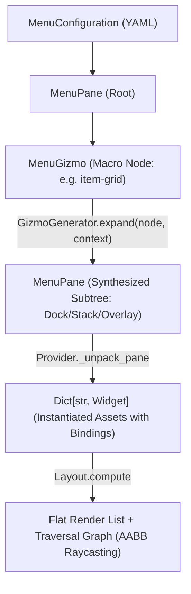

#### Refactor: Phase 04.05 - Gizmos

**Goal**: Similar (but distinct) to Compositions, there needs to be a way of unpacking reusable menu components into flat lists of Widgets for rendering. A pre-defined configuration of Widgets will be called a *Gizmo*.

**Use Case**: The InventoryController will require a configuration of Widgets (a Gizmo) for listing an arbitrary number of items from different fields of the Inventory (`pouch`, `pack`). 

**Overview**

Implement the Gizmo configuration macro system within `app.services.generators.menus.fabricator` to support dynamic, multi-widget UI components (such as item grids and equipment slots) for `InventoryController` and `ExchangeController`. Gizmos dynamically generate declarative `MenuPane` and `MenuWidget` subtrees from runtime collection data, preserving the zero-allocation rendering pipeline and offloading positioning and traversal graph generation entirely to `Layout`.

##### Working Updates: 06-widgets#gizmos

A Gizmo is a declarative macro node within a Menu configuration tree. Gizmos bridge static UI layout structures with variable runtime collection data (e.g., inventory slots, trade grids, crafting lists).

```yaml
gizmos:
  <gizmo-name>:
    id: <gizmo-template-id>
    bind:
      schema: collection
      target:
        source: context.<path>.<collection>
    capacity: <int>
    columns: <int>
    gap: <int>
    pane: <pane-asset-id>
    button: <button-asset-id>
```

**Gizmo Compositions**

Widgets adhere strictly to single-texture rendering. Composite controls (e.g., an equipment slot consisting of a button frame and an item graphic) are composed using `Layout.OVERLAY` within a parent `Pane`:

1. The parent `Pane` allocates the layout cell dimensions (e.g., $40 \times 40$).
2. Child 1 (`Button`) renders the interactive background and captures traversal focus.
3. Child 2 (`Icon`) centers natively on top of the button, binding to the item texture key.

---

##### Architectural Assessment

In the world simulation, `Decomposer` does not invent ad-hoc asset classes; it reads a blueprint from `/src/data/config/compositions/` and expands deployed pseudo-state into standard `Asset` instances that the `Board` consumes uniformly.

For menus, a Gizmo represents a dynamic UI pattern—such as an inventory grid, equipment rack, or shop listing—where the number of rendered controls depends on dynamic collection lengths in `MenuContext`.



Synthesizing a `MenuPane` subtree prior to layout resolution provides distinct architectural advantages:

* **Zero Duplication of Spatial Geometry**: `Layout._layout_dock`, `_layout_stack`, and `_layout_overlay` handle child positioning identically for static and dynamic menus.
* **Unified Traversal Topology**: `Layout._build_graph` evaluates all active button hitboxes uniformly via AABB ray-casting, eliminating manual adjacency-graph wiring.
* **Decal Composition via Overlays**: An inventory slot consists of an outer `transparent-slot` pane with `Layout.OVERLAY`, holding a `slot` button background and an inner centered `icon` widget. Expanding to `MenuPane` trees preserves this rendering hierarchy naturally.

**1. Pseudo-State & Windowed Bindings**

In Compositions, pseudo-state resolves spatial translations and binds relative references (`bind(root.layer)`). In Gizmos, "pseudo-state" resolves **collection slicing and slot index mapping**.

When an inventory holds 24 items but the Gizmo pane only has 8 physical slots:

* **The Windowed State**: The Menu Context or Controller maintains a paging offset ($O \in [0, N]$).
* **Slot Mapping**: Slot $i \in [0, 7]$ maps to index $k = O + i$ in `context.inventory.<field>`.
* **State Superposition**:
* If $k < \text{len}(\text{collection})$: The slot button status is set to `IDLE`, its select binding is wired to item $k$, and the child icon binds to `collection[k]`.
* If $k \ge \text{len}(\text{collection})$: The slot is empty. The button status is set to `DISABLED` (intraversable), and the icon displays a blank/empty frame.

**2. Traversal & Edge Scrolling Mechanics**

Implicit edge-scrolling during traversal risks fighting with `Layout._build_graph` because off-screen items have no spatial bounding boxes.

The engine architecture already implements a clean, tested pattern in `ScrollController` via explicit selection commands (`SCROLLUP`, `SCROLLDOWN`). For Gizmos:

1. **Explicit Navigation Buttons**: The Gizmo macro optionally appends pagination controls (`arrow-up` / `arrow-down` buttons) alongside the grid. Selecting an arrow fires `scrolldown`/`scrollup` on the controller, incrementing the window offset and emitting an `UpdateEvent`.
2. **Deterministic Focus Recovery**: When an update event re-slices the collection, the active focus defaults safely to the first available active slot in the new page.

##### Goal: Gizmo Configuration Models & Macro Expansion

Extend `app.models.config.menus` with a `MenuGizmo` configuration node. Implement `Fabricator` to expand `MenuGizmo` specifications into concrete `MenuPane` hierarchies before `Provider` performs ECS widget instantiation.

```python
@dataclass(slots=True, frozen=True)
class MenuGizmo:
    id: str
    name: str
    bind: MenuBinding
    capacity: int
    columns: int
    gap: int = 5
    pane: str = "transparent-slot"
    button: str = "slot"
```

##### Goal: Windowed Collection Bindings & Pseudo-State

Implement `CollectionBinding` in `app.game.menus.bindings` to manage dynamic index resolution, pagination offsets, and empty-slot suppression, allowing slots to evaluate `context.<path>.<collection>[offset + i]` dynamically.

##### Goal: InventoryController Integration

Implement `InventoryController` to manage Gizmo pagination offsets, item equipping/inspecting commands, and dispatching `UpdateEvent` payloads to refresh slot textures when the inventory state mutates.

##### Tasks

**1. Task: Schematize MenuGizmo & Extend Menu AST**

*Objective*: Allow Menu configurations to declare dynamic Gizmo macros alongside standard Panes and Widgets.

* [ ] Subtask: Add `MenuGizmo` dataclass to `app.models.config.menus`.
* [ ] Subtask: Update `MenuPane.children` type signature to `List[Union[MenuPane, MenuWidget, MenuGizmo]]`.
* [ ] Subtask: Add Pydantic schema validation for Gizmo properties (`capacity`, `columns`, `pane_id`, `button_id`).

**2. Task: Implement GizmoGenerator Service**

*Objective*: Build the expansion generator that transforms `MenuGizmo` nodes into standard `MenuPane` subtrees.

* [ ] Subtask: Implement `app.services.generators.menus.Fabricator`.
* [ ] Subtask: Build grid subdivision logic to partition `capacity` across `columns` using nested `dock` and `stack` panes.
* [ ] Subtask: Generate `transparent-slot` overlay panes with child `buttons` and `icons` with deterministic IDs (`<name>-slot-<i>`, `<name>-icon-<i>`).
* [ ] Subtask: Integrate `GizmoGenerator` into `Provider._unpack_node` so expansion occurs seamlessly during Menu hydration.

**3. Task: Implement CollectionBinding & Slot Paging**

*Objective*: Connect individual slot buttons and icons to underlying collection elements.

* [ ] Subtask: Create `CollectionBinding` subclass in `app.game.menus.bindings.collection`.
* [ ] Subtask: Implement index-slice bounds checks returning empty strings and `DISABLED` statuses for vacant slots.
* [ ] Subtask: Register `collection` schema in `app.services.generators.binder.Binder`.

**4. Task: Implement InventoryController**

*Objective*: Manage selection events, pagination shifts, and item mutations for the player inventory.

* [ ] Subtask: Implement `app.game.menus.controllers.inventory.InventoryController`.
* [ ] Subtask: Implement `select()` to process slot clicks and emit `UpdateEvent` on scroll actions.
* [ ] Subtask: Write unit tests covering Gizmo AST expansion, grid layout computation, and slot traversal graph generation.

---

##### Bug B010: TraversalState and TraversalFrame Decal Omission

**STATUS**: OPEN

**SEVERITY**: LOW

**Description**

The documentation in `06-widgets.md` states that `TraversalState` contains an `icons: Optional[List[str]]` field to embed icon decals onto buttons. However, `TraversalState` in `app.models.state.widgets` lacks this attribute, and `TraversalFrame.keys` only queries the base button frame (`settings.SEPARATOR.join([id, state.animation.action])`).

**Proposed Remediation**

Align the documentation with the actual engine rendering strategy: clarify that button decals must be composed hierarchically via `Layout.OVERLAY` inside a container `transparent-slot` Pane containing both a `Button` widget and an `Icon` widget, rather than expecting single `Button` assets to render multi-texture decal composites.

##### Refactor: Phase 04.05 - Appendix

**Current Widget Properties**

```yaml
widgets:
  buttons:
    slot: 
      dimensions:
        w: 40
        l: 40
    icon:
      dimensions:
        w: 71
        l: 28
    label: 
      dimensions:
        w: 142
        l: 28
    arrow-down:
      dimensions:
        w: 24
        l: 24
    arrow-left:
      dimensions:
        w: 24
        l: 24
    arrow-right:
      dimensions:
        w: 24
        l: 24
    arrow-up:
      dimensions:
        w: 24
        l: 24
  icons:
    digits:
      dimensions:
        w: 12
        l: 14
      frames:
        - zero
        - one
        - two
        - three
        - four
        - five
        - six
        - seven
        - eight
        - nine
    weapons:
      dimensions:
        w: 32
        l: 32
      frames:
        - shortsword
        - dagger
        - knife
        - spear
    shields:
      dimensions:
        w: 32
        l: 32
      frames:
        - buckler
    portraits:
      dimensions: 
        w: 50
        l: 63
      frames:
        - female-persona-1
        - female-persona-2
        - female-persona-3
        - female-persona-4
        - female-persona-5
        - female-persona-6
        - empress-jasilynn
        - female-persona-8
        - female-persona-9
        - female-persona-10
        - female-persona-11
        - female-persona-12
        - female-persona-13
        - male-persona-1
        - male-persona-2
        - male-persona-3
        - male-persona-4
        - male-persona-5
        - male-persona-6
        - male-persona-7
        - male-persona-8
        - male-persona-9
        - male-persona-10
        - male-persona-11
  meters:
    health:
      dimensions:
        w: 72
        l: 20
    magic:
      dimensions:
        w: 72
        l: 20
  pages:
    dialogue:
      dimensions:
        w: 640
        l: 96
    header:
      dimensions:
        w: 426
        l: 163 
    scroll:
      dimensions:
        w: 330
        l: 54
    notification:
      dimensions:
        w: 192
        l: 64
    parchment:
      dimensions:
        w: 465
        l: 273
    portrait:
      dimensions:
        w: 96
        l: 95
  panes:
    dark:
      dimensions:
        w: 318
        l: 180
    dark-small:
      dimensions:
        w: 318
        l: 78
    neutral:
      dimensions:
        w: 318
        l: 180
    neutral-small:
      dimensions:
        w: 318
        l: 78
    light:
      dimensions:
        w: 318 
        l: 180
    light-small:
      dimensions:
        w: 318
        l: 78
    transparent-slot:
      dimensions:
        w: 40
        l: 40
    transparent-block:
      dimensions:
        w: 80
        l: 80
```

**Current Dialogue Menu**

```yaml
menus:
  dialogue:
    controller: scroll
    roots: 
      - id: neutral
        name: dialogue-menu
        position:
          # 480 x 480
          px: 0.175
          py: 0.60
        layout: dock
        alignment: center
        gap: 5
        margin: 10
        children:
          # ------------------------------- PORTRAIT DISPLAY
          - id: transparent-block 
            name: character-portrait-container
            layout: overlay
            alignment: start
            gap: 0
            children:
              - instance: icons
                id: portraits
                name: character-portrait-icon
                bind:
                  schema: icon
                  target: 
                    icon: context.sprite.psyche.persona
          # ------------------------------- DIALOGUE DISPLAY
          - instance: pages
            id: notification
            name: character-speech
            bind:
              schema: library
              target:
                plot: context.plot.current
                persona: context.sprite.psyche.persona
                lexicon: context.sprite.psyche.dialogue
          # ------------------------------- CONTROL DISPLAY
          - id: transparent-slot
            name: text-scroll-buttons
            layout: stack
            alignment: center
            gap: 5
            children:
              - instance: buttons
                id: arrow-up
                name: text-scroll-up
                bind: 
                  schema: select
                  target:
                    selection: scrollup
                    selector: character-speech
              - instance: buttons
                id: arrow-down
                name: text-scroll-down
                bind: 
                  schema: select
                  target:
                    selection: scrolldown
                    selector: character-speech
```