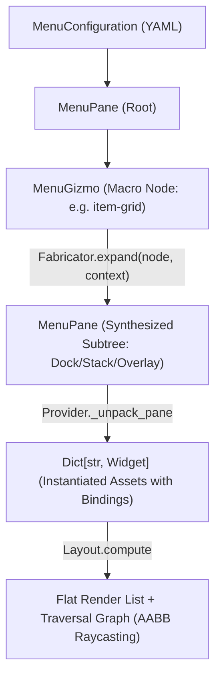

#### Refactor: Phase 04.05 - Gizmos

**Goal**: Similar (but distinct) to Compositions, there needs to be a way of unpacking reusable menu components into flat lists of Widgets for rendering. A pre-defined configuration of Widgets will be called a *Gizmo*.

**Use Case**: The InventoryController will require a configuration of Widgets (a Gizmo) for listing an arbitrary number of items from different fields of the Inventory (`pouch`, `pack`). 

**Overview**

Implement the Gizmo configuration macro system within `app.services.generators.menus.fabricator` to support dynamic, multi-widget UI components (such as item grids and equipment slots) for `InventoryController` and `ExchangeController`. Gizmos dynamically generate declarative `MenuPane` and `MenuWidget` subtrees from runtime collection data, preserving the zero-allocation rendering pipeline and offloading positioning and traversal graph generation entirely to `Layout`.

##### Working Updates: 06-widgets#gizmos

A Gizmo is a declarative macro node within a Menu configuration tree. Gizmos bridge static UI layout structures with variable runtime collection data (e.g., inventory slots, trade grids, crafting lists).

```yaml
gizmos:
  <gizmo-name>:
    id: <gizmo-template-id>
    bind:
      schema: collection
      target:
        source: context.<path>.<collection>
    capacity: <int>
    columns: <int>
    gap: <int>
    pane: <pane-asset-id>
    button: <button-asset-id>
```

**Gizmo Compositions**

Widgets adhere strictly to single-texture rendering. Composite controls (e.g., an equipment slot consisting of a button frame and an item graphic) are composed using `Layout.OVERLAY` within a parent `Pane`:

1. The parent `Pane` allocates the layout cell dimensions (e.g., $40 \times 40$).
2. Child 1 (`Button`) renders the interactive background and captures traversal focus.
3. Child 2 (`Icon`) centers natively on top of the button, binding to the item texture key.

---

##### Architectural Assessment

In the world simulation, `Decomposer` does not invent ad-hoc asset classes; it reads a blueprint from `/src/data/config/compositions/` and expands deployed pseudo-state into standard `Asset` instances that the `Board` consumes uniformly.

For menus, a Gizmo represents a dynamic UI pattern—such as an inventory grid, equipment rack, or shop listing—where the number of rendered controls depends on dynamic collection lengths in `MenuContext`.



Synthesizing a `MenuPane` subtree prior to layout resolution provides distinct architectural advantages:

* **Zero Duplication of Spatial Geometry**: `Layout._layout_dock`, `_layout_stack`, and `_layout_overlay` handle child positioning identically for static and dynamic menus.
* **Unified Traversal Topology**: `Layout._build_graph` evaluates all active button hitboxes uniformly via AABB ray-casting, eliminating manual adjacency-graph wiring.
* **Decal Composition via Overlays**: An inventory slot consists of an outer `transparent-slot` pane with `Layout.OVERLAY`, holding a `slot` button background and an inner centered `icon` widget. Expanding to `MenuPane` trees preserves this rendering hierarchy naturally.

**1. Pseudo-State & Windowed Bindings**

In Compositions, pseudo-state resolves spatial translations and binds relative references (`bind(root.layer)`). In Gizmos, "pseudo-state" resolves **collection slicing and slot index mapping**.

When an inventory holds 24 items but the Gizmo pane only has 8 physical slots:

* **The Windowed State**: The Menu Context or Controller maintains a paging offset ($O \in [0, N]$).
* **Slot Mapping**: Slot $i \in [0, 7]$ maps to index $k = O + i$ in `context.inventory.<field>`.
* **State Superposition**:
* If $k < \text{len}(\text{collection})$: The slot button status is set to `IDLE`, its select binding is wired to item $k$, and the child icon binds to `collection[k]`.
* If $k \ge \text{len}(\text{collection})$: The slot is empty. The button status is set to `DISABLED` (intraversable), and the icon displays a blank/empty frame.

**2. Traversal & Edge Scrolling Mechanics**

Implicit edge-scrolling during traversal risks fighting with `Layout._build_graph` because off-screen items have no spatial bounding boxes.

The engine architecture already implements a clean, tested pattern in `ScrollController` via explicit selection commands (`SCROLLUP`, `SCROLLDOWN`). For Gizmos:

1. **Explicit Navigation Buttons**: The Gizmo macro optionally appends pagination controls (`arrow-up` / `arrow-down` buttons) alongside the grid. Selecting an arrow fires `scrolldown`/`scrollup` on the controller, incrementing the window offset and emitting an `UpdateEvent`.
2. **Deterministic Focus Recovery**: When an update event re-slices the collection, the active focus defaults safely to the first available active slot in the new page.

##### Goal: Gizmo Configuration Models & Macro Expansion

Extend `app.models.config.menus` with a `MenuGizmo` configuration node. Implement `Fabricator` to expand `MenuGizmo` specifications into concrete `MenuPane` hierarchies before `Provider` performs ECS widget instantiation.

```python
@dataclass(slots=True, frozen=True)
class MenuGizmo:
    id: str
    name: str
    bind: MenuBinding
    capacity: int
    columns: int
    gap: int = 5
    pane: str = "transparent-slot"
    button: str = "slot"
```

##### Goal: Windowed Collection Bindings & Pseudo-State

Implement `CollectionBinding` in `app.game.menus.bindings` to manage dynamic index resolution, pagination offsets, and empty-slot suppression, allowing slots to evaluate `context.<path>.<collection>[offset + i]` dynamically.

##### Goal: InventoryController Integration

Implement `InventoryController` to manage Gizmo pagination offsets, item equipping/inspecting commands, and dispatching `UpdateEvent` payloads to refresh slot textures when the inventory state mutates.

##### Tasks

**1. Task: Schematize MenuGizmo & Extend Menu AST**

*Objective*: Allow Menu configurations to declare dynamic Gizmo macros alongside standard Panes and Widgets.

* [x] Subtask: Add `MenuGizmo` dataclass to `app.models.config.menus`.
* [x] Subtask: Update `MenuPane.children` type signature to `List[Union[MenuPane, MenuWidget, MenuGizmo]]`.
* [x] Subtask: Add Pydantic schema validation for Gizmo properties (`capacity`, `columns`, `pane_id`, `button_id`).

**2. Task: Implement GizmoGenerator Service**

*Objective*: Build the expansion generator that transforms `MenuGizmo` nodes into standard `MenuPane` subtrees.

* [x] Subtask: Implement `app.services.generators.menus.Fabricator`.
* [x] Subtask: Build grid subdivision logic to partition `capacity` across `columns` using nested `dock` and `stack` panes.
* [x] Subtask: Generate `transparent-slot` overlay panes with child `buttons` and `icons` with deterministic IDs (`<name>-slot-<i>`, `<name>-icon-<i>`).
* [x] Subtask: Integrate `Fabricator` into `Provider._unpack_node` so expansion occurs seamlessly during Menu hydration.

**3. Task: Implement CollectionBinding & Slot Paging**

*Objective*: Connect individual slot buttons and icons to underlying collection elements.

* [x] Subtask: Create `CollectionBinding` subclass in `app.game.menus.bindings.collection`.
* [x] Subtask: Implement index-slice bounds checks returning empty strings and `DISABLED` statuses for vacant slots.
* [x] Subtask: Register `collection` schema in `app.services.generators.binder.Binder`.

**4. Task: Implement InventoryController**

*Objective*: Manage selection events, pagination shifts, and item mutations for the player inventory.

* [x] Subtask: Implement `app.game.menus.controllers.inventory.InventoryController`.
* [x] Subtask: Implement `select()` to process slot clicks and emit `UpdateEvent` on scroll actions.
* [!: Dependent on Phase Completion] Subtask: Write unit tests covering Gizmo AST expansion, grid layout computation, and slot traversal graph generation.

##### User Review

Gizmos are rendering! However, the layout is messed up. The arrows are rendering on top of the grid. See state dump below.

**Inventory Menu State Dump**

```
Omitted after bug identified for brevity.
```


##### Task: Architectural Assessment

- [x] Complete

With the initial implementation of Gizmos in place, it needs refactored and reanalyzed to streamline the datastructures that support it and the logic that is used to construct it.

- Diagnose the problem with the Gizmo layout.
- Analyze the codebase for errors and bugs as they pertain to this phase.

**Scrolling**

The Inventory menu currently has arrow Buttons for scrolling, but they do not hook into anything. 

Scrolling is currently a "text" only feature. Determine the level of effort and how ugly the code has to be made in order to support scrolling through a collection of slots (gizmo).

**Generalization**

A Gizmo is currently specific to a "Collection". However, there are other configurations of Gizmos that may be useful in the future. The Fabricator should be more like a Factory class, that generates the Gizmo layout from its binded schema.

**Various Notes**

- The Fabricator doesn't use the MenuContext, despite it being passed into `expand()`.

---

The arrows render on top of the inventory grid because `Provider._unpack_pane` silently discards the synthetic dimensions calculated by `Fabricator`, forcing `Layout._layout_dock` to treat the entire $175 \times 85\text{ px}$ grid as a single $40 \times 40\text{ px}$ cell.

### Layout Problem Diagnosis

In `Fabricator.expand()`, the grid dimensions are calculated correctly based on capacity, column count, slot size ($40 \times 40$), and gap ($5\text{ px}$):

$$\text{grid\_w} = 4 \times 40 + (4 - 1) \times 5 = 175\text{ px}$$

$$\text{grid\_l} = 2 \times 40 + (2 - 1) \times 5 = 85\text{ px}$$

These values are attached to the synthesized `MenuPane(dimensions=Dimensions(w=175, l=85))`. However, inside `Provider._unpack_pane()`:

```python
props = self.properties.panes.get(pane.id)
# ...
pane_asset = Asset(
    taxonomy=Factory.taxonomy(
        id=pane.id,
        name=pane.name,
        category=AssetCategories.WIDGETS.value,
        instance=AssetInstances.PANES.value,
    ),
    properties=props,  # Static 40x40 from transparent-slot in main.yaml
    state=PaneState(...),
)

```

`pane.dimensions` on the AST node is ignored. `props` is retrieved directly from `self.properties.panes["transparent-slot"]`, which defines static dimensions of $40 \times 40$.

When `Layout._layout_dock` executes on the parent `inventory-menu` ($W=318, L=180, \text{margin}=10, \text{gap}=10$):

1. **Child Measurement**: `c.dimensions` accesses `Asset.dimensions`, resolving to `Asset.properties.dimensions`.
* `inventory-pack-grid`: Measured as **$40\text{ px}$** instead of **$175\text{ px}$**.
* `inventory-scroll-controls`: Measured as **$40\text{ px}$** (also using `transparent-slot`).


2. **Total Width**:

$$\text{total\_w} = 40 + 40 + 10 = 90\text{ px} \quad (\text{expected } 175 + 40 + 10 = 225\text{ px})$$


3. **Anchor Positioning**: With `alignment: center` and usable width $318 - 20 = 298\text{ px}$:

$$\text{offset\_x} = \frac{298 - 90}{2} = 104\text{ px}$$


$$\text{current\_x} = 81 + 10 + 104 = 195\text{ px}$$


4. **Placement Collision**:
* `inventory-pack-grid` is placed at $X = 195$. Its internal slots expand across $X \in [195, 370]$ (Slot 0 at 195, Slot 1 at 240, Slot 2 at 285, Slot 3 at 330).
* `inventory-scroll-controls` is placed at $X = 195 + 40 + 10 = \mathbf{245}$.
* The arrows ($W=24$) center inside the controls at $X = 245 + \frac{40 - 24}{2} = \mathbf{253}$.


The scroll controls are stamped directly between Slot 1 ($X=240$) and Slot 2 ($X=285$).

---

### Codebase Analysis: Critical Phase Bugs

Beyond the dimensional collapse, four architectural bugs break Gizmo functionality:

1. **Button Status Decoupled from CollectionBinding**: `Fabricator.expand()` assigns `CollectionBinding` to the `icon` widget, but assigns `SelectBinding` to the `button` widget. `InventoryController._sync_slots()` queries `hasattr(widget.binding, "offset")` and attempts to set `widget.state.status = binding.get_status()`. This operation targets the `IconState` (which has no `status` field), while the slot button retains `SelectBinding` and stays permanently `IDLE`. As seen in the state dump, all 8 buttons remain traversable in `menu.graph` even when `context.inventory.pack` is `None`.
2. **Static Traversal Graph Invalidation**: `Layout._build_graph` runs once during `Provider.unpack()`. When collection pagination or inventory mutation changes a slot from active to empty, `menu.graph` is never updated. Traversing into a newly disabled slot causes focus to land on an intraversable widget.
3. **Registry Miss Logging Storm**: When a slot is vacant, `CollectionBinding.get_item()` returns `""`. `IndexFrame.keys()` evaluates this to `[("weapons-", 0, 0)]`. Because `IconState` is not excluded from missing frame checks in `Screen._widgets`, the engine logs `Registry MISS: Frame key not found: 'weapons-'` for every empty slot on every frame, generating hundreds of I/O log writes per second.
4. **AST Mutation of Frozen Configurations**: In `Provider._unpack_pane()`, the loop executes `pane.children[i] = node`. Mutating `pane.children` in-place mutates the long-lived `MenuConfiguration` loaded during boot. Once expanded, the `MenuGizmo` macro node is permanently replaced by a concrete `MenuPane`, preventing subsequent re-expansions or dynamic re-bindings.

---

### Gizmo Scrolling Architecture

Supporting collection scrolling requires minimal effort and zero ugly code because **texture rebaking is not involved**.

Unlike text scrolling—which requires rasterizing glyphs onto an SDL surface canvas via `Screen.stamp()`—Gizmo slot textures are static sprites already cached in the `Registry`. An icon's displayed texture is resolved on the fly each frame through its frame key:

```python
keys = [(f"{widget.id}-{state.icon}", 0, 0)]

```

Where `state.icon` evaluates `CollectionBinding.get_item()` dynamically:

$$k = \text{offset} + \text{index}$$

#### Clean Implementation Strategy

1. **Store Offset on Context**: Move pagination tracking into the context (e.g., `context.offset` or a controller-backed property).
2. **Targeted Paging Bounds**: In `InventoryController.select()`:
* When `selection == SCROLLDOWN`: Advance offset by `columns` (e.g., $+4$), clamped to:

$$\text{max\_offset} = \max\left(0, \left\lceil \frac{N - \text{capacity}}{\text{columns}} \right\rceil \times \text{columns}\right)$$


* When `selection == SCROLLUP`: Decrement offset by `columns`, clamped to $\ge 0$.


3. **Direct Context Resolution**: Configure `CollectionBinding` to resolve `offset` dynamically via path (`target: {"offset": "context.offset", ...}`), eliminating the manual `_sync_slots()` iteration loop entirely.
4. **Focus Recovery**: If `menu.focus` belongs to a slot whose effective index $k \ge N$ after a scroll event, clamp focus to the nearest valid slot or default to `inventory-scroll-up`.

---

### Gizmo Generalization & Fabricator Architecture

`Fabricator` should not be hardcoded to grid collections. Refactor it into an extensible generator factory that selects an expansion strategy based on `gizmo.bind.schema`:

```
Fabricator.expand(gizmo, context, properties)
 ├── schema == "collection" / "grid"   ──> GridFabricator
 ├── schema == "equipment" / "record" ──> EquipmentFabricator
 └── schema == "pagination"           ──> PaginationFabricator

```

#### Utilizing MenuContext in Expansion

`context` is currently passed to `expand()` and unused. Integrating `context` unlocks three capabilities:

* **Dynamic Capacity Sizing**: If `gizmo.capacity` is set to `0` or omitted in YAML, the Fabricator queries `len(context.resolve(source_path))` to generate exactly the required slot count, eliminating empty placeholder slots for fixed lists.
* **Direct Path Binding**: Generates declarative select targets that bind buttons directly to underlying domain entities (e.g., `target: {"entity": f"{source_path}[{k}]"}`).
* **Pre-computed Traversal States**: Evaluates collection bounds during expansion so empty slots are initialized directly as `DISABLED` before `Layout._build_graph()` executes, preventing phantom nodes in the initial navigation graph.

---

### Bug Reports

##### Bug B008: Pane Asset Discards AST Dimensions in Provider Unpack

**STATUS**: OPEN
**SEVERITY**: HIGH

**Description**

When `Provider._unpack_pane()` instantiates a `MenuPane` Asset, it assigns properties solely via `self.properties.panes.get(pane.id)`. Any synthetic or explicit dimensions defined on the configuration AST node (`pane.dimensions`, such as those calculated by `Fabricator`) are ignored. Consequently, `Layout._layout_dock` and `_layout_stack` read the fallback asset dimensions (e.g., $40 \times 40$ for `transparent-slot`), causing subsequent siblings in dock/stack layouts to compute overlapping coordinates.

**Steps to Replicate**

1. Launch `inventory` menu with an expanded Gizmo grid ($175\text{ px}$ wide) and pagination controls in a horizontal `dock` pane.
2. Inspect the resulting `PaneState.position` and button coordinates via state dump.
3. Observe `inventory-scroll-controls` placed at $X=245$, overlapping the grid which extends to $X=370$.

**Proposed Remediation**

In `Provider._unpack_pane()`, check if `pane.dimensions` is set. If present, instantiate an overridden `WidgetProperties` container with `dimensions=pane.dimensions` instead of directly sharing the static prototype from `self.properties.panes`:

```python
if pane.dimensions is not None:
  props = WidgetProperties(
      dimensions=pane.dimensions,
      frames=props.frames if props else None,
  )

```

---

##### Bug B009: Slot Button Decoupled from CollectionBinding

**STATUS**: OPEN
**SEVERITY**: HIGH

**Description**

`Fabricator.expand()` attaches a `CollectionBinding` to the slot's child icon widget, but assigns a standard `SelectBinding` to the slot's button widget. `InventoryController._sync_slots()` checks `hasattr(widget.binding, "offset")`, which succeeds only on the icon widget. The icon widget state (`IconState`) has no `status` property, while the button widget retains `SelectBinding` and stays permanently `IDLE`. This causes empty inventory slots to remain active and traversable in `menu.graph` even when the backing inventory is empty.

**Steps to Replicate**

1. Open `inventory` menu when `player.inventory.pack` is empty or contains fewer items than `gizmo.capacity`.
2. Inspect `menu.graph` or navigate using directional inputs.
3. Observe focus landing on empty slots that display no item.

**Proposed Remediation**

Introduce a composite `SlotBinding` subclassing `SelectBinding` (or add collection index awareness to `SelectBinding`) that evaluates collection length against `effective_index = offset + index`. When $k \ge \text{len}(\text{collection})$, the button automatically yields `status = Statuses.DISABLED.value`.

---

##### Bug B010: Registry Miss Storm on Vacant Icon Frame Keys

**STATUS**: OPEN
**SEVERITY**: MEDIUM

**Description**

When an inventory slot is vacant, `CollectionBinding.get_item()` returns an empty string. `IndexFrame.keys()` joins this with the asset identifier, producing `weapons-`. `Screen._widgets()` queries `self.registry.image("weapons-")`, fails, and logs a warning on every frame because `IconState` is not excluded from missing texture checks.

**Steps to Replicate**

1. Open the inventory menu with empty slots.
2. Monitor application logs.
3. Observe `Registry MISS: Frame key not found: 'weapons-'` logged 60 times per second per empty slot.

**Proposed Remediation**

Update `IndexFrame.keys()` to return an empty list `[]` when `state.icon` is empty or `None`, preventing texture lookup entirely:

```python
def keys(self, id: str, state: AssetState) -> List[Tuple[str, int, int]]:
  if not getattr(state, "icon", None):
    return []
  return [(settings.SEPARATOR.join([id, state.icon]), 0, 0)]

```

---

##### Bug B011: Static Menu AST Mutation in Provider Unpack

**STATUS**: OPEN
**SEVERITY**: MEDIUM

**Description**

In `Provider._unpack_pane()`, the loop performs `pane.children[i] = node`. This mutates the child list of the master `MenuConfiguration` in place. Once a `MenuGizmo` macro is expanded into a `MenuPane`, the configuration tree permanently loses the macro definition, preventing re-expansion or dynamic reconstruction on future menu invocations.

**Steps to Replicate**

1. Open `inventory` menu (triggering Gizmo expansion).
2. Close `inventory` menu.
3. Modify player inventory.
4. Re-open `inventory` menu.
5. Observe that `Provider._unpack_node` receives the stale `MenuPane` rather than the `MenuGizmo` macro node.

**Proposed Remediation**

Treat incoming configuration trees as read-only templates. In `Provider.unpack()`, clone or copy the root panes prior to traversal, or maintain a distinct runtime AST separate from the configuration specification.

---

### Backlog: Phase 04.05 - Gizmos & Dynamic UI Architecture

**Overview**

Refactor the Gizmo subsystem to address dimensional layout bugs, eliminate traversal over vacant slots, generalize macro expansion across collection and equipment schemas, and implement pagination controls.

##### Goal: Dynamic Layout Sizing & Overlap Remediation

Ensure synthesized and container panes propagate explicit dimensional geometry to `Asset.properties` during hydration, allowing `Layout._layout_dock` and `_layout_stack` to calculate spacing using actual subtree bounds.

##### Goal: Unified Slot Bindings & Traversal Integrity

Unify button traversal state with collection item occupancy. When a slot is vacant, its button must automatically assume `DISABLED` status prior to `Layout._build_graph()`, preventing intraversable elements from populating the navigation topology.

##### Goal: Generalized Strategy-Based Fabricator

Refactor `Fabricator` from a concrete grid generator into a factory service delegating macro expansion to dedicated schema generators (`collection`, `equipment`, `pagination`).

##### Goal: Windowed Collection Pagination & Focus Clamping

Connect pagination buttons to controller offset states, implement row-based pagination stepping, and add deterministic focus recovery when the active slot leaves the visible window.

##### Tasks

**1. Task: Fix Pane Geometry Propagation in Provider**

*Objective*: Allow synthesized `MenuPane.dimensions` to override prototype asset properties during unpacking.

* [ ] Subtask: Update `Provider._unpack_pane` to construct custom `WidgetProperties` when `pane.dimensions` is defined.
* [ ] Subtask: Define explicit dimensions for `inventory-scroll-controls` in `data/config/menus/main.yaml` ($W=24, L=53$).
* [ ] Subtask: Verify `inventory-pack-grid` ($W=175$) and scroll controls ($W=24$) dock horizontally without spatial overlap.

**2. Task: Implement SlotBinding & Vacancy Handling**

*Objective*: Synchronize button traversal status and icon frame generation with collection item bounds.

* [ ] Subtask: Implement `SlotBinding` in `app.game.menus.bindings.slot` combining select commands with collection bounds checking.
* [ ] Subtask: Update `IndexFrame.keys()` to return an empty list when `state.icon` is empty, eliminating missing texture log warnings.
* [ ] Subtask: Ensure `Provider._focus()` selects the first valid, non-disabled button upon initial menu hydration.

**3. Task: Refactor Fabricator to Strategy Factory**

*Objective*: Abstract macro expansion to support arbitrary dynamic UI patterns.

* [ ] Subtask: Define `GizmoStrategy` abstract base class with `expand(gizmo, context, properties) -> MenuPane`.
* [ ] Subtask: Extract grid generation logic into `CollectionGridStrategy`.
* [ ] Subtask: Implement `EquipmentSlotStrategy` for binding discrete equipment fields (`weapon`, `shield`, `armor`).
* [ ] Subtask: Register strategies within `Fabricator` keyed by `bind.schema`.

**4. Task: Integrate Collection Pagination in InventoryController**

*Objective*: Implement row-based collection scrolling and focus recovery.

* [ ] Subtask: Update `InventoryController.select()` to advance/decrement `offset` by `columns`.
* [ ] Subtask: Add upper and lower offset clamping based on collection length and grid capacity.
* [ ] Subtask: Implement focus recovery logic shifting traversal focus to `inventory-scroll-up` when the selected slot scrolls out of view.
* [ ] Subtask: Write unit tests covering AST expansion, dock spacing with dynamic pane dimensions, and empty slot traversal exclusion.

---

### Suggested Documentation Updates

#### Update to `docs/06-widgets.md#gizmos`

Add an explicit subsection documenting dimensional propagation rules for composite panes:

> **Pane Dimensional Hierarchy**
> When a `MenuPane` declares explicit `dimensions`, the `Provider` overrides the prototype dimensions declared in `properties.panes[id]`. This is mandatory for macro nodes (such as Gizmos) whose dimensions are derived dynamically from child counts:
> $$\text{Width} = C \cdot w_{\text{slot}} + (C - 1) \cdot \text{gap}$$
> 
> 
> $$\text{Length} = R \cdot l_{\text{slot}} + (R - 1) \cdot \text{gap}$$
> 
> 
> Any parent layout (`dock` or `stack`) evaluates these synthetic dimensions directly when allocating sibling offsets.

#### Update to `docs/06-widgets.md#bindings`

Add the specification for `SlotBinding`:

> **SlotBinding (`schema: slot`)**
> Combines `SelectBinding` interaction semantics with `CollectionBinding` index slicing:
> * If $k = \text{offset} + \text{index} < \text{len}(\text{collection})$: Button status evaluates to `IDLE`, and selecting emits the specified command with payload `collection[k]`.
> * If $k \ge \text{len}(\text{collection})$: Button status evaluates to `DISABLED`, suppressing focus capture and eliminating the node from the traversal graph.
> 
>

#### Appendix

**Current Widget Properties**

```yaml
widgets:
  buttons:
    slot: 
      dimensions:
        w: 40
        l: 40
    icon:
      dimensions:
        w: 71
        l: 28
    label: 
      dimensions:
        w: 142
        l: 28
    # --------
    arrow-down:
      dimensions:
        w: 24
        l: 24
    arrow-left:
      dimensions:
        w: 24
        l: 24
    arrow-right:
      dimensions:
        w: 24
        l: 24
    arrow-up:
      dimensions:
        w: 24
        l: 24
  icons:
    digits:
      dimensions:
        w: 12
        l: 14
      frames:
        - zero
        - one
        - two
        - three
        - four
        - five
        - six
        - seven
        - eight
        - nine
    weapons:
      dimensions:
        w: 32
        l: 32
      frames:
        - shortsword
        - dagger
        - knife
        - spear
    shields:
      dimensions:
        w: 32
        l: 32
      frames:
        - buckler
    portraits:
      dimensions: 
        w: 50
        l: 63
      frames:
        - female-persona-1
        - female-persona-2
        - female-persona-3
        - female-persona-4
        - female-persona-5
        - female-persona-6
        - empress-jasilynn
        - female-persona-8
        - female-persona-9
        - female-persona-10
        - female-persona-11
        - female-persona-12
        - female-persona-13
        - male-persona-1
        - male-persona-2
        - male-persona-3
        - male-persona-4
        - male-persona-5
        - male-persona-6
        - male-persona-7
        - male-persona-8
        - male-persona-9
        - male-persona-10
        - male-persona-11
  meters:
    health:
      dimensions:
        w: 72
        l: 20
    magic:
      dimensions:
        w: 72
        l: 20
  pages:
    # -------- SOLID PAGES
    dark-dialogue:
      dimensions:
        w: 640
        l: 96
    dark-notification:
      dimensions:
        w: 192
        l: 64
    dark-portrait:
      dimensions:
        w: 58
        l: 69
    # -------- FAUX PAPER PAGES
    paper-scroll:
      dimensions:
        w: 189
        l: 192
    paper-header-torn:
      dimensions:
        w: 426
        l: 163 
    paper-header:
      dimensions:
        w: 330
        l: 54
    paper-area:
      dimensions:
        w: 465
        l: 273
    paper-weathered:
      dimensions:
        w: 96
        l: 95
    # -------- TRANSPARENT PAGES
    text-label:
      dimensions:
        w: 142
        l: 28
  panes:
    # -------- DARK PANES
    dark:
      dimensions:
        w: 318
        l: 180
    dark-small:
      dimensions:
        w: 318
        l: 78
    dark-thin:
      dimensions:
        w: 173
        l: 180
    # --------NEUTRAL PANES
    neutral:
      dimensions:
        w: 318
        l: 180
    neutral-small:
      dimensions:
        w: 318
        l: 78
    # -------- LIGHT PANES
    light:
      dimensions:
        w: 318 
        l: 180
    light-small:
      dimensions:
        w: 318
        l: 78
    header-pane:
      dimensions:
        w: 160
        l: 140
    # ----- TRANSPARENT PANES
    transparent-slot:
      dimensions:
        w: 40
        l: 40
    transparent-block:
      dimensions:
        w: 80
        l: 80
    transparent-area:
      dimensions:
        w: 250
        l: 250
    transparent-label:
      dimensions:
        w: 142
        l: 28
```

**Current Inventory Menu**

```yaml
menus:
  inventory:
    controller: inventory
    roots:
      - id: neutral
        name: inventory-menu
        position:
          px: 0.16875
          py: 0.25
        layout: dock
        alignment: center
        gap: 10
        margins: 10
        children:
          # --- INVENTORY GRID GIZMO ---
          - id: weapons
            name: inventory-pack-grid
            bind:
              schema: collection
              target:
                source: context.inventory.pack
            capacity: 8
            columns: 4
            gap: 5
            pane: transparent-slot
            button: slot

          # --- PAGINATION CONTROLS ---
          - id: transparent-slot
            name: inventory-scroll-controls
            layout: stack
            alignment: center
            gap: 5
            children:
              - instance: buttons
                id: arrow-up
                name: inventory-scroll-up
                bind:
                  schema: select
                  target:
                    selection: scrollup
                    selector: inventory-pack-grid
              - instance: buttons
                id: arrow-down
                name: inventory-scroll-down
                bind:
                  schema: select
                  target:
                    selection: scrolldown
                    selector: inventory-pack-grid
```