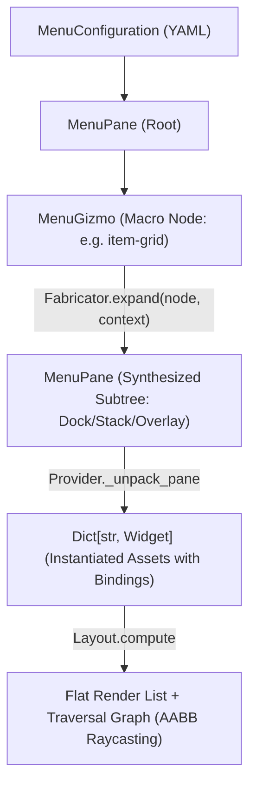
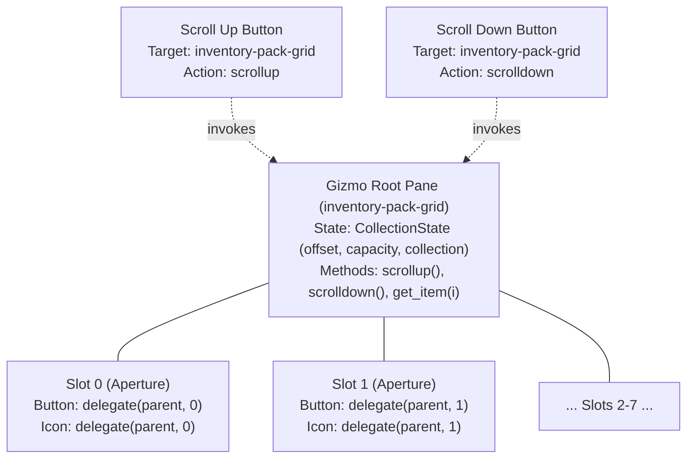

#### Refactor: Phase 04.05 - Gizmos

**Goal**: Similar (but distinct) to Compositions, there needs to be a way of unpacking reusable menu components into flat lists of Widgets for rendering. A pre-defined configuration of Widgets will be called a *Gizmo*.

**Use Case**: The InventoryController will require a configuration of Widgets (a Gizmo) for listing an arbitrary number of items from different fields of the Inventory (`pouch`, `pack`). 

**Overview**

Implement the Gizmo configuration macro system within `app.services.generators.menus.fabricator` to support dynamic, multi-widget UI components (such as item grids and equipment slots) for `InventoryController` and `ExchangeController`. Gizmos dynamically generate declarative `MenuPane` and `MenuWidget` subtrees from runtime collection data, preserving the zero-allocation rendering pipeline and offloading positioning and traversal graph generation entirely to `Layout`.

##### Working Updates: 06-widgets#gizmos

A Gizmo is a declarative macro node within a Menu configuration tree. Gizmos bridge static UI layout structures with variable runtime collection data (e.g., inventory slots, trade grids, crafting lists).

```yaml
gizmos:
  <gizmo-name>:
    id: <gizmo-template-id>
    bind:
      schema: collection
      target:
        source: context.<path>.<collection>
    capacity: <int>
    columns: <int>
    gap: <int>
    pane: <pane-asset-id>
    button: <button-asset-id>
```

**Gizmo Compositions**

Widgets adhere strictly to single-texture rendering. Composite controls (e.g., an equipment slot consisting of a button frame and an item graphic) are composed using `Layout.OVERLAY` within a parent `Pane`:

1. The parent `Pane` allocates the layout cell dimensions (e.g., $40 \times 40$).
2. Child 1 (`Button`) renders the interactive background and captures traversal focus.
3. Child 2 (`Icon`) centers natively on top of the button, binding to the item texture key.

**Pane Dimensional Hierarchy**

When a `MenuPane` declares explicit `dimensions`, the `Provider` overrides the prototype dimensions declared in `properties.panes[id]`. This is mandatory for macro nodes (such as Gizmos) whose dimensions are derived dynamically from child counts:

$$\text{Width} = C \cdot w_{\text{slot}} + (C - 1) \cdot \text{gap}$$

$$\text{Length} = R \cdot l_{\text{slot}} + (R - 1) \cdot \text{gap}$$

##### Architectural Assessment I

In the world simulation, `Decomposer` does not invent ad-hoc asset classes; it reads a blueprint from `/src/data/config/compositions/` and expands deployed pseudo-state into standard `Asset` instances that the `Board` consumes uniformly.

For menus, a Gizmo represents a dynamic UI pattern—such as an inventory grid, equipment rack, or shop listing—where the number of rendered controls depends on dynamic collection lengths in `MenuContext`.



Synthesizing a `MenuPane` subtree prior to layout resolution provides distinct architectural advantages:

* **Zero Duplication of Spatial Geometry**: `Layout._layout_dock`, `_layout_stack`, and `_layout_overlay` handle child positioning identically for static and dynamic menus.
* **Unified Traversal Topology**: `Layout._build_graph` evaluates all active button hitboxes uniformly via AABB ray-casting, eliminating manual adjacency-graph wiring.
* **Decal Composition via Overlays**: An inventory slot consists of an outer `transparent-slot` pane with `Layout.OVERLAY`, holding a `slot` button background and an inner centered `icon` widget. Expanding to `MenuPane` trees preserves this rendering hierarchy naturally.

**1. Pseudo-State & Windowed Bindings**

In Compositions, pseudo-state resolves spatial translations and binds relative references (`bind(root.layer)`). In Gizmos, "pseudo-state" resolves **collection slicing and slot index mapping**.

When an inventory holds 24 items but the Gizmo pane only has 8 physical slots:

* **The Windowed State**: The Menu Context or Controller maintains a paging offset ($O \in [0, N]$).
* **Slot Mapping**: Slot $i \in [0, 7]$ maps to index $k = O + i$ in `context.inventory.<field>`.
* **State Superposition**:
* If $k < \text{len}(\text{collection})$: The slot button status is set to `IDLE`, its select binding is wired to item $k$, and the child icon binds to `collection[k]`.
* If $k \ge \text{len}(\text{collection})$: The slot is empty. The button status is set to `DISABLED` (intraversable), and the icon displays a blank/empty frame.

**2. Traversal & Edge Scrolling Mechanics**

Implicit edge-scrolling during traversal risks fighting with `Layout._build_graph` because off-screen items have no spatial bounding boxes.

The engine architecture already implements a clean, tested pattern in `ScrollController` via explicit selection commands (`SCROLLUP`, `SCROLLDOWN`). For Gizmos:

1. **Explicit Navigation Buttons**: The Gizmo macro optionally appends pagination controls (`arrow-up` / `arrow-down` buttons) alongside the grid. Selecting an arrow fires `scrolldown`/`scrollup` on the controller, incrementing the window offset and emitting an `UpdateEvent`.
2. **Deterministic Focus Recovery**: When an update event re-slices the collection, the active focus defaults safely to the first available active slot in the new page.

##### Goal: Gizmo Configuration Models & Macro Expansion

Extend `app.models.config.menus` with a `MenuGizmo` configuration node. Implement `Fabricator` to expand `MenuGizmo` specifications into concrete `MenuPane` hierarchies before `Provider` performs ECS widget instantiation.

```python
@dataclass(slots=True, frozen=True)
class MenuGizmo:
    id: str
    name: str
    bind: MenuBinding
    capacity: int
    columns: int
    gap: int = 5
    pane: str = "transparent-slot"
    button: str = "slot"
```

##### Goal: Windowed Collection Bindings & Pseudo-State

Implement `CollectionBinding` in `app.game.menus.bindings` to manage dynamic index resolution, pagination offsets, and empty-slot suppression, allowing slots to evaluate `context.<path>.<collection>[offset + i]` dynamically.

##### Goal: InventoryController Integration

Implement `InventoryController` to manage Gizmo pagination offsets, item equipping/inspecting commands, and dispatching `UpdateEvent` payloads to refresh slot textures when the inventory state mutates.

##### Tasks

**1. Task: Schematize MenuGizmo & Extend Menu AST**

*Objective*: Allow Menu configurations to declare dynamic Gizmo macros alongside standard Panes and Widgets.

* [x] Subtask: Add `MenuGizmo` dataclass to `app.models.config.menus`.
* [x] Subtask: Update `MenuPane.children` type signature to `List[Union[MenuPane, MenuWidget, MenuGizmo]]`.
* [x] Subtask: Add Pydantic schema validation for Gizmo properties (`capacity`, `columns`, `pane_id`, `button_id`).

**2. Task: Implement GizmoGenerator Service**

*Objective*: Build the expansion generator that transforms `MenuGizmo` nodes into standard `MenuPane` subtrees.

* [x] Subtask: Implement `app.services.generators.menus.Fabricator`.
* [x] Subtask: Build grid subdivision logic to partition `capacity` across `columns` using nested `dock` and `stack` panes.
* [x] Subtask: Generate `transparent-slot` overlay panes with child `buttons` and `icons` with deterministic IDs (`<name>-slot-<i>`, `<name>-icon-<i>`).
* [x] Subtask: Integrate `Fabricator` into `Provider._unpack_node` so expansion occurs seamlessly during Menu hydration.

**3. Task: Implement CollectionBinding & Slot Paging**

*Objective*: Connect individual slot buttons and icons to underlying collection elements.

* [x] Subtask: Create `CollectionBinding` subclass in `app.game.menus.bindings.collection`.
* [x] Subtask: Implement index-slice bounds checks returning empty strings and `DISABLED` statuses for vacant slots.
* [x] Subtask: Register `collection` schema in `app.services.generators.binder.Binder`.

**4. Task: Implement InventoryController**

*Objective*: Manage selection events, pagination shifts, and item mutations for the player inventory.

* [x] Subtask: Implement `app.game.menus.controllers.inventory.InventoryController`.
* [x] Subtask: Implement `select()` to process slot clicks and emit `UpdateEvent` on scroll actions.
* [!: Dependent on Phase Completion] Subtask: Write unit tests covering Gizmo AST expansion, grid layout computation, and slot traversal graph generation.

##### User Review I

Gizmos are rendering! However, the layout is messed up. The arrows are rendering on top of the grid. See state dump below.

**Inventory Menu State Dump**

```
Omitted after bug identified for brevity.
```

**[x] Task: Architectural Assessment**

With the initial implementation of Gizmos in place, it needs refactored and reanalyzed to streamline the datastructures that support it and the logic that is used to construct it.

- Diagnose the problem with the Gizmo layout.
- Analyze the codebase for errors and bugs as they pertain to this phase.

**Scrolling**

The Inventory menu currently has arrow Buttons for scrolling, but they do not hook into anything. 

Scrolling is currently a "text" only feature. Determine the level of effort and how ugly the code has to be made in order to support scrolling through a collection of slots (gizmo).

**Generalization**

A Gizmo is currently specific to a "Collection". However, there are other configurations of Gizmos that may be useful in the future. The Fabricator should be more like a Factory class, that generates the Gizmo layout from its binded schema.

**Various Notes**

- The Fabricator doesn't use the MenuContext, despite it being passed into `expand()`.

##### Architectural Assessment II

The arrows render on top of the inventory grid because `Provider._unpack_pane` silently discards the synthetic dimensions calculated by `Fabricator`, forcing `Layout._layout_dock` to treat the entire $175 \times 85\text{ px}$ grid as a single $40 \times 40\text{ px}$ cell.

**Layout Problem Diagnosis**

In `Fabricator.expand()`, the grid dimensions are calculated correctly based on capacity, column count, slot size ($40 \times 40$), and gap ($5\text{ px}$):

$$\text{grid\_w} = 4 \times 40 + (4 - 1) \times 5 = 175\text{ px}$$

$$\text{grid\_l} = 2 \times 40 + (2 - 1) \times 5 = 85\text{ px}$$

These values are attached to the synthesized `MenuPane(dimensions=Dimensions(w=175, l=85))`. However, inside `Provider._unpack_pane()`:

```python
props = self.properties.panes.get(pane.id)
# ...
pane_asset = Asset(
    taxonomy=Factory.taxonomy(
        id=pane.id,
        name=pane.name,
        category=AssetCategories.WIDGETS.value,
        instance=AssetInstances.PANES.value,
    ),
    properties=props,  # Static 40x40 from transparent-slot in main.yaml
    state=PaneState(...),
)

```

`pane.dimensions` on the AST node is ignored. `props` is retrieved directly from `self.properties.panes["transparent-slot"]`, which defines static dimensions of $40 \times 40$.

When `Layout._layout_dock` executes on the parent `inventory-menu` ($W=318, L=180, \text{margin}=10, \text{gap}=10$):

1. **Child Measurement**: `c.dimensions` accesses `Asset.dimensions`, resolving to `Asset.properties.dimensions`.
  * `inventory-pack-grid`: Measured as **$40\text{ px}$** instead of **$175\text{ px}$**.
  * `inventory-scroll-controls`: Measured as **$40\text{ px}$** (also using `transparent-slot`).

2. **Total Width**:

$$
\text{total\_w} = 40 + 40 + 10 = 90\text{ px} \quad (\text{expected } 175 + 40 + 10 = 225\text{ px})
$$

3. **Anchor Positioning**: With `alignment: center` and usable width $318 - 20 = 298\text{ px}$:

$$
\text{offset\_x} = \frac{298 - 90}{2} = 104\text{px}
$$

$$
\text{current\_x} = 81 + 10 + 104 = 195\text{px}
$$


4. **Placement Collision**:
  * `inventory-pack-grid` is placed at $X = 195$. Its internal slots expand across $X \in [195, 370]$ (Slot 0 at 195, Slot 1 at 240, Slot 2 at 285, Slot 3 at 330).
  * `inventory-scroll-controls` is placed at $X = 195 + 40 + 10 = \mathbf{245}$.
  * The arrows ($W=24$) center inside the controls at $X = 245 + \frac{40 - 24}{2} = \mathbf{253}$.

The scroll controls are stamped directly between Slot 1 ($X=240$) and Slot 2 ($X=285$).

**Codebase Analysis: Critical Phase Bugs**

Beyond the dimensional collapse, four architectural bugs break Gizmo functionality:

1. **Button Status Decoupled from CollectionBinding**: `Fabricator.expand()` assigns `CollectionBinding` to the `icon` widget, but assigns `SelectBinding` to the `button` widget. `InventoryController._sync_slots()` queries `hasattr(widget.binding, "offset")` and attempts to set `widget.state.status = binding.get_status()`. This operation targets the `IconState` (which has no `status` field), while the slot button retains `SelectBinding` and stays permanently `IDLE`. As seen in the state dump, all 8 buttons remain traversable in `menu.graph` even when `context.inventory.pack` is `None`.
2. **Static Traversal Graph Invalidation**: `Layout._build_graph` runs once during `Provider.unpack()`. When collection pagination or inventory mutation changes a slot from active to empty, `menu.graph` is never updated. Traversing into a newly disabled slot causes focus to land on an intraversable widget.
3. **Registry Miss Logging Storm**: When a slot is vacant, `CollectionBinding.get_item()` returns `""`. `IndexFrame.keys()` evaluates this to `[("weapons-", 0, 0)]`. Because `IconState` is not excluded from missing frame checks in `Screen._widgets`, the engine logs `Registry MISS: Frame key not found: 'weapons-'` for every empty slot on every frame, generating hundreds of I/O log writes per second.
4. **AST Mutation of Frozen Configurations**: In `Provider._unpack_pane()`, the loop executes `pane.children[i] = node`. Mutating `pane.children` in-place mutates the long-lived `MenuConfiguration` loaded during boot. Once expanded, the `MenuGizmo` macro node is permanently replaced by a concrete `MenuPane`, preventing subsequent re-expansions or dynamic re-bindings.

**Gizmo Scrolling Architecture**

Supporting collection scrolling requires minimal effort and zero ugly code because **texture rebaking is not involved**.

Unlike text scrolling—which requires rasterizing glyphs onto an SDL surface canvas via `Screen.stamp()`—Gizmo slot textures are static sprites already cached in the `Registry`. An icon's displayed texture is resolved on the fly each frame through its frame key:

```python
keys = [(f"{widget.id}-{state.icon}", 0, 0)]
```

Where `state.icon` evaluates `CollectionBinding.get_item()` dynamically:

$$k = \text{offset} + \text{index}$$

**Clean Implementation Strategy**

1. **Store Offset on Context**: Move pagination tracking into the context (e.g., `context.offset` or a controller-backed property).
2. **Targeted Paging Bounds**: In `InventoryController.select()`:
  * When `selection == SCROLLDOWN`: Advance offset by `columns` (e.g., $+4$), clamped to: $\text{max\_offset} = \max\left(0, \left\lceil \frac{N - \text{capacity}}{\text{columns}} \right\rceil \times \text{columns}\right)$
  * When `selection == SCROLLUP`: Decrement offset by `columns`, clamped to $\ge 0$.
3. **Direct Context Resolution**: Configure `CollectionBinding` to resolve `offset` dynamically via path (`target: {"offset": "context.offset", ...}`), eliminating the manual `_sync_slots()` iteration loop entirely.
4. **Focus Recovery**: If `menu.focus` belongs to a slot whose effective index $k \ge N$ after a scroll event, clamp focus to the nearest valid slot or default to `inventory-scroll-up`.

**Gizmo Generalization & Fabricator Architecture**

`Fabricator` should not be hardcoded to grid collections. Refactor it into an extensible generator factory that selects an expansion strategy based on `gizmo.bind.schema`:

```
Fabricator.expand(gizmo, context, properties)
 ├── schema == "collection" / "grid"   ──> GridFabricator
 ├── schema == "equipment" / "record" ──> EquipmentFabricator
 └── schema == "pagination"           ──> PaginationFabricator
```

**Utilizing MenuContext in Expansion**

`context` is currently passed to `expand()` and unused. Integrating `context` unlocks three capabilities:

* **Dynamic Capacity Sizing**: If `gizmo.capacity` is set to `0` or omitted in YAML, the Fabricator queries `len(context.resolve(source_path))` to generate exactly the required slot count, eliminating empty placeholder slots for fixed lists.
* **Direct Path Binding**: Generates declarative select targets that bind buttons directly to underlying domain entities (e.g., `target: {"entity": f"{source_path}[{k}]"}`).
* **Pre-computed Traversal States**: Evaluates collection bounds during expansion so empty slots are initialized directly as `DISABLED` before `Layout._build_graph()` executes, preventing phantom nodes in the initial navigation graph.

#### Bug Reports

##### Bug B008: Pane Asset Discards AST Dimensions in Provider Unpack

**STATUS**: OPEN
**SEVERITY**: HIGH

**Description**

When `Provider._unpack_pane()` instantiates a `MenuPane` Asset, it assigns properties solely via `self.properties.panes.get(pane.id)`. Any synthetic or explicit dimensions defined on the configuration AST node (`pane.dimensions`, such as those calculated by `Fabricator`) are ignored. Consequently, `Layout._layout_dock` and `_layout_stack` read the fallback asset dimensions (e.g., $40 \times 40$ for `transparent-slot`), causing subsequent siblings in dock/stack layouts to compute overlapping coordinates.

**Steps to Replicate**

1. Launch `inventory` menu with an expanded Gizmo grid ($175\text{ px}$ wide) and pagination controls in a horizontal `dock` pane.
2. Inspect the resulting `PaneState.position` and button coordinates via state dump.
3. Observe `inventory-scroll-controls` placed at $X=245$, overlapping the grid which extends to $X=370$.

**Proposed Remediation**

In `Provider._unpack_pane()`, check if `pane.dimensions` is set. If present, instantiate an overridden `WidgetProperties` container with `dimensions=pane.dimensions` instead of directly sharing the static prototype from `self.properties.panes`:

```python
if pane.dimensions is not None:
  props = WidgetProperties(
      dimensions=pane.dimensions,
      frames=props.frames if props else None,
  )

```

##### Bug B009: Registry Miss Storm on Vacant Icon Frame Keys

**STATUS**: OPEN
**SEVERITY**: MEDIUM

**Description**

When an inventory slot is vacant, `CollectionBinding.get_item()` returns an empty string. `IndexFrame.keys()` joins this with the asset identifier, producing `weapons-`. `Screen._widgets()` queries `self.registry.image("weapons-")`, fails, and logs a warning on every frame because `IconState` is not excluded from missing texture checks.

**Steps to Replicate**

1. Open the inventory menu with empty slots.
2. Monitor application logs.
3. Observe `Registry MISS: Frame key not found: 'weapons-'` logged 60 times per second per empty slot.

**Proposed Remediation**

Update `IndexFrame.keys()` to return an empty list `[]` when `state.icon` is empty or `None`, preventing texture lookup entirely:

```python
def keys(self, id: str, state: AssetState) -> List[Tuple[str, int, int]]:
  if not getattr(state, "icon", None):
    return []
  return [(settings.SEPARATOR.join([id, state.icon]), 0, 0)]
```

##### Bug B010: Static Menu AST Mutation in Provider Unpack

**STATUS**: OPEN
**SEVERITY**: MEDIUM

**Description**

In `Provider._unpack_pane()`, the loop performs `pane.children[i] = node`. This mutates the child list of the master `MenuConfiguration` in place. Once a `MenuGizmo` macro is expanded into a `MenuPane`, the configuration tree permanently loses the macro definition, preventing re-expansion or dynamic reconstruction on future menu invocations.

**Steps to Replicate**

1. Open `inventory` menu (triggering Gizmo expansion).
2. Close `inventory` menu.
3. Modify player inventory.
4. Re-open `inventory` menu.
5. Observe that `Provider._unpack_node` receives the stale `MenuPane` rather than the `MenuGizmo` macro node.

**Proposed Remediation**

Treat incoming configuration trees as read-only templates. In `Provider.unpack()`, clone or copy the root panes prior to traversal, or maintain a distinct runtime AST separate from the configuration specification.

---

#### Refactor Phase 04.05.02 - Gizmos & Dynamic UI Architecture

**Overview**

Refactor the Gizmo subsystem to address dimensional layout bugs, eliminate traversal over vacant slots, generalize macro expansion across collection and equipment schemas, and implement pagination controls.

##### Goal: Dynamic Layout Sizing & Overlap Remediation

Ensure synthesized and container panes propagate explicit dimensional geometry to `Asset.properties` during hydration, allowing `Layout._layout_dock` and `_layout_stack` to calculate spacing using actual subtree bounds.

##### Goal: Unified Slot Bindings & Traversal Integrity

Unify button traversal state with collection item occupancy. When a slot is vacant, its button must automatically assume `DISABLED` status prior to `Layout._build_graph()`, preventing intraversable elements from populating the navigation topology.

##### Goal: Generalized Strategy-Based Fabricator

Refactor `Fabricator` from a concrete grid generator into a factory service delegating macro expansion to dedicated schema generators (`collection`, `equipment`, `pagination`).

##### Goal: Windowed Collection Pagination & Focus Clamping

Connect pagination buttons to controller offset states, implement row-based pagination stepping, and add deterministic focus recovery when the active slot leaves the visible window.

##### Tasks

!!! warning
  Many tasks have been cancelled following a subsequent user review and architectural assessment.

**1. Task: Fix Pane Geometry Propagation in Provider**

*Objective*: Allow synthesized `MenuPane.dimensions` to override prototype asset properties during unpacking.

* [ ] Subtask: Update `Provider._unpack_pane` to construct custom `WidgetProperties` when `pane.dimensions` is defined.
* [ ] Subtask: Define explicit dimensions for `inventory-scroll-controls` in `data/config/menus/main.yaml` ($W=24, L=53$).
* [ ] Subtask: Verify `inventory-pack-grid` ($W=175$) and scroll controls ($W=24$) dock horizontally without spatial overlap.

**2. Task: Implement SlotBinding & Vacancy Handling**

*Objective*: Synchronize button traversal status and icon frame generation with collection item bounds.

* [!: Cancelled] Subtask: Implement `SlotBinding` in `app.game.menus.bindings.slot` combining select commands with collection bounds checking.
* [ ] Subtask: Update `IndexFrame.keys()` to return an empty list when `state.icon` is empty, eliminating missing texture log warnings.
* [!: Cancelled] Subtask: Ensure `Provider._focus()` selects the first valid, non-disabled button upon initial menu hydration.

**3. Task: Refactor Fabricator to Strategy Factory**

*Objective*: Abstract macro expansion to support arbitrary dynamic UI patterns.

* [!: Cancelled] Subtask: Define `GizmoStrategy` abstract base class with `expand(gizmo, context, properties) -> MenuPane`.
* [!: Cancelled] Subtask: Extract grid generation logic into `CollectionGridStrategy`.
* [!: Cancelled] Subtask: Implement `EquipmentSlotStrategy` for binding discrete equipment fields (`weapon`, `shield`, `armor`).
* [!: Cancelled] Subtask: Register strategies within `Fabricator` keyed by `bind.schema`.

**4. Task: Integrate Collection Pagination in InventoryController**

*Objective*: Implement row-based collection scrolling and focus recovery.

* [!: Cancelled] Subtask: Update `InventoryController.select()` to advance/decrement `offset` by `columns`.
* [!: Cancelled] Subtask: Add upper and lower offset clamping based on collection length and grid capacity.
* [!: Cancelled] Subtask: Implement focus recovery logic shifting traversal focus to `inventory-scroll-up` when the selected slot scrolls out of view.
* [!: Cancelled] Subtask: Write unit tests covering AST expansion, dock spacing with dynamic pane dimensions, and empty slot traversal exclusion.

##### User Review II

The current plan fails to consider how slot pagination breaks the traversal graph generation.

- Slots need to stay traversible in the collection. User has to be able to navigate and select them.
- Arrows page through the slots.

##### Architectural Assessment III

Treating empty slots as `DISABLED` was an error: disabling vacant slots punches physical holes into the Axis-Aligned Bounding Box (AABB) projection, destroying the spatial bridges needed to reach neighboring slots and pagination controls.

The core conflict lies in an architectural impedance mismatch: **`Layout._build_graph` is a purely spatial raycaster operating on physical screen geometry, whereas a paginated collection is a windowed data stream.**

**The Breakdown: Spatial Raycasting vs. Paginated Collections**

`Layout._build_graph` operates under three strict invariants:

1. Every traversable node must exist as an instantiated `Asset` with an absolute `Position` and physical `Dimensions`.
2. Edges are established strictly by 1D interval overlap ($X$ overlap for vertical rays, $Y$ overlap for horizontal rays) and Euclidean distance minimization.
3. Any node omitted or marked `DISABLED` is discarded from candidate evaluation.

```
[Slot 0] <---> [Slot 1] <---> [Slot 2] <---> [Slot 3] <---> [Arrow Up]
   ^              ^              ^              ^
   |              |              |              |
   v              v              v              v
[Slot 4] <---> [Slot 5] <---> [Slot 6] <---> [Slot 7] <---> [Arrow Down]
   |              |              |              |
   x              x              x              x   <-- Offscreen slots 8-11 do not exist!

```

When paginating a collection of 24 items across an 8-slot Gizmo ($4 \times 2$ grid), two distinct failures emerge:

**1. The Empty Slot Collapse**

If an inventory only contains 2 items and slots 2 through 7 are marked `DISABLED`:

* `b1.state.status == Statuses.DISABLED.value` strips slots 2–7 from graph construction.
* Slot 0 and Slot 1 can raycast to each other, but the ray from Slot 1 looking `EAST` finds nothing within its $Y$-interval until the right screen margin. If the pagination arrows sit at a different $Y$-offset, the ray misses entirely.
* The player is physically trapped in the first two slots and cannot navigate to the scroll arrows or inspect empty spaces.
* **Rule**: All physical aperture slots in a Gizmo must remain `IDLE` and traversable at all times, regardless of whether their backing collection index holds data.

**2. The Offscreen Horizon**

Items 8 through 23 cannot participate in `Layout._build_graph`:

* If they are not instantiated as widgets, they have no spatial coordinates; a ray cast `SOUTH` from Slot 4 finds no candidate bounding boxes and terminates with no edge.
* If they *were* instantiated and positioned offscreen below the pane, raycasting would successfully link Slot 4 to Slot 8. However, traversing `SOUTH` would shift `menu.focus` to a coordinate outside the window bounds. Because the engine lacks automatic viewport camera tracking for Menu panes, the focus indicator would vanish off the screen into void space.

##### User Review III

Why are we paging through slots? The physical slots don't have been to rerendered. That's actually absurdly inefficient, if you think about it. It's just their icons that are changing. Okay, so the solution is this, I think: A collection renders a determinate grid of slot and contains data struture of paginated icon strs, e.g. `[ [icon_1, icon_2, ... ], [icon_n, icon_n+1, ...] , ... ]`. Then when user scrolls, it's just rerendering the icons on top of the same slots. It's the "illusion" of slot scrolling. 

However, that requires a Gizmo "state", where the paginated structure can live and be accessed. Which I suppose is what the binding is. However, the Gizmo binding needs to return more than just get_item(). It needs interfaces for scrollup() and scrolldown().

That is the ambiguity in the current setup: Gizmos don't have bindings, their components do. So the collection binding is being made to the icons. That's not correct, I don't think, or atleast it's incomplete, and the source of the woes. 

The question that needs answered is: What *is* a Collection? Is it a binding? What Widget state is it binding to?

- Thought: a Collection binding is actually the ENTIRE schema of bindings for all widgets in the Gizmo. What is lacking a Widget with a scrollup and scrolldown interface for rendering non-text. But that's exactly what a Collection is. Except it's not a concrete Widget, it's an abstract schema.

Right now the whole setup works by utilizing the existing binding flow on Widgets. But it seems like the current Widgets are insufficient to complete what the binding requires.

##### Architectural Assessment IV

Paging the physical slots is an anti-pattern: **slots are static spatial apertures (viewports), while the items sliding underneath them are a windowed data stream.**

The physical buttons must never move, resize, or be rebuilt. They exist solely to provide fixed $(X, Y)$ hitboxes so `Layout._build_graph` can compute an immutable AABB traversal mesh. Only the icon texture keys bound to those apertures change when scrolling.

The reason the current implementation feels broken is an architectural identity crisis: **`Fabricator` decomposes the Gizmo into leaf widgets, but fractures the collection's state across $N$ disconnected child bindings.**

**The Root Cause: Orphaned Window State**

Currently:

1. `Fabricator` stamps out 8 independent `CollectionBinding` instances (one per icon) and 8 independent `SelectBinding` instances (one per button).
2. Each `CollectionBinding` maintains its own `offset` attribute.
3. Because there is no central "collection" entity at runtime, `InventoryController` is forced to iterate over every widget in `menu.widgets`, search for `binding.offset`, and manually mutate it.
4. The slot buttons don't know what their sibling icons are displaying, and the pagination controls have no concrete target to send `scrollup` or `scrolldown` commands to.

In the existing engine design, `ScrollController` works cleanly with `Page` widgets because `Page` has a **single state** (`DisplayState`) with concrete methods: `scrollup()`, `scrolldown()`, `more()`, and `less()`.

A Gizmo cannot be a single leaf widget like `Page` because the engine's traversal system requires discrete `Button` entities with individual bounding boxes. However, **the Gizmo's root `Pane` can own the composite Collection State.**

**The Solution: The Composite Aperture Pattern**

Rather than scattering bindings across individual slots, treat the **Gizmo Pane** as the stateful collection manager, and treat the child slots as **aperture delegates**.



**1. The Gizmo Root Pane Holds `CollectionState`**

Instead of a generic `PaneState`, the root container of the Gizmo (`inventory-pack-grid`) receives a specialized `CollectionState` (or a composite `CollectionBinding`):

```python
@dataclass(slots=True)
class CollectionState(PaneState):
    collection_function: Callable[[], List[Any]]
    capacity: int = 8
    columns: int = 4
    offset: int = 0

    @property
    def collection(self) -> List[Any]:
        return self.collection_function() or []

    def get_item(self, slot_index: int) -> str:
        k = self.offset + slot_index
        if 0 <= k < len(self.collection):
            item = self.collection[k]
            return item if isinstance(item, str) else getattr(item, "id", "")
        return ""

    def is_occupied(self, slot_index: int) -> bool:
        return (self.offset + slot_index) < len(self.collection)

    def scrollup(self) -> None:
        if self.offset > 0:
            self.offset = max(0, self.offset - self.columns)

    def scrolldown(self) -> None:
        if self.offset + self.capacity < len(self.collection):
            self.offset += self.columns
```

**2. Child Slots Use Aperture Delegates**

When `Fabricator` expands the slots, it doesn't give them independent collection paths. It binds them directly to the **parent Gizmo pane**:

* **Child Icon $i$**: `icon_function = lambda: parent_pane.state.get_item(i)`
* **Child Button $i$**: When selected, emits the item at `parent_pane.state.offset + i`.
* **Empty Slots**: If `not parent_pane.state.is_occupied(i)`, the icon returns `""` (rendering nothing), but the button remains `IDLE` so the spatial graph stays intact.

**3. Seamless Integration with `ScrollController`**

This mirrors the existing `Page` architecture. In `main.yaml`, the scroll buttons target `inventory-pack-grid`:

```yaml
- id: arrow-down
  name: inventory-scroll-down
  bind:
    schema: select
    target:
      selection: scrolldown
      selector: inventory-pack-grid

```

When `InventoryController.select()` receives `scrolldown` on selector `inventory-pack-grid`:

1. It looks up `target = menu.widgets["inventory-pack-grid"]`.
2. It calls `target.state.scrolldown()`.
3. It emits `UpdateEvent(widget=target)`.
4. The next frame, every child slot icon automatically pulls the newly shifted item key during standard render passes—**zero allocations, zero widget tree rebuilding, and zero manual loop updates.**

**Architectural Verdict**

We don't need new primitive rendering widgets. The primitive widgets (`Pane`, `Button`, `Icon`) are doing their jobs.

What was missing is the **Composite Container**:

1. **Physical Viewport (Layout)**: Handled by `MenuPane` + child `Button`/`Icon` pairs.
2. **Collection Slicing & Scrolling**: Owned centrally by the parent Gizmo node's state/binding.
3. **Traversal Graph**: Built once over the static apertures and never invalidated by scrolling.

---

#### Refactor: Phase 04.05.03 - Gizmos & Composite Apertures

**Overview**

Refactor the Gizmo UI macro system from fragmented, leaf-level slot bindings to the **Composite Aperture Pattern**. Instead of distributing pagination offsets and collection queries across $N$ isolated child widgets, the root Gizmo `MenuPane` assumes central ownership of a `CollectionState` with windowing and paging mechanics (`scrollup()`, `scrolldown()`, `get_item(i)`).

Child slots are instantiated as fixed spatial apertures (permanent `IDLE` buttons with delegated child icons) that pull their display keys dynamically from the parent Gizmo state. This preserves immutable AABB raycast topology in `Layout._build_graph`, eliminates redundant widget tree rebuilding, and fixes the dock measurement collapse where the pagination controls overlap the grid.

##### Goal: Composite Pane Dimensional Propagation

Ensure synthesized and container panes propagate explicit dimensional geometry to `Asset.properties` during hydration, allowing `Layout._layout_dock` and `_layout_stack` to calculate sibling spacing using actual subtree bounds rather than prototype asset dimensions.

```python
# Provider._unpack_pane dimensional override
if pane.dimensions is not None:
  props = WidgetProperties(
      dimensions=pane.dimensions,
      frames=getattr(props, "frames", None),
  )

```

##### Goal: Centralized CollectionState & Paging Apertures

Model the collection window as a unified state on the Gizmo root pane rather than scattering state across individual slots. The parent `CollectionState` manages the active slice $[O, O + C)$ and handles pagination shifts, while child slots pull data through deterministic slot indices.

```python
@dataclass(slots=True)
class CollectionState(PaneState):
  collection_function: Callable[[], List[Any]] = field(default_factory=Callable)
  capacity: int = 8
  columns: int = 4
  offset: int = 0

  @property
  def collection(self) -> List[Any]:
    return self.collection_function() or []

  def get_item(self, slot_index: int) -> str:
    k = self.offset + slot_index
    if 0 <= k < len(self.collection):
      item = self.collection[k]
      return item if isinstance(item, str) else getattr(item, "id", str(item))
    return ""

  def is_occupied(self, slot_index: int) -> bool:
    return (self.offset + slot_index) < len(self.collection)

  def scrollup(self) -> None:
    if self.offset > 0:
      self.offset = max(0, self.offset - self.columns)

  def scrolldown(self) -> None:
    if self.offset + self.capacity < len(self.collection):
      self.offset += self.columns

```

##### Goal: Aperture Delegation & Traversal Stability

Maintain a permanently stable traversal graph across collection mutations. Slot buttons remain continuously `IDLE` to serve as fixed raycasting anchors. Child icons pull dynamically from `parent.get_item(slot_index)`. When a slot is vacant, the icon returns an empty key which `IndexFrame` converts to an empty list `[]`, suppressing texture rendering and eliminating `Registry MISS` warnings without altering button status.

##### Goal: Centralized Pagination Commands in InventoryController

Align Gizmo pagination with the established `ScrollController` pattern. Pagination buttons target the root Gizmo pane identifier via `SelectBinding(selection="scrolldown", selector="inventory-pack-grid")`. The controller invokes `scrollup()` or `scrolldown()` directly on the target pane's `CollectionState` and emits a single `UpdateEvent`, avoiding manual iteration over individual slot widgets.

---

##### Tasks

**1. Task: Fix Pane Geometry Propagation in Provider**

*Objective*: Ensure `Provider._unpack_pane` respects explicit `dimensions` declared on synthesized AST nodes.

* [x] Subtask: Update `Provider._unpack_pane` to instantiate a custom `WidgetProperties` instance with `pane.dimensions` whenever `pane.dimensions` is defined.
* [x] Subtask: Configure explicit dimensions for `inventory-scroll-controls` in `data/config/menus/main.yaml` ($W=24, L=85$) to match the height of the $4 \times 2$ grid.
* [x] Subtask: Verify that `Layout._layout_dock` spaces `inventory-pack-grid` ($W=175$) and `inventory-scroll-controls` ($W=24$) with the configured $10\text{ px}$ gap, eliminating overlapping screen positions.

**2. Task: Implement CollectionState & Aperture Delegation Models**

*Objective*: Create the centralized collection state and aperture delegation hooks.

* [x] Subtask: Implement `CollectionState` in `app.models.state.widgets` inheriting from `PaneState`, complete with `offset`, `capacity`, `columns`, `get_item()`, `is_occupied()`, `scrollup()`, and `scrolldown()`.
* [x] Subtask: Update `IndexFrame.keys()` in `app.assets.frames.widgets` to return an empty list `[]` when `state.icon` is empty or `None`, preventing missing texture logs for unoccupied apertures.
* [x] Subtask: Register `CollectionState` unpacking within `Provider._unpack_pane` for panes generated with collection schemas.

**3. Task: Refactor Fabricator to the Composite Aperture Pattern**

*Objective*: Structure Gizmo expansion so the root pane manages collection state and child widgets act as fixed apertures.

* [x] Subtask: Update `Fabricator.expand()` to configure the root Gizmo `MenuPane` with `dimensions=Dimensions(w=grid_w, l=grid_l)` and a root-level `CollectionBinding`.
* [x] Subtask: Generate child slot buttons with permanent `status: Statuses.IDLE` and `SelectBinding(selection="slot", selector=f"{gizmo.name}", index=slot_idx)`.
* [x] Subtask: Wire child icon widgets to evaluate the parent Gizmo pane's `get_item(slot_idx)` closure via `IconState.icon_function`.
* [x] Subtask: Ensure `Fabricator.expand()` treats the AST as a template and returns a detached copy of the pane tree to prevent in-place mutation of boot configurations.

**4. Task: Integrate Collection Pagination in InventoryController**

*Objective*: Connect pagination controls and slot selections to centralized Gizmo state.

* [x] Subtask: Implement `scrolldown` and `scrollup` handling in `InventoryController.select()` to call `target_widget.state.scrolldown()` / `scrollup()` on the Gizmo pane and emit `UpdateEvent(widget=target_widget)`.
* [x] Subtask: Update `slot` handling in `InventoryController.select()` to query the item from the Gizmo pane state using the button's slot index, equipping the item if occupied or handling empty slot clicks gracefully.
* [x] Subtask: Remove the manual `_sync_slots()` loop from `InventoryController`, relying on dynamic state evaluation during render passes.
* [x] Subtask: Implement focus recovery in `InventoryController` to ensure that if focus is on a slot that becomes vacant after paging, focus safely resets to the first occupied slot or falls back to `inventory-scroll-up`.

**5. Task: Verification & Unit Testing**

*Objective*: Validate spatial layout calculation, traversal graph stability, and pagination logic.

* [x] Subtask: Write unit tests in `tests/unit/test_app_services_generators_fabricator.py` verifying AST expansion, root `CollectionState` attributes, and child aperture closures.
* [x] Subtask: Write unit tests in `tests/unit/test_app_game_menus_layout.py` confirming `Layout.compute()` generates an unbroken traversal graph where all 8 slots and both arrows connect bidirectionally.
* [x] Subtask: Write unit tests in `tests/unit/test_app_game_menus_controllers.py` validating that sending `scrolldown` to `inventory-pack-grid` increments offset by `columns`, slides item keys across apertures, and preserves active button traversal states.

#### User Review

Dumped inventory menu state after changes,

```markdown
Removed after bug identified for brevity.
```

- No slots are being rendered. Probably because the Player inventory is empty. However, the slots should always be rendered up to the capacity of the Gizmo.
- The code assumes slots are permanently disabled and non-traversible, but can't test until first point is addressed.
- Let's alter the Gizmo schema to align with the existing menu config schema and ensure the data shapes of elements are consistent.
- Ensure the Fabricator binding instantiations are funneled through the Binder service. This will require Fabricator and Binder updates. Goal is to treat a Gizmo like a "virtual asset" in the Menu schema.

Here is the goal menu schema:

```yaml
menus:
  inventory:
    controller: inventory
    roots:
      - id: neutral
        name: inventory-menu
        instance: panes
        parameters:
          position:
            px: 0.16875
            py: 0.25
          layout: dock
          alignment: center
          gap: 10
          margins: 10
          children:
            # --- INVENTORY GRID GIZMO ---
            - id: weapons
              name: inventory-pack-grid
              instance: gizmos
              bind:
                schema: collection
                target:
                  source: context.inventory.pack
              parameters:
                capacity: 8
                columns: 4
                gap: 5
                pane: transparent-slot
                button: slot

            # --- PAGINATION CONTROLS ---
            - id: transparent-slot
              name: inventory-scroll-controls
              instance: panes
              parameters:
                dimensions:
                  w: 24
                  l: 85
                layout: stack
                alignment: center
                gap: 5
                children:
                  - instance: buttons
                    id: arrow-up
                    name: inventory-scroll-up
                    bind:
                      schema: select
                      target:
                        selection: scrollup
                        selector: inventory-pack-grid
                  - instance: buttons
                    id: arrow-down
                    name: inventory-scroll-down
                    bind:
                      schema: select
                      target:
                        selection: scrolldown
                        selector: inventory-pack-grid
```

#### Refactor: Phase 04.05.04 - Unified Menu AST & Virtual Gizmo Architecture

**Overview**

Refactor the Menu configuration AST, `Fabricator`, `Binder`, and `Provider` to adopt a unified node structure where every element in the menu tree shares a consistent data shape (`id`, `name`, `instance`, `bind`, `parameters`). Under this model, a Gizmo is treated as a "virtual asset" (`instance: gizmos`) within the configuration AST, directly mirroring how Compositions act as virtual assets for the world simulation.

This phase also remedies the missing slot rendering in the recent dump. The slots were missing because `Provider.unpack()` did not splice the expanded subtree into the AST tree before invoking `Layout.compute()`. `Layout._compute_recursive()` encountered the unexpanded `MenuGizmo` node, failed the `isinstance(cfg, MenuPane)` check, and aborted recursion before slot positions and traversal edges could be generated. Additionally, this phase introduces `ApertureBinding` into `Binder` so all widget binding generation routes through a single service rather than relying on ad-hoc closures created in `Provider`.

##### Goal: Root Cause Remediation - AST Tree Substitution & Traversal Recursion

In the previous implementation, `Provider._unpack_pane()` called `Fabricator.expand()` and unpacked the resulting widgets into the flat `widgets` dictionary, but it avoided mutating `pane.children` in-place. Consequently, the AST tree passed to `Layout.compute(runtime_roots, widgets)` still held the unexpanded `MenuGizmo` macro node.

When `Layout._compute_recursive` encountered `MenuGizmo`:

```python
if not isinstance(cfg, MenuPane):
    return
```

The recursion halted immediately. The child row panes, slot overlay panes, buttons, and icons were never visited by `Layout`. They received no absolute positions, were omitted from the `flattened` render list, and were excluded from `Layout._build_graph()`.

To resolve this, `Provider.unpack()` must perform a pure tree transformation pass that clones the configuration tree and replaces `instance: gizmos` nodes with their expanded `instance: panes` subtrees before layout resolution begins.

##### Goal: Unified Menu AST Data Model

Replace divergent configuration classes (`MenuPane`, `MenuWidget`, `MenuGizmo`) with a unified node structure where every element declares `id`, `name`, `instance`, an optional `bind`, and a polymorphic `parameters` payload.

```python
@dataclass(slots=True, frozen=True)
class MenuBinding:
    schema: str
    target: Union[str, Dict[str, str]]


@dataclass(slots=True, frozen=True)
class PaneParameters:
    layout: Layouts = Layouts.STACK
    alignment: Alignments = Alignments.START
    gap: int = 0
    margins: int = 0
    position: Optional[ScreenPosition] = None
    dimensions: Optional[Dimensions] = None
    font: Optional[str] = None
    children: List['MenuNode'] = field(default_factory=list)


@dataclass(slots=True, frozen=True)
class GizmoParameters:
    capacity: int
    columns: int
    gap: int = 5
    pane: str = "transparent-slot"
    button: str = "slot"


@dataclass(slots=True, frozen=True)
class ButtonParameters:
    status: Statuses = Statuses.IDLE


@dataclass(slots=True, frozen=True)
class MenuNode:
    id: str
    name: str
    instance: str
    bind: Optional[MenuBinding] = None
    parameters: Optional[Union[PaneParameters, GizmoParameters, ButtonParameters, Dict[str, Any]]] = None
```

##### Goal: ApertureBinding & Binder Funneling

Formalize aperture delegation by implementing `ApertureBinding` in `app.game.menus.bindings.aperture` and registering it in `Binder`. Instead of `Provider` manually assembling closures against `widgets`, `Fabricator` declares standard bindings:

```yaml
bind:
  schema: aperture
  target:
    selector: inventory-pack-grid
    index: "0"
```

When evaluated, `ApertureBinding` resolves the target Gizmo pane via context/widget registry and returns the item string via `target_pane.state.get_item(index)`. If vacant, it returns `""`, which `IndexFrame.keys()` converts to `[]` to suppress texture rendering while keeping the slot button `IDLE` and traversable.

##### Goal: Virtual Gizmo Lifecycle & Strategy Pipeline

Structure `Fabricator` as an AST-to-AST compiler:

```
MenuNode(instance="gizmos") 
       │
       ▼  Fabricator.expand(node, properties)
MenuNode(instance="panes", parameters=PaneParameters(children=[row_panes...]))
```

The `Provider` operates in two explicit phases:

1. **Macro Expansion (AST Pass)**: Recursively walk `config.roots`, delegating any node with `instance == "gizmos"` to `Fabricator.expand()`. Return a fresh, detached AST where all macro nodes are replaced with standard `panes` and `widgets`.
2. **ECS Hydration (Asset Pass)**: Hydrate the resulting tree into `Asset` and `Widget` instances using `Binder` for all bindings. Pass the hydrated tree to `Layout.compute()` to compute spatial coordinates and build the complete traversal graph across all physical slots.

##### Tasks

**1. Task: Schematize Unified Menu AST Models**

*Objective*: Unify all menu configuration nodes into a standardized schema matching the `(id, name, instance, bind, parameters)` specification.

* [x] Subtask: Define `PaneParameters`, `GizmoParameters`, and `ButtonParameters` dataclasses in `app.models.config.menus`.
* [x] Subtask: Implement the unified `MenuNode` configuration model in `app.models.config.menus` replacing separate `MenuPane`, `MenuWidget`, and `MenuGizmo` classes.
* [x] Subtask: Update `MenuConfiguration` to hold `roots: List[MenuNode]`.
* [x] Subtask: Update Pydantic adapter schemas in `app.models.adapters` to validate the nested `parameters` dictionary into the correct parameter dataclass based on `instance`.

**2. Task: Implement ApertureBinding & Extend Binder**

*Objective*: Funnel aperture delegation through the `Binder` service to eliminate inline closure wiring in `Provider`.

* [x] Subtask: Implement `ApertureBinding` in `app.game.menus.bindings.aperture` inheriting from `Binding`, managing `selector` and `index` resolution.
* [x] Subtask: Register `Bindings.APERTURE` in `app.config.enums` and add schema resolution in `app.services.generators.menus.binder.Binder`.
* [x] Subtask: Update `Binder.binding()` to accept an optional widget dictionary or registry reference so `ApertureBinding` can resolve target pane states cleanly.

**3. Task: Refactor Fabricator to the Unified Virtual Asset Schema**

*Objective*: Update `Fabricator` to consume `MenuNode(instance="gizmos")` and synthesize a detached `MenuNode(instance="panes")` subtree.

* [x] Subtask: Refactor `Fabricator.expand()` to ingest a unified `MenuNode` with `GizmoParameters`.
* [x] Subtask: Generate row and slot containers as `MenuNode(instance="panes", parameters=PaneParameters(...))` with explicit grid dimensions.
* [x] Subtask: Generate child slot buttons as `MenuNode(instance="buttons", bind=MenuBinding(schema="select", ...))` with default `status: Statuses.IDLE`.
* [x] Subtask: Generate child slot icons as `MenuNode(instance="icons", bind=MenuBinding(schema="aperture", ...))`.
* [x] Subtask: Attach `MenuBinding(schema="collection", ...)` to the synthesized root pane node.

**4. Task: Refactor Provider Hydration & Runtime AST Tree Substitution**

*Objective*: Ensure macro expansion fully replaces Gizmo nodes in the runtime AST before `Layout` calculates screen coordinates and traversal graphs.

* [x] Subtask: Implement `Provider._expand_tree(node: MenuNode) -> MenuNode` to recursively clone and substitute `instance: "gizmos"` nodes prior to ECS hydration.
* [x] Subtask: Update `Provider._unpack_node()` to unpack elements polymorphically based on `node.instance`.
* [x] Subtask: Ensure `Provider._unpack_pane()` reads `parameters.dimensions` to instantiate `WidgetProperties` overrides, preserving dock spacing.
* [x] Subtask: Pass the expanded AST tree directly into `Layout.compute()`, verifying all 8 slot buttons and pagination arrows are processed into `flattened` and `menu.graph`.

**5. Task: Update Menu Configuration Files**

*Objective*: Migrate existing YAML configurations to the unified node schema.

* [x] Subtask: Update `src/data/config/menus/main.yaml` to conform to the new `instance` and `parameters` schema for `inventory`, `text`, `main`, and `pause` menus.
* [x] Subtask: Set explicit dimensions on `inventory-scroll-controls` ($W=24, L=85$) inside its `parameters` block.