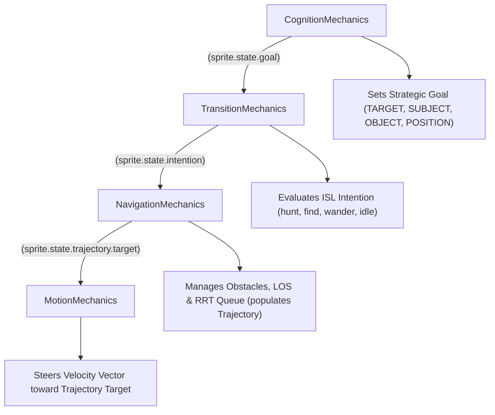

#### Bug Reports

##### Bug B010: FIFO Queue Inversion on Subsumed Path Goals

**STATUS**: OPEN

**SEVERITY**: CRITICAL

**Description**

When a Sprite initiates cross-layer pursuit, `CognitionMechanics._track()` subsumes the original overarching goal (e.g., `player`) into `sprite.state.memory.goals` and sets a prerequisite `OBJECT` goal (the transition door). When `_plan()` subsequent generates an RRT path to the door, `CognitionMechanics.path()` appends the new `path-*` waypoints to the existing `memory.goals` dictionary and re-appends the door goal.

Because Python dictionaries preserve insertion order, the previously subsumed parent goal (`player`) remains at index 0. On the subsequent engine tick in `idle`, `CognitionMechanics._remember()` inspects `memory.goals` and pops the entry at index 0. It pops `player` instead of `path-0`, completely bypassing the RRT waypoint sequence. The waypoints and door remain stranded in memory, and the engine resets into an infinite cycle of door re-acquisition and path regeneration.

**Steps to Replicate**

1. Place a Sprite on layer `brick-house-compose-layer` with an initial `SUBJECT` goal targeting `player` on layer `0`.
2. Allow `_track()` to detect layer mismatch, subsume `player` into `memory.goals`, and assign `door-strut-house-interior-1-1` as the active `OBJECT` goal.
3. Obstruct direct line-of-sight to the door to trigger `Planner.plan()`.
4. Observe the memory stack when transitioning to `idle`: `_remember()` pops `player` rather than `path-0`.

**Proposed Remediation**

In `CognitionMechanics.path()`, reconstruct `memory.goals` so the generated `path-*` waypoints and the active sub-goal precede existing background goals:

```python
new_goals = {}
for i, wp in enumerate(segments):
    name = settings.SEPARATOR.join([settings.RRT_PATH_PREFIX, str(i)])
    new_goals[name] = Goal(
        name=name,
        category=Goals.POSITION.value,
        layer=sprite.state.layer,
        position=Position(x=wp.x - offset_x, y=wp.y - offset_y)
    )
new_goals[sprite.state.goal.name] = sprite.state.goal
for k, v in sprite.state.memory.goals.items():
    if not str(k).startswith(settings.RRT_PATH_PREFIX) and k != sprite.state.goal.name:
        new_goals[k] = v
sprite.state.memory.goals = new_goals
sprite.state.goal = None
```

!!! note
    Superseded by Phase Realignment.

##### Bug B011: Spurious Waypoint Re-Planning via Fallthrough in `_track`

**STATUS**: OPEN

**SEVERITY**: HIGH

**Description**

In `CognitionMechanics._track()`, active RRT waypoints (`name.startswith(settings.RRT_PATH_PREFIX)`) execute an invalidation check: `if is_path and self._scrap(sprite, board): return`. When the path remains unobstructed, `_scrap()` returns `False`. Because there is no unconditional exit branch for active waypoints, execution falls through to the subsequent positional block:

```python
elif goal.category in [
    Goals.POSITION.value,
    Goals.OBJECT.value, 
    Goals.PROPERTY.value
]:
    sprite.state.mutators.triggers.vision = True
    self._plan(sprite, board)
```

Because waypoints are typed with `category=Goals.POSITION.value`, `self._plan()` executes every single frame on every waypoint during active navigation. This causes massive redundant spatial checks and risks premature path trashing.

**Steps to Replicate**

1. Allow an entity to begin traversing an RRT waypoint (`path-0`).
2. Retain a clear line-of-sight to `path-0`.
3. Observe engine execution in `_track()`: `_plan()` runs on every frame rather than yielding to motion integration.

**Proposed Remediation**

Enforce immediate return after invalidation processing when tracking an active path:

```python
prefix = settings.RRT_PATH_PREFIX
is_path = goal.name and goal.name.startswith(prefix)

if is_path:
    self._scrap(sprite, board)
    return
```

!!! note
    Superseded by Phase Realignment.

##### Bug B012: Hitbox Drift from Missing Anchor Offset in `CognitionMechanics.path`

**STATUS**: OPEN

**SEVERITY**: HIGH

**Description**

`Planner` generates waypoints in sensory anchor space (footprint center). In `CognitionMechanics.path()`, waypoints are committed to goals directly as `Goal(position=Position(x=wp.x, y=wp.y))`. When `motive.update()` and `physics.dynamics()` compute acceleration vectors, they evaluate distance against `sprite.state.position` (the top-left canvas origin). This steers the sprite's canvas origin to the anchor coordinate, shifting the physical collision hitbox by $+(\text{anchor}_x - \text{origin}_x, \text{anchor}_y - \text{origin}_y)$ away from the calculated collision-free trajectory. The entity drifts into adjacent obstacles while traversing waypoints.

**Steps to Replicate**

1. Execute an RRT route passing flush along a wall.
2. Inspect the sprite's hitbox coordinates in `physics.collisions` during motion.
3. Observe collision overlaps caused by the origin-anchor displacement.

**Proposed Remediation**

Subtract the entity's anchor displacement vector when constructing waypoint `Position` models in `CognitionMechanics.path()`:

```python
anchor = self.anchor(sprite)
offset_x = anchor.x - sprite.state.position.x
offset_y = anchor.y - sprite.state.position.y

for i, wp in enumerate(segments):
    name = settings.SEPARATOR.join([settings.RRT_PATH_PREFIX, str(i)])
    sprite.state.memory.goals[name] = Goal(
        name=name,
        category=Goals.POSITION.value,
        layer=sprite.state.layer,
        position=Position(x=int(wp.x - offset_x), y=int(wp.y - offset_y))
    )
```

!!! note
    Superseded by Phase Realignment.

#### Refactor: Phase 08.02: Path Execution & Recovery Finalization (CANCELLED)

!!! warning
    After an architectural review of the preceding bugs, this phase has been cancelled and superseded by what follows in the next section. It has been retained purely for record-keeping, to detail the thought process which led to the architectural shift discussed in the next section.

**Overview**

Finalize RRT integration by resolving FIFO memory queue ordering, eliminating redundant per-tick planning on active paths, offsetting waypoints by sensory anchors, and implementing unreachable target backoff to prevent automaton thrashing.

##### Goal: FIFO Memory Reordering

Ensure RRT waypoints and active sub-goals take immediate precedence over suspended background goals in `CognitionMechanics.path()`.

```python
new_goals = {wp_name: wp_goal, ..., sub_goal_name: sub_goal}
for k, v in sprite.state.memory.goals.items():
    if not str(k).startswith(settings.RRT_PATH_PREFIX) and k != sub_goal_name:
        new_goals[k] = v
sprite.state.memory.goals = new_goals
```

##### Goal: Pathfinding Failure Backoff

Prevent two-tick oscillation between `find` and `idle` when a path cannot be found by shelving unreachable goals with a cooldown interval.

```python
# In CognitionMechanics._plan():
if not path:
    CognitionMechanics.log_goal(sprite, verb="unreachable")
    sprite.state.memory.unreachable[sprite.state.goal.name] = (
        current_tick + settings.PATH_RETRY_INTERVAL
    )
    sprite.state.goal = None
```

##### Tasks

**1. Task: Waypoint FIFO Queue Rectification**

*Objective*: Prepend waypoints ahead of background goals during path injection.

* [!] Subtask: Refactor `CognitionMechanics.path()` to build a reconstructed dictionary where `path-*` waypoints and the current goal precede any existing entries in `memory.goals`.
* [!] Subtask: In `CognitionMechanics.path()`, compute anchor displacement `(anchor.x - sprite.state.position.x, anchor.y - sprite.state.position.y)` and subtract it from each waypoint coordinate.

**2. Task: Active Waypoint Dispatch Isolation**

*Objective*: Prevent per-tick re-planning on existing paths.

* [!] Subtask: Update `CognitionMechanics._track()` to return immediately after running `self._scrap()` when `is_path` evaluates to `True`.

**3. Task: Unreachable Target Backoff Mechanism**

*Objective*: Stabilize the automaton when targets or transition doors are unreachable.

* [!] Subtask: Add `unreachable: Optional[Dict[str, int]] = field(default_factory=dict)` to `Memory` in `src/app/models/state/sprites.py`.
* [!] Subtask: In `CognitionMechanics._remember()`, bypass candidate goals whose key exists in `sprite.state.memory.unreachable` if `current_tick < retry_tick`.
* [!] Subtask: In `CognitionMechanics._plan()`, when `planner.plan()` returns `[]`, record `current_tick + settings.PATH_RETRY_INTERVAL` into `memory.unreachable` before setting `sprite.state.goal = None`.

---

**User Note**: Stepping back, reviewing the complexity of CognitionMechanics and analyzing the underlying root cause of the bugs and woes...

---

#### Refactor: Phase 08.02 - NavigationMechanics

**Overview**

The architectural friction in `CognitionMechanics` stems from a category error: conflating **Strategic Intent** (what entity or location a Sprite desires to reach) with **Tactical Kinematics** (the intermediate coordinates traversed to steer around an obstacle).

Treating RRT waypoints as `POSITION` goals forces the engine to abuse `sprite.state.memory.goals` as a path queue, resulting in dictionary FIFO inversion during door subsumptions (Bug B010), spurious per-tick re-planning (Bug B011), and anchor-offset spatial drift (Bug B012). Worse, it forces `TransitionMechanics` into an artificial ping-pong loop (`hunt -> idle -> wander -> idle -> wander -> hunt`), repeatedly throwing the automaton into `wander` simply to step past a wall.

This phase extracts tactical steering into a dedicated `NavigationMechanics` and introduces `TrajectoryState`. `CognitionMechanics` retains sole authority over high-level `Goal` selection, while `NavigationMechanics` manages the spatial trajectory required to reach that goal. Sprites pursuing an entity remain continuously in their primary intention (`hunt`, `find`) while navigating around physical barriers.



##### Goal: Data Structure Changes

**1. Trajectory State Model (`src/app/models/state/sprites.py`)**

Introduce `TrajectoryState` to encapsulate active steering waypoints, isolating continuous geometric points from cognitive memories:

```python
@dataclass(slots=True)
class TrajectoryState:
    target: Optional[Position] = None
    vertices: List[Position] = field(default_factory=list)
    stalled: bool = False
    cooldown: int = 0

```

* `target`: The immediate physical coordinate `(x, y)` the kinematic/motive engine must steer toward on the current tick. If LOS to the strategic goal is clear, `target == sprite.state.goal.position`. If occluded, `target == vertices[0]`.
* `vertices`: The FIFO queue of intermediate RRT avoidance coordinates.
* `stalled`: Boolean flag set when RRT fails to resolve a valid route, notifying deliberative systems of an impassable obstruction.
* `cooldown`: Engine tick accumulator preventing thrashing re-evaluations against impassable geometries.

**2. SpriteState Integration (`src/app/models/state/sprites.py`)**

Inject `Trajectory` into `SpriteState`:

```python
@dataclass(slots=True)
class SpriteState(AssetState):
    # ... existing fields ...
    trajectory: Trajectory = field(default_factory=Trajectory)

```

**3. Strategic Memory Sanitation (`src/app/models/state/sprites.py`)**

`sprite.state.memory.goals` reverts to its intended role: an episodic store of true strategic entities (`Dict[str, Goal]`). All string-prefix conventions (`path-*`, `RRT_PATH_PREFIX`) are eliminated from memory storage.

##### Goal: Mechanical Responsibilities & Logic Changes

**1. `CognitionMechanics` (Strategic Deliberation)**

* **Retains**: `_resolve()`, `_scan()`, `_remember()`, `_ideate()`, `_motivate()`, `_track()`, and `_project()`.
* **Purges**: `_plan()`, `_scrap()`, `path()`, `anchor()`, and `obstacles()`.
* **Logic Changes**:
* In `_track()`: When tracking a same-layer entity (`TARGET`, `SUBJECT`), it simply writes `goal.position = target_state.position`. It performs no LOS checks and triggers no RRT routines.
* Cross-layer door subsumption remains in `_track()`: if `goal.layer != sprite.layer`, it pushes the parent goal to `memory.goals` and sets a prerequisite `OBJECT` goal for the door.
* In `_project()`: Evaluates only autonomous wander randomization (`name = "wander"`) when `not sprite.state.goal` and the Sprite is already in the `wander` Intention.
* In `_resolve()`: Evaluates only strategic completion (target dead, dialogue finished, door crossed). It is completely unaware of intermediate waypoint progress.

Strip tactical obstacle processing, geometric path generation, and waypoint tracking out of `CognitionMechanics`.

```python
# In CognitionMechanics._track():
# Simply maintain the coordinates of high-level goals.
if target_state and self.nearby(target_state.position, sprite.state.position, vision_radius):
    sprite.state.mutators.triggers.vision = True
    sprite.state.goal.position.x = target_state.position.x
    sprite.state.goal.position.y = target_state.position.y
```

**2. `NavigationMechanics` (Tactical Trajectory Planning)**

A new Mechanic executing in the `world` pipeline after `TransitionMechanics` and before `MotionMechanics`:

* **Execution Lifecycle**:
    1. **Goal Verification**: If `not sprite.state.goal` or `sprite.state.intention not in NavigationIntentions`, clear `sprite.state.trajectory` and return.
    2. **Anchor Computation**: Calculate physical sensory origins using `anchor(sprite)` and target footprint offsets.
    3. **Direct Line-of-Sight Check**: Raycast via Cython `geometry.los()` against `board.weights(layer)` and `board.perimeters`.
    4. **Path Maintenance**:
        * If LOS is **clear**: Clear `trajectory.waypoints`. Set `trajectory.target = sprite.state.goal.position`.
        * If LOS is **blocked**:
        * If `trajectory.waypoints` is empty: Extract hitboxes via `obstacles()`, execute `Planner.plan()`, and populate `trajectory.waypoints` with anchor-adjusted coordinates. Set `trajectory.target = trajectory.waypoints[0]`.
        * If `trajectory.waypoints` exists: Validate LOS to `trajectory.target`. If blocked by a dynamic asset (e.g., pushed crate), invalidate waypoints and replan.
    5. **Waypoint Arrival**: If `geometry.nearby(anchor, trajectory.target, arrival_radius)`:
        * Pop `trajectory.waypoints[0]`.
        * If waypoints remain, set `trajectory.target = trajectory.waypoints[0]`.
        * If waypoints are exhausted, set `trajectory.target = sprite.state.goal.position`.
    6. **Stall Handling**: If RRT fails to find a path, set `trajectory.stalled = True` and write an unreachable cooldown for the goal.

Construct the tactical navigation mechanic responsible for obstacle querying, line-of-sight validation, RRT dispatch, and trajectory target updating.

```python
# app/game/logic/mechanics/intentional/navigation.py
class NavigationMechanics(Mechanic):
    def update(self, board: Board, delta: float, bus: deque, payload: DevicePayload) -> None:
        for sprite in board.instances(AssetInstances.SPRITES.value):
            self._navigate(sprite, board)
```

**3. `MotionMechanics` & `AnimationMap` (Actuation Alignment)**

* In `motive.update()`: Steer velocity vectors toward `sprite.state.trajectory.target` instead of `sprite.state.goal.position`.
* In `AnimationMap.direction()`: Compute facing direction using the vector from `sprite.state.position` to `sprite.state.trajectory.target`.

Rebind motive acceleration and directional orientation to track `sprite.state.trajectory.target`.

```python
# In motive.update():
target_pos = sprite.state.trajectory.target or sprite.state.goal.position
physics.dynamics(
    sprite.state.velocity,
    sprite.state.position.x,
    sprite.state.position.y,
    target_pos.x,
    target_pos.y,
    sprite.state.character.speed,
    sprite.state.character.impulse,
    delta
)
```

##### Tasks

**1. Task: Trajectory State Definitions**

*Objective*: Implement models for intermediate steering and navigation buffers.

* [x] Subtask: Define `Trajectory` in `src/app/models/state/sprites.py` with `target`, `vertices`, `stalled`, and `cooldown` fields.
* [x] Subtask: Add `trajectory: Trajectory` to `SpriteState` and register the default factory.
* [ ] Subtask: Purge `RRT_PATH_PREFIX` references from `src/app/config/settings.py` and `src/app/models/state/sprites.py`.

**2. Task: NavigationMechanics Construction**

*Objective*: Build the tactical navigation subsystem.

* [x] Subtask: Create `src/app/game/logic/mechanics/intentional/navigation.py` implementing `NavigationMechanics`.
* [x] Subtask: Migrate `anchor()` and `obstacles()` from `CognitionMechanics` into `NavigationMechanics` (or `libs.core.math`).
* [x] Subtask: Implement waypoint progress resolution: when a sprite's footprint arrives within `action_radius` of `trajectory.target`, advance to the next waypoint or return to direct tracking.
* [x] Subtask: Implement dynamic path invalidation: if line-of-sight to the active intermediate waypoint becomes obstructed, clear waypoints and recalculate via `Planner`.
* [x] Subtask: Register `NavigationMechanics` in `src/data/config/mechanics/main.yaml` directly following `TransitionMechanics` and preceding `MotionMechanics`.

**3. Task: CognitionMechanics Purge & Realignment**

*Objective*: Restrict `CognitionMechanics` purely to high-level strategic reasoning.

* [x] Subtask: Delete `_plan()`, `_scrap()`, `path()`, `obstacles()`, and `anchor()` from `src/app/game/logic/mechanics/intentional/cognition.py`.
* [x] Subtask: Remove waypoint bypass logic and `name.startswith(settings.RRT_PATH_PREFIX)` filtering from `_track()`, `_ideate()`, `_project()`, and `_remember()`.
* [x] Subtask: Revert `_resolve()` to evaluate exclusively strategic completion (`dead`, `not dialogue`, `layer != goal.layer`).
* [x] Subtask: In `_track()`, update same-layer entity goals directly without checking line of sight.

**4. Task: Motive and Animation Redirection**

*Objective*: Ensure movement vectors and facing directions track tactical waypoints.

* [x] Subtask: Update `src/app/game/logic/mechanics/modules/motion/motive.py` to accelerate towards `sprite.state.trajectory.target` when present, falling back to `sprite.state.goal.position`.
* [x] Subtask: Update `TransitionMechanics` / `AnimationMap.direction()` in `src/app/game/logic/maps.py` to resolve facing angles from `sprite.state.trajectory.target`.

**5. Task: Cythonization**

*Objective*: Move intensive calculations across the Cython boundary.

* [!] Once the implementation is complete and passes user acceptence, migrate the RRT math in `app.game.logic.modules.paths.plan` to Cython. Devise the interfaces and leave the `app.game.logic.modules.path.plan` as a light wrapper around the interfaces that unpacks the game data for Cython.

**6. Task: Verification and Behavioral Regression Suite**

*Objective*: Verify pathfinding and intention stability across obstacles.

* [!: User Task] Subtask: Add unit tests in `tests/unit/test_app_game_logic_mechanics_intentional_navigation.py` validating trajectory generation, waypoint advancement, and dynamic replanning.
* [!: User Task] Subtask: Verify an NPC navigating around a wall to reach an enemy remains continuously in the `hunt` Intention without dropping into `idle` or `wander`.
* [!: User Task] Subtask: Verify cross-layer door subsumption operates without memory queue corruption when the door itself requires pathfinding avoidance.

##### Goal: Cython Migration

**1. Architectural Scope & Boundary Layout**

The current Python implementation (`app.game.logic.modules.paths.plan`) incurs heavy overhead in its inner loop due to:

* Per-iteration Python heap allocations (`Node` instances, `Position` models).
* Repeated dynamic dispatch and attribute lookups (`node.x`, `node.parent`).
* Unpacking Python tuples and calling Python functions during obstacle collision checks (`geometry.los` iterating over Python `tuple` obstacles).
* Python-level trigonometric and distance math (`math.atan2`, `math.cos`, `math.sin`, `math.hypot`).

The core algorithm will move to `src/libs/core/math/paths.pyx`, exposing a fast C-level procedure, while `app.game.logic.modules.paths.plan` remains a lightweight Python wrapper that unpacks engine objects and delegates to the Cython binary.

```
src/
├── libs/
│   └── core/
│       └── math/
│           ├── geometry.pxd        # Expose C-level bisects to avoid Python tuple unpacking
│           ├── paths.pxd           # C-declarations for RRT structs and routines
│           └── paths.pyx           # Cython RRT implementation (contiguous C memory)
└── app/
    └── game/
        └── logic/
            └── modules/
                └── paths/
                    └── plan.py     # Thin Python wrapper retaining existing Planner interface

```

**2. C Data Structures & Memory Strategy**

To satisfy the **"Zero Heap Allocation in the Inner Loop"** constraint:

```c
typedef struct {
    float x;
    float y;
    int parent_idx; // Array index of parent node; eliminates object pointer overhead
} RRTNode;

typedef struct {
    float x;
    float y;
    float w;
    float l;
} RRTObstacle;

```

* **Node Buffer**: Pre-allocated contiguous block via `malloc(sizeof(RRTNode) * (max_iter + 2))`. Released via `free()` in a `try...finally` block.
* **Obstacle Buffer**: Ingest incoming obstacle list once at entry into a stack-allocated or `malloc`'d contiguous `RRTObstacle*` array. Obstacle queries in the inner loop then iterate over raw C-memory with zero Python object lookups.
* **Collision Checking**: Call a C-level inline `c_bisects` function directly (sharing logic with `libs.core.math.geometry`), bypassing Python tuple unpacking during ray-box evaluations.
* **Math & Sampling**: Use `libc.math` (`atan2f`, `cosf`, `sinf`, `hypotf`) and `libc.stdlib.rand` for 2D sampling within pre-calculated bounding limits.
* **Backtracing**: Traverse `parent_idx` backwards from target to start, instantiating Python `Position` models only once when building the final path list.

##### Tasks

**1: Expose C-Level Segment Intersection in `geometry`**

*Objective*: Allow `paths.pyx` to call line-of-sight collision checks directly without Python wrapper overhead.

* [ ] Subtask 1.1: Create `src/libs/core/math/geometry.pxd` exposing `cdef bint c_bisects(float x1, float y1, float x2, float y2, float rx, float ry, float rw, float rl) nogil`.
* [ ] Subtask 1.2: Refactor `bisects` in `src/libs/core/math/geometry.pyx` to delegate to `c_bisects`.

**Task 2: Implement Cython RRT Engine (`libs.core.math.paths`)**

*Objective*: Build the standalone, zero-allocation C-level RRT solver.

* [ ] Subtask 2.1: Define `RRTNode` and `RRTObstacle` structs in `src/libs/core/math/paths.pxd`.
* [ ] Subtask 2.2: Implement `cpdef list rrt(float sx, float sy, float tx, float ty, list obstacles, float step_size, int max_iter)` in `src/libs/core/math/paths.pyx`.
* [ ] Subtask 2.3: Ingest `obstacles` into a flat `RRTObstacle*` buffer at entry and free on exit.
* [ ] Subtask 2.4: Implement C-level nearest-neighbor search, 5% goal-biased sampling, and trigonometric node steering using `libc.math` and `libc.stdlib.rand`.
* [ ] Subtask 2.5: Implement parent index backtracing to return `List[Position]`.

**Task 3: Build & Extension Registration**

*Objective*: Integrate the new Cython extension into the build pipeline.

* [x] Subtask 3.1: Register `libs.core.math.paths` in `setup.py` and `setup.cicd.py`.
* [!: User Task] Subtask 3.2: Verify clean compilation via `python setup.py build_ext --inplace`.

**Task 4: Rebind `Planner` Interface in Python**

*Objective*: Retain API compatibility while delegating all work to Cython.

* [ ] Subtask 4.1: Refactor `app/game/logic/modules/paths/plan.py` to import `libs.core.math.paths.rrt`.
* [ ] Subtask 4.2: Preserve `Planner(start, target, obstacles, step_size, max_iter).plan()` as a thin wrapper unpacking `Position` coordinates and delegating to `rrt()`.
* [ ] Subtask 4.3: Deprecate Python `Node` class in `plan.py`.

##### Task 5: Algorithmic Verification & Regression

*Objective*: Verify path generation correctness and performance.

* [!] Subtask 5.1: Execute `tests/algorithms/rrt.py` to ensure convergence, collision clearance, and return formats remain identical.
* [!] Subtask 5.2: Verify integration through `tests/unit/test_app_game_logic_modules_paths.py` (or existing path test suite).