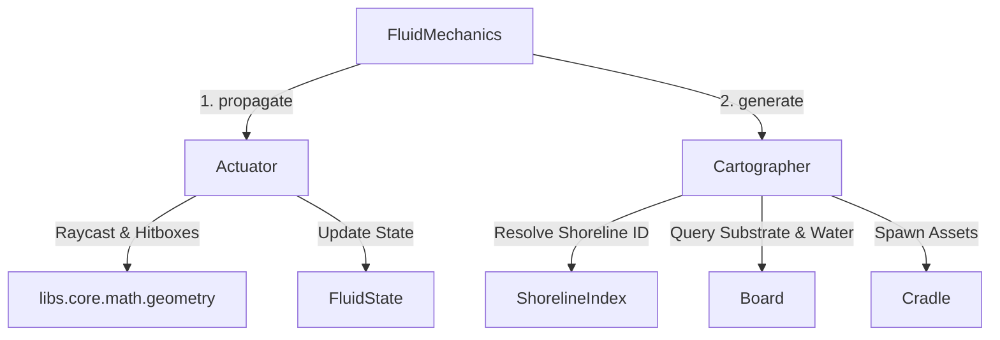
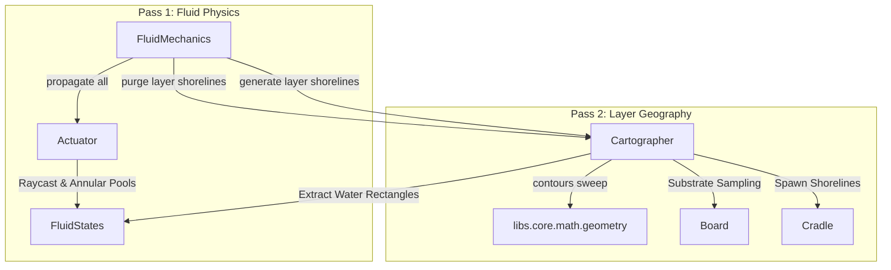

#### Refactor: Phase 09.03 - Fluid Consolidation

**Overview**

Refactor the fluid generation pipeline by decoupling shoreline synthesis from `Actuator` into a standalone, stateless `Cartographer` service. Unify environmental water checks on `Board`, eliminate the crate-fluid infinite invalidation loop by restricting fluid obstacles strictly to immovable static bodies ($m = 0$), and resolve endpoint and cross-fluid shoreline rendering regressions via a coordinated two-pass propagation lifecycle.

---

##### Bug Reports

###### Bug B011: Crate-Fluid Interaction Crash Loop 

**STATUS**: OPEN
**SEVERITY**: CRITICAL

**Description**

The introduction of Fluid fields has caused the Crate obstruction to fail. When a Crate enters a Fluid field, the fluid pooling and velocity addition interact and cause the game to enter into an unsustainable crash loop where the fluid pushes the Crate and then redraws the pool around the Crate.

**Steps to Replicate** 

Place Crate into the path of a Fluid stream.

**Root Cause**

`Actuator._collect_obstacles` ingests `board.weights(layer)` (all assets with $m \ge 0$) and `board.obstacles(layer)` (which includes `Crates`). Because a Crate has dynamic mass ($m = 5$ or $100$), it halts the raycast. The Actuator places a pool around the Crate. On the next tick, `MotionMechanics` (`fields.py`) applies fluid velocity to the Crate. In `FluidMechanics`, any velocity change on a crate (`|vx| > 0` or `|vy| > 0`) marks the fluid as `dirty`, causing per-frame raycasting and pool recalculations.

**Proposed Remeditation**

In accordance with the physics specification, **only static, immovable bodies ($m = 0$) block fluid flow.** Dynamic bodies ($m > 0$) must be excluded from fluid raycast obstacles. Furthermore, `FluidMechanics.update()` must cease monitoring crate velocities for fluid dirtying; only switchable static barriers (e.g., `Gates`) invalidate fluid propagation.

###### Bug B012: Shorelines Not Rendering at Endpoints 

**STATUS**: OPEN
**SEVERITY**: MEDIUM

**Description**

The source Asset dimensions of a Fluid are not receiving Shorelines, i.e. the very first frame in a stream of Fluid has no Shorelines.

**Steps To Repicate**

See [Latest State Dump](#latest-state-dump) for reproduction.

**Root Cause**

Two distinct issues cause missing endpoint shorelines:

1. `Actuator._extract_flank_descriptors` only generates side flanks (West/East for vertical streams, North/South for horizontal streams). It completely omits the distal or source cap (e.g., North margin at `fy` for a `DOWN` stream), leaving emitter origins bare.
2. In `_detect_flank_occlusions`, the boundary sweep algorithm evaluates the probe area (`probe_x, probe_y, probe_w, probe_l`) against outer perimeter hulls. At map bounds (`fy = 0`), the 32px probe box intersects the 1px boundary line, causing the entire first tile (`y = 0..32`) to be falsely discarded as "occluded."

**Proposed Remediation**

Add source cap descriptors in the flank extraction routine when bounded by land. Refine flank occlusion validation so that orthogonal perimeter hulls do not disqualify valid parallel shoreline margins.

###### Bug B013: Shoreline Cross Fluid Interactions

**STATUS**: OPEN
**SEVERITY**: HIGH

**Description**

When Fluid streams cross into the pool of another Fluid, they are generating Shoreline assets within the Pool, creating a disjointed look. For example, a `source = left` Fluid when crossing into a `source = down` Pool leaves a trail of Shorelines within the area of the Pool.

**Steps To Replicate**

See [Latest State Dump](#latest-state-dump) for reproduction.

**Root Cause**

1. `pump()` is executed per-fluid. When Fluid A flows into Fluid B's pool, Fluid A's shorelines are placed before Fluid B's pool is computed, or Fluid B's shorelines run across Fluid A's stream entrance.
2. The cleanup routine checks submersion by probing a single point `(pos.x + 16, pos.y + 16)`. For a coalesced shoreline of length 480px, checking only the origin tile fails to detect that intermediate tiles are submerged under an overlapping pool.

**Proposed Remediation**

1. Move `water` onto `Board` with an optional `exclude` argument.
2. In `FluidMechanics`, adopt a **two-pass execution pattern** across dirty layers:
    * **Pass 1 (Propagation)**: Update all dirty fluids' lengths, pools, and hitboxes via `Actuator.propagate()`.
    * **Pass 2 (Shorelines)**: Generate shorelines across the updated fluids using `Cartographer.generate()`. Because all fluid pools and streams are already registered on the board, `board.water()` accurately suppresses shorelines at every water-to-water junction.

###### Bug B014: Single-Point Shoreline Submersion Culling

**STATUS**: OPEN
**SEVERITY**: HIGH

**Description**

`Actuator.pump()` attempts to clean up existing shorelines submerged by expanding pools using `scx = s.state.position.x + 16` and `scy = s.state.position.y + 16`. Because procedural shorelines are coalesced into continuous strips up to several hundred pixels in length, evaluating only the origin tile causes long shorelines to bypass submersion checks when overlapping pools cover downstream sections. Conversely, if the origin tile is submerged, the entire multi-tile shoreline is purged even if the remainder borders dry land.

**Steps to Replicate**

1. Spawn a fluid with a continuous horizontal or vertical stream length $\ge 192\text{px}$.
2. Introduce an intersecting fluid or pool overlapping the midpoint of the stream.
3. Observe that the original shoreline is either entirely removed or completely preserved across the water intersection.

**Proposed Remediation**

Deprecate the single-point `cull_submerged` routine. Defer shoreline synthesis until all layer fluid propagation has completed (Two-Pass update). During shoreline generation, `Cartographer` samples `board.water()` at each discrete tile step, preventing submerged segments from ever being generated or coalesced.

---

##### Latest State Dump

###### Initial Conditions

**Properties**

```yaml
effects:
  fluids:
    # -------------------------------------------------------
    waterflow-00:
      dimensions:
        w: 32
        l: 32
      lifecycle: 
        type: continuous
        delay: 60
      count: 3
      hitboxes: null
      mass: 0
    # -------------------------------------------------------
    waterflow-01:
      dimensions:
        w: 32
        l: 96
      lifecycle:
        type: continuous
        delay: 20
      count: 5
      hitboxes: null
      mass: 0
geography:
  shorelines:
    grassy-shore:
      tile: grass
      fluid: waterflow-00
      dimensions: 
        w: 32
        l: 32
      thickness: 10
      mass: -1
      hitboxes: null
```

**State**

```yaml
effects:
  fluids:
    - id: waterflow-00
      name: jasilynns-tears-00
      layer: '0'
      position:
        x: 70
        y: 0
      flow: 2
      source: down
    - id: waterflow-00
      name: jasilynns-tears-01
      layer: '0'
      position:
        x: 600
        y: 600
      source: left
    - id: waterflow-00
      name: jasilynns-tears-02
      layer: '0'
      flow: 4
      position:
        x: 632
        y: 0
      source: down
```

###### Results

**Application Logs**

*Omitted after bug identified for brevity.*

**State Dump**

*Omitted after bug identified for brevity.*

##### Architectural Analysis

Currently, `Actuator.pump()` attempts to:

1. Collect spatial obstacles and boundaries along the stream propagation vector.
2. Truncate the stream path via 2D raycasting.
3. Compute dynamic pooling geometry and partition hitboxes around impacted bodies.
4. Trace stream and pool perimeters to derive directional flank descriptors.
5. Sample bordering substrate terrain tiles from `Board`.
6. Query secondary relational indices (`ShorelineIndex`) to resolve asset bindings.
7. Coalesce contiguous cell segments and spawn `Shoreline` entities via `Cradle`.
8. Enforce shoreline cleanup and submerged margin culling.

This tight coupling creates severe architectural friction:

* **Embedded Terrain Queries**: Spatial queries like `_water()` and `_water_excluding()` query `board.instances(AssetInstances.FLUIDS.value, layer)` directly inside the actuator. The `Board` is the game's centralized database; environmental queries belong on `Board`, accessible to any mechanic or service without duplicating lookup algorithms.
* **Stateful Leakage in a Generator**: The `Actuator` retains a reference to `ShorelineIndex` and mutates `Board` entities directly (`board.add()`, `board.remove()`), while also altering `FluidState`. Generator services in Ontology should remain stateless calculators that return pure geometric or entity specifications rather than orchestrating multi-entity world mutations.
* **Inter-Fluid Order Dependencies (Bug B013)**: Because shoreline generation is coupled directly inside single-fluid `pump()` execution, each fluid emitter generates and cleans up shorelines in isolation. When multiple fluids cross or meet (e.g., a lateral stream entering a vertical pool), neither fluid has complete visibility over the resolved water boundaries of the other, resulting in disjointed shorelines inside pooled areas.
* **Coupling Dynamic Masses to Fluid Raycasts (Bug B011)**: Treating dynamic objects ($m > 0$, such as `Crates`) as stream-blocking obstacles triggers an infinite feedback loop: fluid hits crate $\to$ creates pool $\to$ imparts velocity $\to$ crate moves $\to$ fluid marks dirty $\to$ stream recalculates $\to$ loop repeats.

###### Dependency & Decomposition Analysis



1. **Fluid Generation is a Prerequisite for Shoreline Generation**:
A shoreline is an environmental boundary asset. It has no physical or visual identity without an established, stationary water margin. Therefore, **fluid propagation must be fully resolved before shorelines can be computed.**
2. **The Actuator Interface Must Be Segregated**:
    * `Actuator.propagate(fluid: Asset, board: Board)`: Evaluates raycast truncation against immovable environmental occluders ($m = 0$), derives annular pooling bounds, and constructs stream/pool hitboxes.
    * `Cartographer.generate(fluid: Asset, board: Board, index: ShorelineIndex)`: A static, stateless service that reads resolved fluid bounds and generates the corresponding `Shoreline` entities.
    * `Actuator.pump(fluid: Asset, board: Board)`: Maintained as a convenience interface that chains propagation and shoreline generation for isolated updates and test harnesses.

##### Goal: Board Environmental Water Query Unification

Migrate `water()` from `Actuator` to `Board` and eliminate `water_excluding()`. Provide an $O(N)$ spatial query on `Board` that evaluates whether a given Cartesian coordinate falls within any active fluid corridor or pool on a layer, with an optional fluid entity exclusion parameter.

```python
# app/game/board.py
def water(
    self,
    layer: str,
    position: Position,
    exclude: Optional[str] = None
) -> bool:
    """
    Evaluates whether world coordinate (pos.x, pos.y) intersects any active
    fluid stream corridor or annular pool on the given layer.
    """
    fluids = self.instances(AssetInstances.FLUIDS.value, layer)
    for fluid in fluids:
        if exclude and fluid.name == exclude:
            continue
        # Evaluate pool bounds
        pool = fluid.state.pool
        if pool and pool.x <= position.x < pool.x + pool.w and pool.y <= position.y < pool.y + pool.l:
            return True
        # Evaluate directional stream corridor bounds
        if fluid.state.length > 0:
            if self._in_stream(position, fluid):
                return True
    return False

```

##### Goal: Decoupled Stateless Cartographer Service

Extract all shoreline extraction, flank descriptor generation, substrate sampling, contiguous coalescing, and sensor hitbox calculation out of `Actuator` into `Cartographer`. The service remains purely stateless and accepts explicit `Board`, `Fluid`, and `ShorelineIndex` dependencies on execution.

```python
# app/services/generators/game/shoreline.py
class Cartographer:
    """
    Stateless geometric generator for environmental shoreline margins.
    """
    @classmethod
    def generate(
        cls,
        fluid: Asset,
        board: Board,
        index: ShorelineIndex
    ) -> List[Asset]:
        descriptors = cls._extract_descriptors(fluid)
        return cls._coalesce_segments(descriptors, fluid, board, index)

    @classmethod
    def purge(cls, fluid: Asset, board: Board) -> None:
        if not fluid.state.shorelines:
            return
        removals = [board.asset(name, fluid.state.layer) for name in fluid.state.shorelines]
        board.remove([s for s in removals if s is not None])
        fluid.state.shorelines.clear()

```

##### Goal: Actuator Refactoring & Multi-Pass Interface

Refactor `Actuator` to focus strictly on fluid dynamics (stream raycasting, pool expansion, and compound hitbox construction). Expose `propagate()` for pure fluid calculations, `generate_shorelines()` for shoreline delegation, and maintain `pump()` as a unified wrapper.

```python
# app/services/generators/game/actuator.py
class Actuator:
    def propagate(self, fluid: Asset, board: Board) -> Tuple[int, Optional[Pool], List[Hitbox]]:
        # Raycast against m == 0 obstacles and map boundaries
        # Calculate annular pool if obstacle struck
        # Update FluidState length, pool, hitboxes, dirty
        ...

    def generate_shorelines(self, fluid: Asset, board: Board) -> List[Asset]:
        Cartographer.purge(fluid, board)
        if not self.shorelines:
            return []
        shores = Cartographer.generate(fluid, board, self.shorelines)
        board.add(shores)
        fluid.state.shorelines = [s.name for s in shores]
        return shores

    def pump(self, fluid: Asset, board: Board) -> Tuple[int, Optional[Pool], List[Hitbox]]:
        self.propagate(fluid, board)
        self.generate_shorelines(fluid, board)
        return fluid.state.length, fluid.state.pool, fluid.state.hitboxes

```

##### Goal: Two-Pass Fluid Execution & Dynamic Obstacle Resolution

Update `FluidMechanics` to enforce the physics rule that dynamic bodies ($m > 0$) do not obstruct fluids, resolving Bug B011. Structure layer updates into a two-pass pipeline (Pass 1: Propagate all dirty fluids; Pass 2: Generate shorelines for all dirty fluids), ensuring cross-fluid interactions (Bug B013) evaluate against settled water bodies.

##### Tasks

**1. Task: Unify Water Query Interface on Board**

*Objective*: Implement `Board.water()` with optional fluid entity exclusion and remove `_water` / `_water_excluding` from `Actuator`.

* [x] Subtask: Add `water(layer, position, exclude=None)` method to `Board` in `src/app/game/board.py`.
* [x] Subtask: Implement stream bounding box intersection helper `_in_stream(position, fluid)` in `Board`.
* [x] Subtask: Update unit tests for `Board` to verify coordinate intersection across pools and streams with exclusion filtering.

**2. Task: Restrict Fluid Occlusion to Immovable Assets (Fix B011)**

*Objective*: Prevent dynamic bodies from blocking fluid streams and remove crate-based invalidation loops.

* [x] Subtask: Modify `Actuator._collect_obstacles` to filter candidates strictly by `asset.properties.mass == 0`.
* [x] Subtask: Remove `crates` traversal and `_crate_positions` invalidation logic from `FluidMechanics.update()`.
* [x] Subtask: Verify gate state transitions remain the sole dynamic trigger for layer fluid invalidation.

**3. Task: Extract Stateless Cartographer Service**

*Objective*: Decouple all shoreline derivation and instantiation logic out of `Actuator` into a standalone service.

* [~] Subtask: Create `src/app/services/generators/game/cartographer.py` with class `Cartographer`.
* [x] Subtask: Move flank descriptor extraction, hitbox synthesis, substrate validation, and segment coalescing from `Actuator` to `Cartographer`.
* [x] Subtask: Implement `Cartographer.purge(fluid, board)` to centralize previous child shoreline disposal.
* [x] Subtask: Implement `Cartographer.generate(fluid, board, index)` returning spawned `Asset` lists without directly mutating `board`.

**4. Task: Fix Endpoint and Flank Boundary Occlusions (Fix B012)**

*Objective*: Ensure source asset dimensions and boundary-adjacent corridors generate complete shorelines.

* [x] Subtask: Add source cap descriptors in `Cartographer._extract_descriptors` for emitter origin margins bordered by land.
* [x] Subtask: Adjust `_detect_flank_occlusions` to prevent perpendicular 1px map perimeters from disqualifying parallel shoreline margins.
* [!: Conditional on User Acceptance] Subtask: Add regression unit tests verifying shorelines generate at `c = 0` for border emitters.

**5. Task: Implement Two-Pass Layer Updates in FluidMechanics (Fix B013)**

*Objective*: Resolve cross-fluid shoreline overlapping by decoupling fluid propagation from shoreline generation.

* [x] Subtask: Refactor `Actuator` to expose `propagate()` and `generate_shorelines()`.
* [x] Subtask: Update `FluidMechanics.update()` to execute Pass 1 (`propagate`) across all dirty layer fluids before executing Pass 2 (`generate_shorelines`).
* [x] Subtask: Eliminate single-point `cull_submerged` checks in favor of Pass 2 evaluation against `board.water()`.

##### User Review

###### Bug: Erratic Crate Behavior

Crates now behave better, but still have a few bugs. When pushing a crate into a fluid stream, it goes haywire and flies across screen. I suspect what is going on is: Crate still has velocity orthogonal to the stream flow so the addition of field velocity causes Crate to go off course. 

It seems as though what should occur is: when Crates (or other frictive Assets) enter into a stream field, their velocity is immediately snapped to the direction of the stream flow. All friction calculations should be suspended while the Crate is "floating".

##### Bug: Erratic Shoreline Behavior

Shorelines where Fluid streams meet separate Fluid streams are still being generated inside of the annular pool where the impinging stream intersects the pool. However, curiously, when the Player intersects a Switch to open a Gate, the shorelines along the intersection disappear. 

##### Root Cause Analysis

###### 1. Erratic Crate Behavior

* **Friction Calculation**: In `frictive.py`, the engine was calculating ground tile friction decay on floating crates. When floating in fluid, friction should be suspended entirely so the body drifts with the current rather than decelerating against the underlying terrain.
* **Per-Frame Velocity Accumulation**: In `fields.py`, direct immersion added fluid velocity vectorally via accumulation (`asset.state.velocity.vx += flow_vx`). Unlike kinematic assets (which clamp or overwrite velocity from user input every frame), frictive bodies persist velocity frame-to-frame. Accumulating `flow_vx` and `flow_vy` on every tick caused crate velocity to accelerate exponentially to thousands of pixels per second while retaining previous orthogonal momentum.
* **Remediation**:
1. In `frictive.py`, check `board.water(asset.state.layer, center_pos)` and bypass friction decay while floating.
2. In `fields.py`, directly snap frictive assets (`AssetInstances.CRATES.value`) to the stream velocity vector (`vx = flow_vx`, `vy = flow_vy`) instead of accumulating.

###### 2. Erratic Shoreline Behavior

* **Sequential Startup Hydration**: During bootstrapping and state hydration, `Actuator.pump()` was called iteratively on each fluid emitter in isolation. When Fluid 0 (`jasilynns-tears-00`) was pumped, Fluid 1 (`jasilynns-tears-01`) had not yet propagated, so Fluid 0 generated shorelines across the perimeter of its pool where Fluid 1 enters. When Fluid 1 subsequently propagated into Fluid 0's pool, Fluid 0's existing shorelines were not purged or re-evaluated.
* **Delayed Two-Pass Trigger in `FluidMechanics**`: `FluidMechanics.update()` previously only flagged fluids as dirty when a gate switch changed (`prev_switch is not None and prev_switch != curr_switch`). Because hydration marked fluids clean (`dirty = False`), the coordinated Two-Pass layer update never executed on frame 1. When the player stepped on a plate to open a gate, `FluidMechanics` invalidated the layer and ran the Two-Pass update for all layer fluids, which correctly purged and suppressed the intersecting shorelines.
* **Single-Corner Probe Sampling**: In `Cartographer._coalesce_segments`, the boundary check sampled only the top-left index point `Position(c, probe_coord)`. Because fluid emitters can reside at fractional offsets (e.g., $x = 70$), testing $c = 64$ checked a point just outside the stream corridor, failing to detect water-to-water junctions.
* **Remediation**:
1. Refactor `Actuator.pump(fluid, board)` to execute Pass 1 (`propagate`) followed by Pass 2 (`generate_shorelines`) across all fluids on that layer.
2. In `FluidMechanics.update()`, ensure that on the initial tick (`not self._initialized`), all layer fluids are marked dirty and run through the Two-Pass update.
3. In `Cartographer`, implement `_is_step_water` to sample the active step interval across its midpoint and boundaries, preventing coordinate misalignment from bypassing water-to-water margin suppression.

##### User Review

All changes accepted and passing. Last remaining point before moving onto unit tests. 

###### Crate Submersion (-> Arbitrary Asset Submersion)

Currently, only Sprites have the submersion Channel directive applied to them. To achieve the effect of submersion in Fluid, SpriteFrame uses a Channel directive conditional on its `mutator` state field,

The Screen then uses the Channel to call the Cython SDL interface.

**NOTE**: The Screen is unaware the Channel came from a Sprite Asset.

Mutators are currently specific to Sprites,

Objects do not have Mutators.

I believe the most architecturally sound course of action is make Mutators are core Asset state attribute available on all instances of Assets and shift the logic for submersion that currently resides SpriteFrame to the base Frame class.

Analyze this proposal. Propose a sequence of tasks to achieve this functionality. Use the [Template: Backlog](#template-backlog).

##### Analysis

Promoting `mutators` to `AssetState` and shifting `ChannelTypes.SUBMERGE` derivation to `Frame.channels()` is architecturally sound:

1. **ECS Consistency**: In Ontology, behavioral distinction is driven by injected components, while common physical/environmental states reside on the base model. Submersion is an environmental condition governed by spatial mechanics (`fields.py`), not a Sprite-exclusive cognitive state.
2. **Elimination of Instance-Gated Logic**: Currently, `fields.py` explicitly gates submersion assignment behind `if asset.instance in (PLAYERS, SPRITES)`. Moving `mutators` to `AssetState` allows `fields.py` to toggle `asset.state.mutators.triggers.submerged` across all active entities (Crates, Sprites, Players) without duck typing or instance whitelisting.
3. **DRY Rendering Directives**: `SpriteFrame` is currently the only frame calculating submerge channel offsets. Because submersion splits an asset's height at $l/2$ using `properties.dimensions.l`, placing this logic directly in `Frame.channels()` provides universal submersion rendering across all frame types (`SingleFrame`, `IterableFrame`, `SpriteFrame`) without code duplication.
4. **Structural Segregation**: While `MutatorTriggers` (e.g., `submerged`, `animated`, `dead`) applies universally to all assets, `MutatorParameters` (e.g., `fear`, `vision`, `squeeze`) contains AI-specific sensory radiuses. Retaining `parameters: Optional[MutatorParameters] = None` on `Mutators` ensures the base footprint remains minimal for non-cognitive entities like Crates.

---

#### Refactor: Phase 09.03.01 - Unified Asset Mutators & Submersion Channel

**Overview**

Elevate `mutators` from `SpriteState` to the foundational `AssetState` model, providing universal environmental status tracking across all physical entities. Migrate procedural submersion channel generation from `SpriteFrame` to the base `Frame` class, and update `fields.py` to evaluate submersion triggers and splash particle emissions uniformly across all dynamic and frictive bodies.

##### Goal: Universal Mutator State Promotion

Relocate `MutatorTriggers` and `Mutators` to the core state definitions. Add `mutators: Mutators = field(default_factory=Mutators)` to `AssetState` so that every deployed entity inherits state-level trigger flags with `submerged = False` by default.

```python
# app/models/state/core.py
@dataclass(slots=True)
class MutatorTriggers:
    animated: bool = False
    frightened: bool = False
    dead: bool = False
    vision: bool = False
    submerged: bool = False

@dataclass(slots=True)
class Mutators:
    triggers: MutatorTriggers = field(default_factory=MutatorTriggers)
    parameters: Optional[Any] = None

@dataclass(slots=True)
class AssetState:
    id: str
    name: Optional[str] = None
    layer: Optional[str] = None
    depth: int = 0
    height: Optional[Union[int, str]] = None
    mutators: Mutators = field(default_factory=Mutators)

```

##### Goal: Base Frame Submersion Channels

Implement default channel emission in `Frame.channels()`. If `state.mutators.triggers.submerged` is active, calculate the horizontal half-length split ($l / 2$) from `properties.dimensions.l` and emit `(ChannelTypes.SUBMERGE.value, (half_l, 40, 110, 180, 170))`. Derived frames (such as `SpriteFrame`) call `super().channels()` and append their own specialized channel directives.

```python
# app/assets/base.py
class Frame(ABC):
    def channels(self, 
        id: str, 
        state: AssetState, 
        properties: AssetProperties
    ) -> List[Tuple]:
        directives = []
        if getattr(state, "mutators", None) and state.mutators.triggers.submerged:
            if hasattr(properties, "dimensions") and properties.dimensions:
                half_l = properties.dimensions.l // 2
                directives.append((
                    ChannelTypes.SUBMERGE.value,
                    (half_l, 40, 110, 180, 170)
                ))
        return directives

```

##### Goal: Uniform Environmental Immersion Resolution

Refactor `app.game.logic.modules.motion.fields` to remove entity instance whitelisting on shoreline crossings and direct fluid immersion. All non-raft mutable assets (Crates, Sprites, Players) entering or exiting water toggle `asset.state.mutators.triggers.submerged` and spawn splash particles via `Cradle`.

##### Tasks

**1. Task: Promote Mutator Models to Core State**

*Objective*: Make `mutators` a standard field on `AssetState` and remove the redundant declaration from `SpriteState`.

* [x] Subtask: Move `MutatorTriggers` and `Mutators` definitions into `src/app/models/state/core.py`.
* [x] Subtask: Add `mutators: Mutators = field(default_factory=Mutators)` to `AssetState`.
* [x] Subtask: Remove overridden `mutators` field from `SpriteState` in `src/app/models/state/sprites.py`.

**2. Task: Implement Default Submersion in Base Frame**

*Objective*: Provide universal `SUBMERGE` channel emission on `Frame` for all inheriting frame strategies.

* [x] Subtask: Implement `channels()` on `Frame` in `src/app/assets/base.py` checking `state.mutators.triggers.submerged`.
* [x] Subtask: Refactor `SingleFrame`, `IterableFrame`, and `StateFrame` to inherit or delegate to `Frame.channels()`.
* [x] Subtask: Refactor `SpriteFrame.channels()` in `src/app/assets/frames/sprites.py` to call `super().channels()` and remove duplicated submersion slice logic.

**3. Task: Generalize Field Immersion and Splash Handling**

*Objective*: Apply shoreline ledge transitions, direct fluid immersion, and splash particle spawning across all mutable assets.

* [x] Subtask: Remove `AssetInstances.PLAYERS.value` and `AssetInstances.SPRITES.value` instance filters for `submerged` state updates in `src/app/game/logic/modules/motion/fields.py`.
* [x] Subtask: Ensure dynamic Crates crossing shorelines or entering fluids update `submerged = True` and emit splash particles via `board.cradle.spawn_passive`.
* [x] Subtask: Ensure exiting water clears `submerged = False` across all mutable assets.

##### User Review

Everything is mostly working to spec. However, a subtler bug was discovered during this round of User Acceptance testing. When there are two adjacent Fluid streams, the Shoreline around the overlapping Pools from the adjacent streams is not being rendered at all.

In addition, when the Player passes over an unrelated Gate, Shorelines are generated where the adjacent streams touch.

**Initial Conditions**

!!! note
  This was tried with `name = jasilynns-tears-01` such that `position.x = 101` with the same results.

```yaml
effects:
  fluids:
    - id: waterflow-00
      name: jasilynns-tears-00
      layer: '0'
      position:
        x: 70
        y: 0
      flow: 2
      source: down
    - id: waterflow-00
      name: jasilynns-tears-01
      layer: '0'
      position:
        x: 102
        y: 0
      flow: 2
      source: down
    - id: waterflow-00
      name: jasilynns-tears-02
      layer: '0'
      position:
        x: 600
        y: 600
      source: left
    - id: waterflow-00
      name: jasilynns-tears-03
      layer: '0'
      flow: 4
      position:
        x: 632
        y: 0
      source: down
```

**Application Logs**

*Omitted after bug identified for brevity*

**State Dump**

*Omitted after bug identified for brevity*

**Hypotheses**

- the `_is_step_water` function, due to its `exclude=fluid.name` parameter, suppresses shoreline generation for overlapping pools.  Both fluid streams, with identical pool dimensions, end up mutually excluding each other, resulting in no shoreline generation around either pool, mathematically explaining Bug 1.

**Notes**
 
- a core flaw: the shoreline logic is overly coupled to the individual Fluid instances. This leads to the mutual exclusion of shorelines at identical pool boundaries. Refactoring to decouple shoreline generation from individual fluids will resolve the core issue.
  - This will entail an analysis of where to place the Shoreline State, as this state is currently a "Virtual State" on the Fluid asset. **Thought**: It could reside on the Board, similarly to the plot state, except keyed by layer.
- shorelines represent where water on a layer meets land. They don't belong to individual fluids but arise from the overall water geography of the layer. This unified perspective simplifies the logic.
- The shoreline should be linked to a layer as a whole, no longer belonging to a single fluid. This architectural shift simplifies the logic and provides a clean separation.
- Possible Shoreline invariant formula: A shoreline exists at (x, y) with orientation O if and only if: the tile is water, the adjacent cell (in direction O) is not water, and this adjacent cell is valid land. This removes the mutual exclusion deadlock and ensures correct shoreline generation regardless of the water's origin. This is a core shift in design and will require careful planning.

**Task**: Put together Phase 09.03.03 to refactor the Fluid workflow around these bugs.

##### Architectural Analysis

The erratic shoreline behavior discovered during User Acceptance Testing stems from a foundational category error: **treating Shorelines as dependent child entities of individual `Fluid` emitters rather than as emergent, layer-scoped environmental geography.**

###### 1. Coincident Pool Mutual Exclusion Deadlock

When two adjacent streams (`jasilynns-tears-00` and `jasilynns-tears-01`) strike the same immovable obstacle (`jasilynns-rock` at `x=68, y=600`), both calculate an identical annular pool bounding box:

$$\text{Pool}_0 = \text{Pool}_1 = (x: 0, y: 512, w: 192, l: 224)$$

During shoreline generation in `Cartographer._coalesce_segments`:

```python
# 2. Skip if shoreline tile is submerged under an overlapping fluid (Fix B013)
if cls._is_step_water(board, layer, axis, c, step_len, center_fixed, exclude=fluid.name):
    commit_segment()
    c += step_len
    continue
```

1. `Cartographer.generate(tears-00)` evaluates its pool perimeter at `center_fixed = 528`. It queries `board.water(layer, pos, exclude="jasilynns-tears-00")`. Because `tears-01` occupies the identical pool bounds, `board.water` evaluates to `True`. `Cartographer` classifies every single perimeter cell of `tears-00` as submerged under `tears-01` and discards them.
2. `Cartographer.generate(tears-01)` evaluates its pool perimeter with `exclude="jasilynns-tears-01"`. Because `tears-00` occupies the identical pool bounds, `board.water` evaluates to `True`. `Cartographer` classifies every single perimeter cell of `tears-01` as submerged under `tears-00` and discards them.
3. **Result**: Both fluids mutually suppress each other's shorelines, resulting in zero shorelines around the entire pool.

###### 2. Startup Hydration vs. Gate Invalidation Desynchronization

The appearance of shorelines when a player steps on an unrelated gate plate occurs due to order-dependent state hydration:

1. **Hydration Phase**: The `Migrator` hydrates entities sequentially. When `tears-00` is hydrated and pumped, `tears-01` does not yet exist on the board. `tears-00` generates shorelines without seeing `tears-01`. When `tears-01` is later pumped, it sees `tears-00`'s established water corridor.
2. **Runtime Invalidation**: When the player steps on a switch, `FluidMechanics.update()` flags all fluids on layer `0` as `dirty`. It executes Pass 1 (`propagate`) followed by Pass 2 (`generate_shorelines`) for each fluid iteratively:
```python
for f in layer_fluids:
    self.actuator.generate_shorelines(f, board)
```

`Cartographer.purge(fluid, board)` only removes the shorelines associated with the active fluid instance (`fluid.state.shorelines`). Because shoreline synthesis is executed per-fluid rather than per-layer, cross-fluid boundary queries evaluate against partially updated intermediate states on `Board`.

###### Remediation: Layer-Wide Geography Synthesis

Shorelines represent the topological boundary where water meets dry substrate on a given layer. They have no physical or behavioral connection to individual fluid emitters.



1. **Decouple Shorelines from FluidState**:
  * Remove `shorelines: List[str]` from `FluidState`.
  * Remove `parent_fluid: str` from `ShorelineState`.
  * Shorelines become first-class geography entities indexed on `Board` solely by `layer`.
2. **Layer-Scoped Contour Sweep**:
  * Instead of running 150 lines of directional flank descriptor extraction per fluid, `Cartographer` collects all active stream corridors and pool bounds on the layer into a single collection of primitive AABB tuples: $\text{Rects}_{\text{water}} = \{ (x_1, y_1, x_2, y_2)_{\text{stream}}, (x_1, y_1, x_2, y_2)_{\text{pool}} \}$
  * Pass $\text{Rects}_{\text{water}}$ directly to `libs.core.math.geometry.contours()`.
  * The existing Cython Sweep-Line XOR algorithm dissolves all shared interior edges, merges coincident pools, eliminates stream-to-pool seams, and returns the exact outer mathematical perimeter of the layer's aggregate water mask.
3. **Stateless Substrate & Occlusion Evaluation**:
  * `Cartographer` samples the exterior normal of each exposed contour boundary against `board.tile(layer, coord)`.
  * `ShorelineIndex` resolves the matching `shoreline_id`.
  * Contiguous segments are coalesced and spawned into `board` in a single pass. Mutual exclusion deadlocks and order dependencies are eliminated.

##### Clarification: Where Shoreline State Lives

```mermaid
flowchart TD
    subgraph Board Database
        BD[Board]
        BD -->|Layer Metadata| PERIM[board.perimeters: Dict[str, List[Boundary]]]
        BD -->|Layer Metadata| SHORES[board.shorelines: Dict[str, List[Asset]]]
        BD -->|Global Assets| ASSETS[board._assets: List[Asset]]
    end

    subgraph Geography Assets
        ASSETS --> SHORE1[Asset: spawn-01]
        ASSETS --> SHORE2[Asset: spawn-02]
        SHORE1 --> SS1[state: ShorelineState]
        SHORE2 --> SS2[state: ShorelineState]
    end

    subgraph Mechanics & Generators
        FM[FluidMechanics] -->|Pass 2: purge & generate| CART[Cartographer]
        CART -->|Update| SHORES
        CART -->|board.add / board.remove| ASSETS
    end

```

**Layer-Level State: `board.shorelines` on `Board`**

The "virtual state" that previously lived on `fluid.state.shorelines` is migrated directly to `Board`, structured identically to `board.perimeters`:

```python
# app/game/board.py
class Board:
    # Public Layer Metadata
    perimeters: Dict[str, List[Boundary]]
    shorelines: Dict[str, List[Asset]]
```

* **Storage**: A layer-keyed collection on `Board` holding references to all active procedural shoreline `Asset` instances on that layer (`board.shorelines[layer] = [...]`).
* **Initialization**: `board._init_cache(layer)` initializes `self.shorelines[layer] = []`.
* **Database Synchronization**:
* `board.add(assets)`: Whenever an added asset has `instance == AssetInstances.SHORELINES.value`, it is registered into `self.shorelines[layer]` (in addition to `_assets` and `_cached_renderables`).
* `board.remove(assets)`: Automatically removes matching assets from `self.shorelines[layer]`.

---

##### Bug Reports

###### Bug B015: Coincident Pool Mutual Exclusion & Flank Desynchronization

**STATUS**: OPEN
**SEVERITY**: HIGH

**Description**

When two fluid streams form identical or overlapping annular pools against the same obstacle, `Cartographer._coalesce_segments` evaluates each fluid's pool margin against `board.water(exclude=fluid.name)`. Because each pool's margin falls within the other fluid's pool bounds, both fluids mutually exclude each other, suppressing shoreline generation entirely. Furthermore, because `Cartographer.purge` and `Cartographer.generate` operate per-fluid, sequential startup hydration leaves stale shoreline artifacts that mutate whenever a dynamic gate switch invalidates the layer.

**Steps to Replicate**

1. Define two fluid emitters (`jasilynns-tears-00` and `jasilynns-tears-01`) flowing in parallel along the same axis into a shared static obstacle ($m = 0$).
2. Boot the engine and inspect the pool boundaries. Observe that zero shorelines are generated along the shared pool perimeter.
3. Trigger a switch on an unrelated gate to invalidate the layer. Observe that shorelines appear and disappear along inter-stream boundaries.

**Proposed Remediation**

Deprecate per-fluid shoreline generation. Remove `shorelines` from `FluidState` and `parent_fluid` from `ShorelineState`. Implement layer-wide shoreline synthesis in `Cartographer.generate(layer, board, index)` using `libs.core.math.geometry.contours` to derive the outer boundary of the layer's aggregate water mask.

---

#### Refactor: Phase 09.03.03 - Layer-Wide Fluid Geography & Contour Shorelines

**Overview**

Decouple shoreline geography from individual fluid emitters by removing relational parent-child tracking from `FluidState` and `ShorelineState`. Promote layer shoreline tracking to a first-class metadata collection on `Board` (`board.shorelines`), and migrate `Cartographer` to layer-wide geometric contour sweeps using `libs.core.math.geometry.contours()`.

##### Goal: De-parenting Shoreline & Fluid State Models

Remove `shorelines: List[str]` from `FluidState` and `parent_fluid: Optional[str]` from `ShorelineState`. Individual shoreline segments retain `ShorelineState` as their concrete ECS state model, while parent-child tracking is eliminated.

```python
# app/models/state/effects.py
@dataclass(slots=True)
class FluidState(EffectState):
    height: Optional[int] = 0
    depth: int = -1
    length: int = 0
    pool: Optional[Pool] = None
    hitboxes: List[Hitbox] = field(default_factory=list)
    dirty: bool = True
    flow: int = 1
    source: Directions = Directions.DOWN.value

# app/models/state/geography.py
@dataclass(slots=True)
class ShorelineState(AssetState):
    height: Optional[Union[int, str]] = 0
    depth: int = 0
    position: Optional[Position] = None
    orientation: str = Directions.DOWN.value
    length: int = 0
    thickness: int = 8
    bidirectional: bool = True
    hitboxes: List[Hitbox] = field(default_factory=list)

```

##### Goal: Board Layer Shoreline Tracking

Add `board.shorelines: Dict[str, List[Asset]]` to `Board` to track active procedural shoreline geography by layer, analogous to `board.perimeters`.

```python
# app/game/board.py
class Board:
    perimeters: Dict[str, List[Boundary]]
    shorelines: Dict[str, List[Asset]]

    def _init_cache(self, layer: Optional[str] = None) -> None:
        ...
        self.perimeters[layer] = []
        self.shorelines[layer] = []

    def shorelines(self, layer: Optional[str] = None) -> List[Asset]:
        if layer is not None:
            return self.shorelines.get(layer, [])
        all_shores = []
        for l_shores in self.shorelines.values():
            all_shores.extend(l_shores)
        return all_shores

```

##### Goal: Layer-Wide Geometric Water Contour Synthesis

Refactor `Cartographer` to extract all layer water AABBs into `(min_x, min_y, max_x, max_y)` primitives, compute the outer boundary hull via `geometry.contours()`, evaluate bordering substrate tiles from `board.tile()`, and spawn coalesced `Shoreline` entities.

```python
# app/services/generators/game/cartographer.py
class Cartographer:
    @classmethod
    def purge(cls, layer: str, board: Board) -> None:
        shores = board.shorelines(layer)
        if shores:
            board.remove(list(shores))

    @classmethod
    def generate(
        cls,
        layer: str,
        board: Board,
        index: ShorelineIndex
    ) -> List[Asset]:
        water_rects = cls._collect_water_rectangles(layer, board)
        if not water_rects:
            return []
        boundaries = geometry.contours(water_rects)
        return cls._synthesize_margins(boundaries, layer, board, index)

```

##### Goal: Coordinated Two-Pass Layer Updates in FluidMechanics

Update `FluidMechanics.update()` to execute Pass 1 (`Actuator.propagate`) across all dirty layer fluids, followed by a single layer-level Pass 2 (`Cartographer.purge` and `Cartographer.generate`).

```python
# app/game/logic/mechanics/world/fluid.py
for layer in dirty_layers:
    layer_fluids = board.instances(AssetInstances.FLUIDS.value, layer)
    # Pass 1: Propagate fluid dynamics
    for f in layer_fluids:
        self.actuator.propagate(f, board)
    # Pass 2: Synthesize layer geography
    Cartographer.purge(layer, board)
    new_shores = Cartographer.generate(layer, board, self.shorelines)
    board.add(new_shores)
```

##### Tasks

**1. Task: Establish Layer Shoreline State on Board**

*Objective*: Add layer-scoped shoreline tracking to `Board` and update caching and mutation lifecycles.

* [x] Subtask: Add `shorelines: Dict[str, List[Asset]]` field to `Board` in `src/app/game/board.py`.
* [x] Subtask: Initialize `self.shorelines[layer] = []` in `Board._init_cache()`.
* [x] Subtask: Update `Board.add()` and `Board.remove()` to maintain `self.shorelines[layer]` alongside `_cached_instances`.
* [x] Subtask: Add `Board.shorelines(layer=None)` query interface.

**2. Task: De-parent Shoreline and Fluid State Models**

*Objective*: Remove `shorelines` from `FluidState` and `parent_fluid` from `ShorelineState` and `Cradle`.

* [x] Subtask: Remove `shorelines: List[str]` field from `FluidState` in `src/app/models/state/effects.py`.
* [x] Subtask: Remove `parent_fluid: Optional[str]` field from `ShorelineState` in `src/app/models/state/geography.py`.
* [x] Subtask: Remove `parent_fluid` parameter from `Cradle.spawn_shoreline` in `src/app/services/generators/game/cradle.py`.

**3. Task: Implement Layer-Wide Geometric Contour Generation in Cartographer**

*Objective*: Refactor `Cartographer` to extract layer water AABBs and derive unified shoreline boundaries using `geometry.contours()`.

* [x] Subtask: Implement `Cartographer._collect_water_rectangles(layer, board)` converting active streams and pools into `(min_x, min_y, max_x, max_y)` primitives.
* [x] Subtask: Implement `Cartographer.purge(layer, board)` using `board.shorelines(layer)`.
* [x] Subtask: Implement boundary orientation detection by probing outward normal coordinates against `board.water(layer, pos)`.
* [x] Subtask: Port 32px step sampling, substrate lookup (`board.tile`), occlusion checks (`_detect_flank_occlusions`), and contiguous segment coalescing to evaluate contour boundaries.
* [x] Subtask: Refactor `Cartographer.generate(layer, board, index)` to return all synthesized `Shoreline` entities for the layer.

**4. Task: Refactor FluidMechanics Pipeline and Segregate Actuator**

*Objective*: Remove shoreline delegation from `Actuator` and coordinate layer-wide two-pass updates in `FluidMechanics`.

* [x] Subtask: Remove `generate_shorelines()` and `self.shorelines` dependency from `Actuator` in `src/app/services/generators/game/actuator.py`.
* [x] Subtask: Update `Actuator.pump(fluid, board)` to strictly propagate fluid dynamics.
* [x] Subtask: Inject `ShorelineIndex` directly into `FluidMechanics`.
* [x] Subtask: Update `FluidMechanics.update()` to execute Pass 1 per-fluid and Pass 2 per-layer across all invalidated layers.
