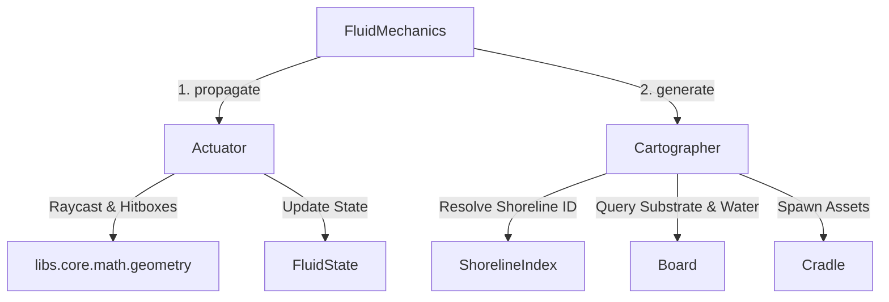

#### Refactor: Phase 09.03 - Fluid Consolidation

**Overview**

Refactor the fluid generation pipeline by decoupling shoreline synthesis from `Actuator` into a standalone, stateless `Cartographer` service. Unify environmental water checks on `Board`, eliminate the crate-fluid infinite invalidation loop by restricting fluid obstacles strictly to immovable static bodies ($m = 0$), and resolve endpoint and cross-fluid shoreline rendering regressions via a coordinated two-pass propagation lifecycle.

---

##### Bug Reports

###### Bug B011: Crate-Fluid Interaction Crash Loop 

**STATUS**: OPEN
**SEVERITY**: CRITICAL

**Description**

The introduction of Fluid fields has caused the Crate obstruction to fail. When a Crate enters a Fluid field, the fluid pooling and velocity addition interact and cause the game to enter into an unsustainable crash loop where the fluid pushes the Crate and then redraws the pool around the Crate.

**Steps to Replicate** 

Place Crate into the path of a Fluid stream.

**Root Cause**

`Actuator._collect_obstacles` ingests `board.weights(layer)` (all assets with $m \ge 0$) and `board.obstacles(layer)` (which includes `Crates`). Because a Crate has dynamic mass ($m = 5$ or $100$), it halts the raycast. The Actuator places a pool around the Crate. On the next tick, `MotionMechanics` (`fields.py`) applies fluid velocity to the Crate. In `FluidMechanics`, any velocity change on a crate (`|vx| > 0` or `|vy| > 0`) marks the fluid as `dirty`, causing per-frame raycasting and pool recalculations.

**Proposed Remeditation**

In accordance with the physics specification, **only static, immovable bodies ($m = 0$) block fluid flow.** Dynamic bodies ($m > 0$) must be excluded from fluid raycast obstacles. Furthermore, `FluidMechanics.update()` must cease monitoring crate velocities for fluid dirtying; only switchable static barriers (e.g., `Gates`) invalidate fluid propagation.

###### Bug B012: Shorelines Not Rendering at Endpoints 

**STATUS**: OPEN
**SEVERITY**: MEDIUM

**Description**

The source Asset dimensions of a Fluid are not receiving Shorelines, i.e. the very first frame in a stream of Fluid has no Shorelines.

**Steps To Repicate**

See [Latest State Dump](#latest-state-dump) for reproduction.

**Root Cause**

Two distinct issues cause missing endpoint shorelines:

1. `Actuator._extract_flank_descriptors` only generates side flanks (West/East for vertical streams, North/South for horizontal streams). It completely omits the distal or source cap (e.g., North margin at `fy` for a `DOWN` stream), leaving emitter origins bare.
2. In `_detect_flank_occlusions`, the boundary sweep algorithm evaluates the probe area (`probe_x, probe_y, probe_w, probe_l`) against outer perimeter hulls. At map bounds (`fy = 0`), the 32px probe box intersects the 1px boundary line, causing the entire first tile (`y = 0..32`) to be falsely discarded as "occluded."

**Proposed Remediation**

Add source cap descriptors in the flank extraction routine when bounded by land. Refine flank occlusion validation so that orthogonal perimeter hulls do not disqualify valid parallel shoreline margins.

###### Bug B013: Shoreline Cross Fluid Interactions

**STATUS**: OPEN
**SEVERITY**: HIGH

**Description**

When Fluid streams cross into the pool of another Fluid, they are generating Shoreline assets within the Pool, creating a disjointed look. For example, a `source = left` Fluid when crossing into a `source = down` Pool leaves a trail of Shorelines within the area of the Pool.

**Steps To Replicate**

See [Latest State Dump](#latest-state-dump) for reproduction.

**Root Cause**

1. `pump()` is executed per-fluid. When Fluid A flows into Fluid B's pool, Fluid A's shorelines are placed before Fluid B's pool is computed, or Fluid B's shorelines run across Fluid A's stream entrance.
2. The cleanup routine checks submersion by probing a single point `(pos.x + 16, pos.y + 16)`. For a coalesced shoreline of length 480px, checking only the origin tile fails to detect that intermediate tiles are submerged under an overlapping pool.

**Proposed Remediation**

1. Move `is_water` onto `Board` with an optional `exclude` argument.
2. In `FluidMechanics`, adopt a **two-pass execution pattern** across dirty layers:
    * **Pass 1 (Propagation)**: Update all dirty fluids' lengths, pools, and hitboxes via `Actuator.propagate()`.
    * **Pass 2 (Shorelines)**: Generate shorelines across the updated fluids using `Cartographer.generate()`. Because all fluid pools and streams are already registered on the board, `board.is_water()` accurately suppresses shorelines at every water-to-water junction.


##### Bug B014: Single-Point Shoreline Submersion Culling

**STATUS**: OPEN
**SEVERITY**: HIGH

**Description**

`Actuator.pump()` attempts to clean up existing shorelines submerged by expanding pools using `scx = s.state.position.x + 16` and `scy = s.state.position.y + 16`. Because procedural shorelines are coalesced into continuous strips up to several hundred pixels in length, evaluating only the origin tile causes long shorelines to bypass submersion checks when overlapping pools cover downstream sections. Conversely, if the origin tile is submerged, the entire multi-tile shoreline is purged even if the remainder borders dry land.

**Steps to Replicate**

1. Spawn a fluid with a continuous horizontal or vertical stream length $\ge 192\text{px}$.
2. Introduce an intersecting fluid or pool overlapping the midpoint of the stream.
3. Observe that the original shoreline is either entirely removed or completely preserved across the water intersection.

**Proposed Remediation**

Deprecate the single-point `cull_submerged` routine. Defer shoreline synthesis until all layer fluid propagation has completed (Two-Pass update). During shoreline generation, `Cartographer` samples `board.is_water()` at each discrete tile step, preventing submerged segments from ever being generated or coalesced.

---

##### Latest State Dump

###### Initial Conditions

!!! note
    Only Fluid property and state data included.

**Properties**

```yaml
effects:
  fluids:
    # -------------------------------------------------------
    waterflow-00:
      dimensions:
        w: 32
        l: 32
      lifecycle: 
        type: continuous
        delay: 60
      count: 3
      hitboxes: null
      mass: 0
    # -------------------------------------------------------
    waterflow-01:
      dimensions:
        w: 32
        l: 96
      lifecycle:
        type: continuous
        delay: 20
      count: 5
      hitboxes: null
      mass: 0
geography:
  shorelines:
    grassy-shore:
      tile: grass
      fluid: waterflow-00
      dimensions: 
        w: 32
        l: 32
      thickness: 10
      mass: -1
      hitboxes: null
```

**State**

```yaml
effects:
  fluids:
    - id: waterflow-00
      name: jasilynns-tears-00
      layer: '0'
      position:
        x: 70
        y: 0
      flow: 2
      source: down
    - id: waterflow-00
      name: jasilynns-tears-01
      layer: '0'
      position:
        x: 600
        y: 600
      source: left
    - id: waterflow-00
      name: jasilynns-tears-02
      layer: '0'
      flow: 4
      position:
        x: 632
        y: 0
      source: down
```

###### Results

**Application Logs**

```bash
2026-09-28 10:55:32,942 - INFO - __main__ - Starting CLI with command: 'start' for board: 'world-01'
2026-09-28 10:55:32,945 - INFO - __main__ - Igniting engine for live execution...
2026-09-28 10:55:32,946 - INFO - app.config.loader - Loading YAML property schemas...
2026-09-28 10:55:33,268 - INFO - app.config.loader - Loading YAML configurations...
2026-09-28 10:55:33,594 - INFO - app.services.orchestration.builder - Loading YAML data for target state: world-01 ...
2026-09-28 10:55:33,596 - INFO - app.config.loader - Loading YAML state configurations from /home/grant/Projects/ontology/src/data/state/world-01 ...
2026-09-28 10:55:33,760 - INFO - app.services.orchestration.builder - Compiling master mechanic executors...
2026-09-28 10:55:33,767 - INFO - app.services.orchestration.builder - Initializing SDL and Cython rendering subsystems...
2026-09-28 10:55:34,243 - INFO - app.services.orchestration.builder - Constructing Empty Board and Migrator subsystem...
2026-09-28 10:55:34,244 - INFO - app.game.board - Initializing Board with 0 incoming assets.
2026-09-28 10:55:34,245 - INFO - app.game.board - Board completely hydrated and initialized.
2026-09-28 10:55:34,245 - INFO - app.services.orchestration.builder - Initializing Registry with native models...
2026-09-28 10:55:34,266 - INFO - app.services.orchestration.builder - Injecting Generators and Devices into Board...
2026-09-28 10:55:34,267 - INFO - app.services.orchestration.builder - Building rendering pipelines, mechanics, and UI...
2026-09-28 10:55:34,267 - INFO - app.game.screen - Initializing Screen (Viewport: 480x480 |Board: 480x480)
2026-09-28 10:55:34,270 - INFO - app.services.orchestration.builder - Engine successfully assembled.
2026-09-28 10:55:34,271 - INFO - app.game.engine - Entering Game Loop...
2026-09-28 10:55:34,309 - INFO - app.services.orchestration.migrator - Migrator starting hydration for target state: world-01
2026-09-28 10:55:34,310 - INFO - app.config.loader - Loading YAML state configurations from /home/grant/Projects/ontology/src/data/state/world-01 ...
2026-09-28 10:55:34,482 - INFO - app.game.board - Appending Asset(id=frame-brick, name=strut-house-1, category=crafts, instance=struts)
2026-09-28 10:55:34,483 - INFO - app.game.board - Appending Asset(id=door-house, name=door-strut-house-1-1, category=objects, instance=doors)
2026-09-28 10:55:34,483 - INFO - app.game.board - Appending Asset(id=wall-blue, name=strut-house-interior-1, category=crafts, instance=struts)
2026-09-28 10:55:34,483 - INFO - app.game.board - Appending Asset(id=wood-bookshelf, name=crate-strut-house-interior-1-1, category=objects, instance=crates)
2026-09-28 10:55:34,483 - INFO - app.game.board - Appending Asset(id=door-shadow, name=door-strut-house-interior-1-1, category=objects, instance=doors)
2026-09-28 10:55:34,483 - INFO - app.game.board - Appending Asset(id=floor-wood, name=strut-strut-house-interior-1-1, category=crafts, instance=struts)
2026-09-28 10:55:34,483 - INFO - app.game.board - Appending Asset(id=grandfather-clock, name=passive-strut-house-interior-1-1, category=effects, instance=passive)
2026-09-28 10:55:34,690 - INFO - app.game.board - Appending Asset(id=wall-castle, name=strut-castle-exterior-2, category=crafts, instance=struts)
2026-09-28 10:55:34,691 - INFO - app.game.board - Appending Asset(id=door-castle-open, name=door-strut-castle-exterior-2-2, category=objects, instance=doors)
2026-09-28 10:55:34,691 - INFO - app.game.board - Appending Asset(id=castle-gate, name=gate-strut-castle-exterior-2-2, category=objects, instance=gates)
2026-09-28 10:55:34,692 - INFO - app.game.board - Appending Asset(id=stone-switch, name=plate-strut-castle-exterior-2-2, category=objects, instance=plates)
2026-09-28 10:55:34,692 - INFO - app.game.board - Appending Asset(id=torch, name=passive-strut-castle-exterior-2-2, category=effects, instance=passive)
2026-09-28 10:55:34,692 - INFO - app.game.board - Appending Asset(id=torch, name=passive-strut-castle-exterior-2-2, category=effects, instance=passive)
2026-09-28 10:55:34,692 - INFO - app.game.board - Appending Asset(id=grass, name=the-steppe, category=tiles, instance=back)
2026-09-28 10:55:34,701 - INFO - app.game.board - Appending Asset(id=wood-barrel, name=castle-dawn-barrel-00, category=objects, instance=crates)
2026-09-28 10:55:34,702 - INFO - app.game.board - Appending Asset(id=gray-rock-00, name=jasilynns-rock, category=objects, instance=obstacles)
2026-09-28 10:55:34,702 - INFO - app.game.board - Appending Asset(id=gray-rock-00, name=jasilynns-other-rock, category=objects, instance=obstacles)
2026-09-28 10:55:34,703 - INFO - app.game.board - Appending Asset(id=wood-bulletin, name=castle-dawn-sign-board-00, category=objects, instance=signs)
2026-09-28 10:55:34,703 - INFO - app.game.board - Appending Asset(id=spinning-dummy, name=test-dummy, category=effects, instance=reactables)
2026-09-28 10:55:34,703 - INFO - app.game.board - Appending Asset(id=waterflow-00, name=jasilynns-tears-00, category=effects, instance=fluids)
2026-09-28 10:55:34,703 - INFO - app.game.board - Appending Asset(id=waterflow-00, name=jasilynns-tears-01, category=effects, instance=fluids)
2026-09-28 10:55:34,704 - INFO - app.game.board - Appending Asset(id=waterflow-00, name=jasilynns-tears-02, category=effects, instance=fluids)
2026-09-28 10:55:34,704 - INFO - app.game.board - Appending Asset(id=jasilynn, name=evil-empress-jasilynn, category=sheets, instance=sprites)
2026-09-28 10:55:34,704 - INFO - app.game.board - Appending Asset(id=player, name=player, category=sheets, instance=players)
2026-09-28 10:55:34,704 - INFO - app.services.generators.game.perimeter - Calculating dynamic perimeter boundaries for layer: 0
2026-09-28 10:55:34,705 - INFO - app.services.generators.game.perimeter - Derived simply-connected hull containing 4 edges.
2026-09-28 10:55:34,706 - INFO - app.services.generators.game.perimeter - Calculating dynamic perimeter boundaries for layer: brick-house-compose-layer
2026-09-28 10:55:34,707 - INFO - app.services.generators.game.perimeter - Derived simply-connected hull containing 4 edges.
2026-09-28 10:55:34,721 - INFO - app.game.board - Appending Asset(id=grassy-shore, name=spawn-d78b0176, category=geography, instance=shorelines)
2026-09-28 10:55:34,722 - INFO - app.game.board - Appending Asset(id=grassy-shore, name=spawn-52e4eb17, category=geography, instance=shorelines)
2026-09-28 10:55:34,722 - INFO - app.game.board - Appending Asset(id=grassy-shore, name=spawn-9fed8a16, category=geography, instance=shorelines)
2026-09-28 10:55:34,723 - INFO - app.game.board - Appending Asset(id=grassy-shore, name=spawn-8efc539a, category=geography, instance=shorelines)
2026-09-28 10:55:34,723 - INFO - app.game.board - Appending Asset(id=grassy-shore, name=spawn-beb2fbb2, category=geography, instance=shorelines)
2026-09-28 10:55:34,723 - INFO - app.game.board - Appending Asset(id=grassy-shore, name=spawn-4cda0e35, category=geography, instance=shorelines)
2026-09-28 10:55:34,723 - INFO - app.services.generators.game.actuator - Fluid(name=jasilynns-tears-00, direction=down) |  Length: 600px,  Struck: jasilynns-rock, Pool: True, Shorelines: 6
2026-09-28 10:55:34,726 - INFO - app.game.board - Appending Asset(id=grassy-shore, name=spawn-47e588a6, category=geography, instance=shorelines)
2026-09-28 10:55:34,727 - INFO - app.game.board - Appending Asset(id=grassy-shore, name=spawn-5a98a6a9, category=geography, instance=shorelines)
2026-09-28 10:55:34,727 - INFO - app.services.generators.game.actuator - Fluid(name=jasilynns-tears-01, direction=left) |  Length: 476px,  Struck: jasilynns-rock, Pool: True, Shorelines: 2
2026-09-28 10:55:34,737 - INFO - app.game.board - Appending Asset(id=grassy-shore, name=spawn-70b70118, category=geography, instance=shorelines)
2026-09-28 10:55:34,738 - INFO - app.game.board - Appending Asset(id=grassy-shore, name=spawn-0679cfd4, category=geography, instance=shorelines)
2026-09-28 10:55:34,738 - INFO - app.game.board - Appending Asset(id=grassy-shore, name=spawn-36279dac, category=geography, instance=shorelines)
2026-09-28 10:55:34,738 - INFO - app.game.board - Appending Asset(id=grassy-shore, name=spawn-eb8704aa, category=geography, instance=shorelines)
2026-09-28 10:55:34,738 - INFO - app.game.board - Appending Asset(id=grassy-shore, name=spawn-78786778, category=geography, instance=shorelines)
2026-09-28 10:55:34,738 - INFO - app.game.board - Appending Asset(id=grassy-shore, name=spawn-7171832e, category=geography, instance=shorelines)
2026-09-28 10:55:34,738 - INFO - app.game.board - Appending Asset(id=grassy-shore, name=spawn-a62a6298, category=geography, instance=shorelines)
2026-09-28 10:55:34,738 - INFO - app.game.board - Appending Asset(id=grassy-shore, name=spawn-4d8345b0, category=geography, instance=shorelines)
2026-09-28 10:55:34,739 - INFO - app.services.generators.game.actuator - Fluid(name=jasilynns-tears-02, direction=down) |  Length: 600px,  Struck: jasilynns-other-rock, Pool: True, Shorelines: 8
libpng warning: iCCP: known incorrect sRGB profile
libpng warning: iCCP: known incorrect sRGB profile
libpng warning: iCCP: known incorrect sRGB profile
libpng warning: iCCP: known incorrect sRGB profile
libpng warning: iCCP: known incorrect sRGB profile
libpng warning: iCCP: known incorrect sRGB profile
libpng warning: iCCP: known incorrect sRGB profile
libpng warning: iCCP: known incorrect sRGB profile
libpng warning: iCCP: known incorrect sRGB profile
libpng warning: iCCP: known incorrect sRGB profile
libpng warning: iCCP: known incorrect sRGB profile
libpng warning: iCCP: known incorrect sRGB profile
libpng warning: iCCP: known incorrect sRGB profile
libpng warning: iCCP: known incorrect sRGB profile
libpng warning: iCCP: known incorrect sRGB profile
libpng warning: iCCP: known incorrect sRGB profile
libpng warning: iCCP: known incorrect sRGB profile
libpng warning: iCCP: known incorrect sRGB profile
libpng warning: iCCP: known incorrect sRGB profile
libpng warning: iCCP: known incorrect sRGB profile
2026-09-28 10:55:42,712 - INFO - app.game.menus.controllers.load - Hydration complete. Reallocating rendering canvases...
2026-09-28 10:55:42,714 - INFO - app.game.screen - Rebaking Screen canvases for new world state...
2026-09-28 10:55:42,775 - INFO - app.game.screen - Initializing Screen (Viewport: 480x480 |Board: 239x264)
2026-09-28 10:55:42,779 - INFO - app.game.logic.mechanics.intentional.cognition - evil-empress-jasilynn tracked Goal(category=object, name = door-strut-house-interior-1-1, layer = brick-house-compose-layer, position=(47, 142))
2026-09-28 10:55:42,782 - INFO - app.game.logic.mechanics.intentional.navigation - Pathfinding stalled for evil-empress-jasilynn; no valid route found.
2026-09-28 10:55:42,787 - INFO - app.game.logic.mechanics.intentional.cognition - evil-empress-jasilynn tracked Goal(category=object, name = door-strut-house-interior-1-1, layer = brick-house-compose-layer, position=(47, 142))
2026-09-28 10:55:42,811 - INFO - app.game.logic.mechanics.intentional.navigation - Pathfinding stalled for evil-empress-jasilynn; no valid route found.
2026-09-28 10:55:42,834 - INFO - app.game.logic.mechanics.intentional.navigation - Pathfinding stalled for evil-empress-jasilynn; no valid route found.
2026-09-28 10:55:42,846 - INFO - app.game.logic.mechanics.intentional.transition - Transition(evil-empress-jasilynn): Intentions.FIND -> interact
2026-09-28 10:55:42,847 - INFO - app.game.logic.mechanics.intentional.cognition - evil-empress-jasilynn resolved Goal(category=object, name = door-strut-house-interior-1-1, layer = brick-house-compose-layer, position=(47, 142))
2026-09-28 10:55:42,847 - INFO - app.game.logic.mechanics.intentional.transition - Transition(evil-empress-jasilynn): Intentions.INTERACT -> idle
2026-09-28 10:55:42,848 - INFO - app.game.logic.mechanics.intentional.cognition - evil-empress-jasilynn remembered Goal(category=subject, name = player, layer = 0, position=(100, 200))
2026-09-28 10:55:42,848 - INFO - app.game.logic.mechanics.intentional.transition - Transition(evil-empress-jasilynn): Intentions.IDLE -> find
2026-09-28 10:55:42,869 - INFO - app.game.logic.mechanics.intentional.navigation - Pathfinding stalled for evil-empress-jasilynn; no valid route found.
2026-09-28 10:55:42,908 - INFO - app.game.logic.mechanics.intentional.navigation - Pathfinding stalled for evil-empress-jasilynn; no valid route found.
2026-09-28 10:55:43,347 - INFO - app.game.logic.mechanics.intentional.navigation - Pathfinding stalled for evil-empress-jasilynn; no valid route found.
2026-09-28 10:55:44,371 - INFO - app.game.logic.mechanics.intentional.navigation - Pathfinding stalled for evil-empress-jasilynn; no valid route found.
^C2026-09-28 10:55:44,525 - INFO - __main__ - Signal 2 received. Requesting graceful engine shutdown...
2026-09-28 10:55:44,537 - INFO - __main__ - Generating state dump...
2026-09-28 10:55:44,753 - INFO - __main__ - State dump successfully written to /home/grant/Projects/ontology/20260928_105544.state-dump.md
2026-09-28 10:55:44,753 - INFO - app.game.engine - Stopping Engine and releasing resources...
2026-09-28 10:55:45,102 - INFO - __main__ - CLI processes completed.
```

**State Dump**

```markdown
# Ontology: State Dump

- **Board:** world-01
- **Timestamp:** 20260928_105544

## strut-house-1

- **Taxonomy:**
  - Category: `crafts`
  - Instance: `struts`
  - ID: `frame-brick`
  - Name: `strut-house-1`
- **Components:**
  - Animation: `<class 'app.assets.animations.core.NoAnimation'>`
  - Frame: `<class 'app.assets.frames.core.SingleFrame'>`
- **Properties:**
  - Dimensions:
    - Width: 96
    - Length: 190
  - Mass: 0
  - Cost:
    - `stone`: 10
  - Hitboxes:
    - Position: (10, 20) | Dimensions: w: 76, l: 144
- **State:**
  - Layer: `0`
  - Depth: 0
  - Position: (150, 750)
  - Owner: `player`


## door-strut-house-1-1

- **Taxonomy:**
  - Category: `objects`
  - Instance: `doors`
  - ID: `door-house`
  - Name: `door-strut-house-1-1`
- **Components:**
  - Animation: `<class 'app.assets.animations.core.NoAnimation'>`
  - Frame: `<class 'app.assets.frames.core.SingleFrame'>`
- **Properties:**
  - Dimensions:
    - Width: 32
    - Length: 48
  - Mass: -1
  - Count: 1
- **State:**
  - Layer: `0`
  - Depth: 1
  - Height: 940
  - Position: (182, 868)
  - Door Out:
    - Layer: `brick-house-compose-layer`
    - Position: (82, 143)


## strut-house-interior-1

- **Taxonomy:**
  - Category: `crafts`
  - Instance: `struts`
  - ID: `wall-blue`
  - Name: `strut-house-interior-1`
- **Components:**
  - Animation: `<class 'app.assets.animations.core.NoAnimation'>`
  - Frame: `<class 'app.assets.frames.core.SingleFrame'>`
- **Properties:**
  - Dimensions:
    - Width: 128
    - Length: 96
  - Mass: 0
  - Cost:
    - `wood`: 10
  - Hitboxes:
    - Position: (6, 17) | Dimensions: w: 116, l: 54
- **State:**
  - Layer: `brick-house-compose-layer`
  - Depth: 0
  - Position: (0, 0)
  - Owner: `player`


## crate-strut-house-interior-1-1

- **Taxonomy:**
  - Category: `objects`
  - Instance: `crates`
  - ID: `wood-bookshelf`
  - Name: `crate-strut-house-interior-1-1`
- **Components:**
  - Animation: `<class 'app.assets.animations.core.NoAnimation'>`
  - Frame: `<class 'app.assets.frames.core.SingleFrame'>`
- **Properties:**
  - Dimensions:
    - Width: 54
    - Length: 64
  - Mass: 100
  - Count: 1
- **State:**
  - Layer: `brick-house-compose-layer`
  - Depth: 0
  - Position: (33, 71)
  - Velocity: (-0.0, -0.0)


## door-strut-house-interior-1-1

- **Taxonomy:**
  - Category: `objects`
  - Instance: `doors`
  - ID: `door-shadow`
  - Name: `door-strut-house-interior-1-1`
- **Components:**
  - Animation: `<class 'app.assets.animations.core.NoAnimation'>`
  - Frame: `<class 'app.assets.frames.core.SingleFrame'>`
- **Properties:**
  - Dimensions:
    - Width: 32
    - Length: 48
  - Mass: -1
  - Count: 1
- **State:**
  - Layer: `brick-house-compose-layer`
  - Depth: 0
  - Position: (47, 142)
  - Door Out:
    - Layer: `0`
    - Position: (193, 913)


## strut-strut-house-interior-1-1

- **Taxonomy:**
  - Category: `crafts`
  - Instance: `struts`
  - ID: `floor-wood`
  - Name: `strut-strut-house-interior-1-1`
- **Components:**
  - Animation: `<class 'app.assets.animations.core.NoAnimation'>`
  - Frame: `<class 'app.assets.frames.core.SingleFrame'>`
- **Properties:**
  - Dimensions:
    - Width: 128
    - Length: 96
  - Mass: -1
  - Cost:
    - `wood`: 10
- **State:**
  - Layer: `brick-house-compose-layer`
  - Depth: 0
  - Height: -100
  - Position: (0, 96)
  - Owner: `player`


## passive-strut-house-interior-1-1

- **Taxonomy:**
  - Category: `effects`
  - Instance: `passive`
  - ID: `grandfather-clock`
  - Name: `passive-strut-house-interior-1-1`
- **Components:**
  - Animation: `<class 'app.assets.animations.core.LifecycleAnimation'>`
  - Frame: `<class 'app.assets.frames.core.IterableFrame'>`
- **Properties:**
  - Dimensions:
    - Width: 32
    - Length: 96
  - Mass: 0
  - Lifecycle: Lifecycle(type=<Lifecycles.CONTINUOUS: 'continuous'>, delay=60, frequency=0, cooldown=60, persist=False)
  - Count: 12
- **State:**
  - Layer: `brick-house-compose-layer`
  - Depth: 0
  - Position: (1, 30)
  - Active: `True`
  - Animation:
    - Action: `walk`
    - Direction: `down`
    - Frame: 6
    - Tick: 19


## strut-castle-exterior-2

- **Taxonomy:**
  - Category: `crafts`
  - Instance: `struts`
  - ID: `wall-castle`
  - Name: `strut-castle-exterior-2`
- **Components:**
  - Animation: `<class 'app.assets.animations.core.NoAnimation'>`
  - Frame: `<class 'app.assets.frames.core.SingleFrame'>`
- **Properties:**
  - Dimensions:
    - Width: 222
    - Length: 133
  - Mass: 0
  - Cost:
    - `stone`: 100
  - Hitboxes:
    - Position: (178, 102) | Dimensions: w: 25, l: 12
    - Position: (17, 102) | Dimensions: w: 25, l: 12
    - Position: (5, 39) | Dimensions: w: 203, l: 63
- **State:**
  - Layer: `0`
  - Depth: 0
  - Position: (250, 250)
  - Owner: `the-government`


## door-strut-castle-exterior-2-2

- **Taxonomy:**
  - Category: `objects`
  - Instance: `doors`
  - ID: `door-castle-open`
  - Name: `door-strut-castle-exterior-2-2`
- **Components:**
  - Animation: `<class 'app.assets.animations.core.NoAnimation'>`
  - Frame: `<class 'app.assets.frames.core.SingleFrame'>`
- **Properties:**
  - Dimensions:
    - Width: 64
    - Length: 64
  - Mass: -1
  - Count: 1
- **State:**
  - Layer: `0`
  - Depth: 0
  - Height: 383
  - Position: (331, 299)
  - Door Out:
    - Layer: `castle-compose-layer`


## gate-strut-castle-exterior-2-2

- **Taxonomy:**
  - Category: `objects`
  - Instance: `gates`
  - ID: `castle-gate`
  - Name: `gate-strut-castle-exterior-2-2`
- **Components:**
  - Animation: `<class 'app.assets.animations.core.BinaryAnimation'>`
  - Frame: `<class 'app.assets.frames.core.IterableFrame'>`
- **Properties:**
  - Dimensions:
    - Width: 64
    - Length: 64
  - Mass: 0
  - Count: 2
- **State:**
  - Layer: `0`
  - Depth: 1
  - Height: 383
  - Position: (331, 299)
  - Animation:
    - Action: `walk`
    - Direction: `down`
    - Frame: 0
    - Tick: 1
  - Switch: False
  - Link: `castle-gate-link`


## plate-strut-castle-exterior-2-2

- **Taxonomy:**
  - Category: `objects`
  - Instance: `plates`
  - ID: `stone-switch`
  - Name: `plate-strut-castle-exterior-2-2`
- **Components:**
  - Animation: `<class 'app.assets.animations.core.BinaryAnimation'>`
  - Frame: `<class 'app.assets.frames.core.IterableFrame'>`
- **Properties:**
  - Dimensions:
    - Width: 15
    - Length: 14
  - Mass: -1
  - Count: 2
- **State:**
  - Layer: `0`
  - Depth: 1
  - Height: 383
  - Position: (274, 395)
  - Animation:
    - Action: `walk`
    - Direction: `down`
    - Frame: 0
    - Tick: 1
  - Switch: False
  - Link: `castle-gate-link`


## passive-strut-castle-exterior-2-2

- **Taxonomy:**
  - Category: `effects`
  - Instance: `passive`
  - ID: `torch`
  - Name: `passive-strut-castle-exterior-2-2`
- **Components:**
  - Animation: `<class 'app.assets.animations.core.LifecycleAnimation'>`
  - Frame: `<class 'app.assets.frames.core.IterableFrame'>`
- **Properties:**
  - Dimensions:
    - Width: 32
    - Length: 64
  - Mass: -1
  - Lifecycle: Lifecycle(type=<Lifecycles.CONTINUOUS: 'continuous'>, delay=15, frequency=0, cooldown=60, persist=False)
  - Count: 9
- **State:**
  - Layer: `0`
  - Depth: 1
  - Height: 383
  - Position: (265, 308)
  - Active: `True`
  - Animation:
    - Action: `walk`
    - Direction: `down`
    - Frame: 7
    - Tick: 4


## passive-strut-castle-exterior-2-2

- **Taxonomy:**
  - Category: `effects`
  - Instance: `passive`
  - ID: `torch`
  - Name: `passive-strut-castle-exterior-2-2`
- **Components:**
  - Animation: `<class 'app.assets.animations.core.LifecycleAnimation'>`
  - Frame: `<class 'app.assets.frames.core.IterableFrame'>`
- **Properties:**
  - Dimensions:
    - Width: 32
    - Length: 64
  - Mass: -1
  - Lifecycle: Lifecycle(type=<Lifecycles.CONTINUOUS: 'continuous'>, delay=15, frequency=0, cooldown=60, persist=False)
  - Count: 9
- **State:**
  - Layer: `0`
  - Depth: 1
  - Height: 383
  - Position: (424, 308)
  - Active: `True`
  - Animation:
    - Action: `walk`
    - Direction: `down`
    - Frame: 2
    - Tick: 4


## the-steppe

- **Taxonomy:**
  - Category: `tiles`
  - Instance: `back`
  - ID: `grass`
  - Name: `the-steppe`
- **Components:**
  - Animation: `<class 'app.assets.animations.core.NoAnimation'>`
  - Frame: `<class 'app.assets.frames.core.SingleFrame'>`
- **Properties:**
  - Dimensions:
    - Width: 32
    - Length: 32
  - Friction: 100.0
- **State:**
  - Layer: `0`
  - Depth: 0
  - Position: (0, 0)
  - Multiple:
    - nx: 100
    - ny: 100


## castle-dawn-barrel-00

- **Taxonomy:**
  - Category: `objects`
  - Instance: `crates`
  - ID: `wood-barrel`
  - Name: `castle-dawn-barrel-00`
- **Components:**
  - Animation: `<class 'app.assets.animations.core.NoAnimation'>`
  - Frame: `<class 'app.assets.frames.core.SingleFrame'>`
- **Properties:**
  - Dimensions:
    - Width: 28
    - Length: 38
  - Mass: 5
  - Count: 1
  - Hitboxes:
    - Position: (0, 0) | Dimensions: w: 28, l: 38
- **State:**
  - Layer: `0`
  - Depth: 0
  - Position: (110, 250)
  - Velocity: (0.0, 0.0)


## jasilynns-rock

- **Taxonomy:**
  - Category: `objects`
  - Instance: `obstacles`
  - ID: `gray-rock-00`
  - Name: `jasilynns-rock`
- **Components:**
  - Animation: `<class 'app.assets.animations.core.NoAnimation'>`
  - Frame: `<class 'app.assets.frames.core.SingleFrame'>`
- **Properties:**
  - Dimensions:
    - Width: 56
    - Length: 56
  - Mass: 0
  - Count: 1
- **State:**
  - Layer: `0`
  - Depth: 0
  - Position: (68, 600)
  - Velocity: (0.0, 0.0)


## jasilynns-other-rock

- **Taxonomy:**
  - Category: `objects`
  - Instance: `obstacles`
  - ID: `gray-rock-00`
  - Name: `jasilynns-other-rock`
- **Components:**
  - Animation: `<class 'app.assets.animations.core.NoAnimation'>`
  - Frame: `<class 'app.assets.frames.core.SingleFrame'>`
- **Properties:**
  - Dimensions:
    - Width: 56
    - Length: 56
  - Mass: 0
  - Count: 1
- **State:**
  - Layer: `0`
  - Depth: 0
  - Position: (632, 600)
  - Velocity: (0.0, 0.0)


## castle-dawn-sign-board-00

- **Taxonomy:**
  - Category: `objects`
  - Instance: `signs`
  - ID: `wood-bulletin`
  - Name: `castle-dawn-sign-board-00`
- **Components:**
  - Animation: `<class 'app.assets.animations.core.NoAnimation'>`
  - Frame: `<class 'app.assets.frames.core.SingleFrame'>`
- **Properties:**
  - Dimensions:
    - Width: 30
    - Length: 32
  - Mass: 0
  - Count: 1
  - Hitboxes:
    - Position: (4, 4) | Dimensions: w: 22, l: 24
- **State:**
  - Layer: `0`
  - Depth: 0
  - Position: (430, 370)
  - Persona: `castle-dawn-sign`
  - Lexicon: `spring`


## test-dummy

- **Taxonomy:**
  - Category: `effects`
  - Instance: `reactables`
  - ID: `spinning-dummy`
  - Name: `test-dummy`
- **Components:**
  - Animation: `<class 'app.assets.animations.core.LifecycleAnimation'>`
  - Frame: `<class 'app.assets.frames.core.IterableFrame'>`
- **Properties:**
  - Dimensions:
    - Width: 64
    - Length: 64
  - Mass: 0
  - Lifecycle: Lifecycle(type=<Lifecycles.TEMPORARY: 'temporary'>, delay=5, frequency=0, cooldown=30, persist=True)
  - Count: 8
  - Hitboxes:
    - Position: (2, 20) | Dimensions: w: 14, l: 14
- **State:**
  - Layer: `0`
  - Depth: 0
  - Position: (225, 500)
  - Active: `False`
  - Animation:
    - Action: `walk`
    - Direction: `down`
    - Frame: 0
    - Tick: 0
  - Intention: `attack`


## jasilynns-tears-00

- **Taxonomy:**
  - Category: `effects`
  - Instance: `fluids`
  - ID: `waterflow-00`
  - Name: `jasilynns-tears-00`
- **Components:**
  - Animation: `<class 'app.assets.animations.core.LifecycleAnimation'>`
  - Frame: `<class 'app.assets.frames.effects.FluidFrame'>`
- **Properties:**
  - Dimensions:
    - Width: 32
    - Length: 32
  - Mass: 0
  - Lifecycle: Lifecycle(type=<Lifecycles.CONTINUOUS: 'continuous'>, delay=60, frequency=0, cooldown=60, persist=False)
  - Count: 3
- **State:**
  - Layer: `0`
  - Depth: -1
  - Height: 0
  - Position: (70, 1)
  - Active: `True`
  - Animation:
    - Action: `walk`
    - Direction: `down`
    - Frame: 0
    - Tick: 19
  - Source: `down`
  - Flow: 2
  - Length: 600
  - Dirty: False
  - Pool:
    - Position: (0, 512)
    - Dimensions: w: 192, l: 224
  - Shorelines:
    - `spawn-d78b0176`
    - `spawn-52e4eb17`
    - `spawn-9fed8a16`
    - `spawn-8efc539a`
    - `spawn-beb2fbb2`
    - `spawn-4cda0e35`
  - Hitboxes:
    - Position: (0, 0) | Dimensions: w: 32, l: 600
    - Position: (-70, 512) | Dimensions: w: 192, l: 224


## jasilynns-tears-01

- **Taxonomy:**
  - Category: `effects`
  - Instance: `fluids`
  - ID: `waterflow-00`
  - Name: `jasilynns-tears-01`
- **Components:**
  - Animation: `<class 'app.assets.animations.core.LifecycleAnimation'>`
  - Frame: `<class 'app.assets.frames.effects.FluidFrame'>`
- **Properties:**
  - Dimensions:
    - Width: 32
    - Length: 32
  - Mass: 0
  - Lifecycle: Lifecycle(type=<Lifecycles.CONTINUOUS: 'continuous'>, delay=60, frequency=0, cooldown=60, persist=False)
  - Count: 3
- **State:**
  - Layer: `0`
  - Depth: -1
  - Height: 0
  - Position: (600, 600)
  - Active: `True`
  - Animation:
    - Action: `walk`
    - Direction: `down`
    - Frame: 0
    - Tick: 19
  - Source: `left`
  - Flow: 1
  - Length: 476
  - Dirty: False
  - Pool:
    - Position: (32, 544)
    - Dimensions: w: 128, l: 160
  - Shorelines:
    - `spawn-47e588a6`
    - `spawn-5a98a6a9`
  - Hitboxes:
    - Position: (-476, 0) | Dimensions: w: 476, l: 32
    - Position: (-568, -56) | Dimensions: w: 128, l: 160


## jasilynns-tears-02

- **Taxonomy:**
  - Category: `effects`
  - Instance: `fluids`
  - ID: `waterflow-00`
  - Name: `jasilynns-tears-02`
- **Components:**
  - Animation: `<class 'app.assets.animations.core.LifecycleAnimation'>`
  - Frame: `<class 'app.assets.frames.effects.FluidFrame'>`
- **Properties:**
  - Dimensions:
    - Width: 32
    - Length: 32
  - Mass: 0
  - Lifecycle: Lifecycle(type=<Lifecycles.CONTINUOUS: 'continuous'>, delay=60, frequency=0, cooldown=60, persist=False)
  - Count: 3
- **State:**
  - Layer: `0`
  - Depth: -1
  - Height: 0
  - Position: (632, 1)
  - Active: `True`
  - Animation:
    - Action: `walk`
    - Direction: `down`
    - Frame: 0
    - Tick: 19
  - Source: `down`
  - Flow: 4
  - Length: 600
  - Dirty: False
  - Pool:
    - Position: (480, 448)
    - Dimensions: w: 352, l: 352
  - Shorelines:
    - `spawn-70b70118`
    - `spawn-0679cfd4`
    - `spawn-36279dac`
    - `spawn-eb8704aa`
    - `spawn-78786778`
    - `spawn-7171832e`
    - `spawn-a62a6298`
    - `spawn-4d8345b0`
  - Hitboxes:
    - Position: (0, 0) | Dimensions: w: 32, l: 600
    - Position: (-152, 448) | Dimensions: w: 352, l: 352


## evil-empress-jasilynn

- **Taxonomy:**
  - Category: `sheets`
  - Instance: `sprites`
  - ID: `jasilynn`
  - Name: `evil-empress-jasilynn`
- **Components:**
  - Animation: `<class 'app.assets.animations.core.SpriteAnimation'>`
  - Frame: `<class 'app.assets.frames.sheets.SpriteFrame'>`
- **Properties:**
  - Dimensions:
    - Width: 64
    - Length: 64
  - Mass: 25
  - Stack:
    - `human-female-ivory`
    - `torso-dress-red`
    - `hair-long-black`
    - `head-crown-gold`
    - `feet-boots-black`
  - Hitboxes:
    - Position: (23, 34) | Dimensions: w: 18, l: 15
  - Actions:
    - `cast`:
      - Count: 7
      - Delay: 1
      - Directions:
        - `Directions.UP`: row 0
        - `Directions.LEFT`: row 1
        - `Directions.DOWN`: row 2
        - `Directions.RIGHT`: row 3
    - `thrust`:
      - Count: 8
      - Delay: 1
      - Directions:
        - `Directions.UP`: row 4
        - `Directions.LEFT`: row 5
        - `Directions.DOWN`: row 6
        - `Directions.RIGHT`: row 7
    - `walk`:
      - Count: 9
      - Delay: 3
      - Directions:
        - `Directions.UP`: row 8
        - `Directions.LEFT`: row 9
        - `Directions.DOWN`: row 10
        - `Directions.RIGHT`: row 11
    - `slash`:
      - Count: 6
      - Delay: 5
      - Directions:
        - `Directions.UP`: row 12
        - `Directions.LEFT`: row 13
        - `Directions.DOWN`: row 14
        - `Directions.RIGHT`: row 15
    - `shoot`:
      - Count: 13
      - Delay: 1
      - Directions:
        - `Directions.UP`: row 16
        - `Directions.LEFT`: row 17
        - `Directions.DOWN`: row 18
        - `Directions.RIGHT`: row 19
    - `die`:
      - Count: 6
      - Delay: 1
      - Directions:
        - `Directions.UP`: row 20
- **State:**
  - Layer: `0`
  - Depth: 0
  - Position: (171, 880)
  - Velocity: (-5.192361831665039, 49.72966003417969)
  - Animation:
    - Action: `walk`
    - Direction: `up`
    - Frame: 4
    - Tick: 0
  - Character:
    - Strength: 5
    - Defense: 5
    - Speed: 50
    - Impulse: 25
  - Meters:
    - Health: 50 / 100
    - Magic: 100 / 100
  - Inventory:
    - Wallet: 0
    - Equipment:
      - Weapon: `shortsword`
  - Goal:
    - Name: `player`
    - Category: `subject`
    - Layer: `0`
    - Position: (100, 200)
  - Mutators:
    - Triggers:
      - Animated: True
      - Frightened: False
      - Dead: False
      - Vision: False
    - Parameters:
      - Fear:
        - Radius: 100
        - Limit: 0.5
        - Enemy: 5
      - Vision:
        - Radius: 150
      - Action:
        - Radius: 25
  - Memory:
    - Sprites:
      - `player`: (100, 200)
    - Doors:
      - `door-strut-house-interior-1-1`: `0`
    - Relationships:
      - `player`: `friend`
  - Psyche:
    - Persona: `empress-jasilynn`
    - Motivation: `conquest`
    - Dialogue: `greeting`
  - Intention: `find`


## player

- **Taxonomy:**
  - Category: `sheets`
  - Instance: `players`
  - ID: `player`
  - Name: `player`
- **Components:**
  - Animation: `<class 'app.assets.animations.core.SpriteAnimation'>`
  - Frame: `<class 'app.assets.frames.sheets.SpriteFrame'>`
- **Properties:**
  - Dimensions:
    - Width: 64
    - Length: 64
  - Mass: 7
  - Stack:
    - `human-male-ivory`
    - `feet-boots-black`
    - `legs-robe-black`
    - `torso-shirt-male-black`
    - `toros-cape-black`
    - `head-glasses`
    - `head-beard-white`
    - `hair-curls-white`
    - `head-wizard-hat-moon`
  - Hitboxes:
    - Position: (23, 34) | Dimensions: w: 18, l: 15
  - Actions:
    - `cast`:
      - Count: 7
      - Delay: 1
      - Directions:
        - `Directions.UP`: row 0
        - `Directions.LEFT`: row 1
        - `Directions.DOWN`: row 2
        - `Directions.RIGHT`: row 3
    - `thrust`:
      - Count: 8
      - Delay: 1
      - Directions:
        - `Directions.UP`: row 4
        - `Directions.LEFT`: row 5
        - `Directions.DOWN`: row 6
        - `Directions.RIGHT`: row 7
    - `walk`:
      - Count: 9
      - Delay: 3
      - Directions:
        - `Directions.UP`: row 8
        - `Directions.LEFT`: row 9
        - `Directions.DOWN`: row 10
        - `Directions.RIGHT`: row 11
    - `slash`:
      - Count: 6
      - Delay: 5
      - Directions:
        - `Directions.UP`: row 12
        - `Directions.LEFT`: row 13
        - `Directions.DOWN`: row 14
        - `Directions.RIGHT`: row 15
    - `shoot`:
      - Count: 13
      - Delay: 1
      - Directions:
        - `Directions.UP`: row 16
        - `Directions.LEFT`: row 17
        - `Directions.DOWN`: row 18
        - `Directions.RIGHT`: row 19
    - `die`:
      - Count: 6
      - Delay: 1
      - Directions:
        - `Directions.UP`: row 20
- **State:**
  - Layer: `0`
  - Depth: 0
  - Position: (10, 80)
  - Velocity: (0.0, 0.0)
  - Animation:
    - Action: `walk`
    - Direction: `down`
    - Frame: 0
    - Tick: 0
  - Character:
    - Strength: 5
    - Defense: 5
    - Speed: 100
    - Impulse: 25
  - Meters:
    - Health: 50 / 100
    - Magic: 100 / 100
  - Inventory:
    - Wallet: 0
    - Equipment:
      - Weapon: `shortsword`
      - Shield: `buckler`
  - Goal:
    - Position: (10, 80)
  - Mutators:
    - Triggers:
      - Animated: False
      - Frightened: False
      - Dead: False
      - Vision: False
    - Parameters:
      - Fear:
        - Radius: 30
        - Limit: 0.5
        - Enemy: 5
      - Vision:
        - Radius: 30
      - Action:
        - Radius: 30
  - Intention: `idle`


## spawn-d78b0176

- **Taxonomy:**
  - Category: `geography`
  - Instance: `shorelines`
  - ID: `grassy-shore`
  - Name: `spawn-d78b0176`
- **Components:**
  - Animation: `<class 'app.assets.animations.core.NoAnimation'>`
  - Frame: `<class 'app.assets.frames.geography.ShorelineFrame'>`
- **Properties:**
  - Dimensions:
    - Width: 32
    - Length: 32
  - Mass: -1
  - Tile: `grass`
  - Fluid: `waterflow-00`
  - Thickness: 10
- **State:**
  - Layer: `0`
  - Depth: 0
  - Height: 0
  - Position: (70, 32)
  - Orientation: `left`
  - Thickness: 10
  - Bidirectional: True
  - Parent Fluid: `jasilynns-tears-00`
  - Length: 480
  - Hitboxes:
    - Position: (0, 0) | Dimensions: w: 10, l: 480


## spawn-52e4eb17

- **Taxonomy:**
  - Category: `geography`
  - Instance: `shorelines`
  - ID: `grassy-shore`
  - Name: `spawn-52e4eb17`
- **Components:**
  - Animation: `<class 'app.assets.animations.core.NoAnimation'>`
  - Frame: `<class 'app.assets.frames.geography.ShorelineFrame'>`
- **Properties:**
  - Dimensions:
    - Width: 32
    - Length: 32
  - Mass: -1
  - Tile: `grass`
  - Fluid: `waterflow-00`
  - Thickness: 10
- **State:**
  - Layer: `0`
  - Depth: 0
  - Height: 0
  - Position: (70, 32)
  - Orientation: `right`
  - Thickness: 10
  - Bidirectional: True
  - Parent Fluid: `jasilynns-tears-00`
  - Length: 480
  - Hitboxes:
    - Position: (22, 0) | Dimensions: w: 10, l: 480


## spawn-9fed8a16

- **Taxonomy:**
  - Category: `geography`
  - Instance: `shorelines`
  - ID: `grassy-shore`
  - Name: `spawn-9fed8a16`
- **Components:**
  - Animation: `<class 'app.assets.animations.core.NoAnimation'>`
  - Frame: `<class 'app.assets.frames.geography.ShorelineFrame'>`
- **Properties:**
  - Dimensions:
    - Width: 32
    - Length: 32
  - Mass: -1
  - Tile: `grass`
  - Fluid: `waterflow-00`
  - Thickness: 10
- **State:**
  - Layer: `0`
  - Depth: 0
  - Height: 0
  - Position: (32, 512)
  - Orientation: `up`
  - Thickness: 10
  - Bidirectional: True
  - Parent Fluid: `jasilynns-tears-00`
  - Length: 64
  - Hitboxes:
    - Position: (0, 0) | Dimensions: w: 64, l: 10


## spawn-8efc539a

- **Taxonomy:**
  - Category: `geography`
  - Instance: `shorelines`
  - ID: `grassy-shore`
  - Name: `spawn-8efc539a`
- **Components:**
  - Animation: `<class 'app.assets.animations.core.NoAnimation'>`
  - Frame: `<class 'app.assets.frames.geography.ShorelineFrame'>`
- **Properties:**
  - Dimensions:
    - Width: 32
    - Length: 32
  - Mass: -1
  - Tile: `grass`
  - Fluid: `waterflow-00`
  - Thickness: 10
- **State:**
  - Layer: `0`
  - Depth: 0
  - Height: 0
  - Position: (128, 512)
  - Orientation: `up`
  - Thickness: 10
  - Bidirectional: True
  - Parent Fluid: `jasilynns-tears-00`
  - Length: 64
  - Hitboxes:
    - Position: (0, 0) | Dimensions: w: 64, l: 10


## spawn-beb2fbb2

- **Taxonomy:**
  - Category: `geography`
  - Instance: `shorelines`
  - ID: `grassy-shore`
  - Name: `spawn-beb2fbb2`
- **Components:**
  - Animation: `<class 'app.assets.animations.core.NoAnimation'>`
  - Frame: `<class 'app.assets.frames.geography.ShorelineFrame'>`
- **Properties:**
  - Dimensions:
    - Width: 32
    - Length: 32
  - Mass: -1
  - Tile: `grass`
  - Fluid: `waterflow-00`
  - Thickness: 10
- **State:**
  - Layer: `0`
  - Depth: 0
  - Height: 0
  - Position: (32, 704)
  - Orientation: `down`
  - Thickness: 10
  - Bidirectional: True
  - Parent Fluid: `jasilynns-tears-00`
  - Length: 160
  - Hitboxes:
    - Position: (0, 22) | Dimensions: w: 160, l: 10


## spawn-4cda0e35

- **Taxonomy:**
  - Category: `geography`
  - Instance: `shorelines`
  - ID: `grassy-shore`
  - Name: `spawn-4cda0e35`
- **Components:**
  - Animation: `<class 'app.assets.animations.core.NoAnimation'>`
  - Frame: `<class 'app.assets.frames.geography.ShorelineFrame'>`
- **Properties:**
  - Dimensions:
    - Width: 32
    - Length: 32
  - Mass: -1
  - Tile: `grass`
  - Fluid: `waterflow-00`
  - Thickness: 10
- **State:**
  - Layer: `0`
  - Depth: 0
  - Height: 0
  - Position: (160, 512)
  - Orientation: `right`
  - Thickness: 10
  - Bidirectional: True
  - Parent Fluid: `jasilynns-tears-00`
  - Length: 224
  - Hitboxes:
    - Position: (22, 0) | Dimensions: w: 10, l: 224


## spawn-47e588a6

- **Taxonomy:**
  - Category: `geography`
  - Instance: `shorelines`
  - ID: `grassy-shore`
  - Name: `spawn-47e588a6`
- **Components:**
  - Animation: `<class 'app.assets.animations.core.NoAnimation'>`
  - Frame: `<class 'app.assets.frames.geography.ShorelineFrame'>`
- **Properties:**
  - Dimensions:
    - Width: 32
    - Length: 32
  - Mass: -1
  - Tile: `grass`
  - Fluid: `waterflow-00`
  - Thickness: 10
- **State:**
  - Layer: `0`
  - Depth: 0
  - Height: 0
  - Position: (192, 600)
  - Orientation: `up`
  - Thickness: 10
  - Bidirectional: True
  - Parent Fluid: `jasilynns-tears-01`
  - Length: 408
  - Hitboxes:
    - Position: (0, 0) | Dimensions: w: 408, l: 10


## spawn-5a98a6a9

- **Taxonomy:**
  - Category: `geography`
  - Instance: `shorelines`
  - ID: `grassy-shore`
  - Name: `spawn-5a98a6a9`
- **Components:**
  - Animation: `<class 'app.assets.animations.core.NoAnimation'>`
  - Frame: `<class 'app.assets.frames.geography.ShorelineFrame'>`
- **Properties:**
  - Dimensions:
    - Width: 32
    - Length: 32
  - Mass: -1
  - Tile: `grass`
  - Fluid: `waterflow-00`
  - Thickness: 10
- **State:**
  - Layer: `0`
  - Depth: 0
  - Height: 0
  - Position: (192, 600)
  - Orientation: `down`
  - Thickness: 10
  - Bidirectional: True
  - Parent Fluid: `jasilynns-tears-01`
  - Length: 408
  - Hitboxes:
    - Position: (0, 22) | Dimensions: w: 408, l: 10


## spawn-70b70118

- **Taxonomy:**
  - Category: `geography`
  - Instance: `shorelines`
  - ID: `grassy-shore`
  - Name: `spawn-70b70118`
- **Components:**
  - Animation: `<class 'app.assets.animations.core.NoAnimation'>`
  - Frame: `<class 'app.assets.frames.geography.ShorelineFrame'>`
- **Properties:**
  - Dimensions:
    - Width: 32
    - Length: 32
  - Mass: -1
  - Tile: `grass`
  - Fluid: `waterflow-00`
  - Thickness: 10
- **State:**
  - Layer: `0`
  - Depth: 0
  - Height: 0
  - Position: (632, 32)
  - Orientation: `left`
  - Thickness: 10
  - Bidirectional: True
  - Parent Fluid: `jasilynns-tears-02`
  - Length: 416
  - Hitboxes:
    - Position: (0, 0) | Dimensions: w: 10, l: 416


## spawn-0679cfd4

- **Taxonomy:**
  - Category: `geography`
  - Instance: `shorelines`
  - ID: `grassy-shore`
  - Name: `spawn-0679cfd4`
- **Components:**
  - Animation: `<class 'app.assets.animations.core.NoAnimation'>`
  - Frame: `<class 'app.assets.frames.geography.ShorelineFrame'>`
- **Properties:**
  - Dimensions:
    - Width: 32
    - Length: 32
  - Mass: -1
  - Tile: `grass`
  - Fluid: `waterflow-00`
  - Thickness: 10
- **State:**
  - Layer: `0`
  - Depth: 0
  - Height: 0
  - Position: (632, 32)
  - Orientation: `right`
  - Thickness: 10
  - Bidirectional: True
  - Parent Fluid: `jasilynns-tears-02`
  - Length: 416
  - Hitboxes:
    - Position: (22, 0) | Dimensions: w: 10, l: 416


## spawn-36279dac

- **Taxonomy:**
  - Category: `geography`
  - Instance: `shorelines`
  - ID: `grassy-shore`
  - Name: `spawn-36279dac`
- **Components:**
  - Animation: `<class 'app.assets.animations.core.NoAnimation'>`
  - Frame: `<class 'app.assets.frames.geography.ShorelineFrame'>`
- **Properties:**
  - Dimensions:
    - Width: 32
    - Length: 32
  - Mass: -1
  - Tile: `grass`
  - Fluid: `waterflow-00`
  - Thickness: 10
- **State:**
  - Layer: `0`
  - Depth: 0
  - Height: 0
  - Position: (480, 448)
  - Orientation: `up`
  - Thickness: 10
  - Bidirectional: True
  - Parent Fluid: `jasilynns-tears-02`
  - Length: 160
  - Hitboxes:
    - Position: (0, 0) | Dimensions: w: 160, l: 10


## spawn-eb8704aa

- **Taxonomy:**
  - Category: `geography`
  - Instance: `shorelines`
  - ID: `grassy-shore`
  - Name: `spawn-eb8704aa`
- **Components:**
  - Animation: `<class 'app.assets.animations.core.NoAnimation'>`
  - Frame: `<class 'app.assets.frames.geography.ShorelineFrame'>`
- **Properties:**
  - Dimensions:
    - Width: 32
    - Length: 32
  - Mass: -1
  - Tile: `grass`
  - Fluid: `waterflow-00`
  - Thickness: 10
- **State:**
  - Layer: `0`
  - Depth: 0
  - Height: 0
  - Position: (672, 448)
  - Orientation: `up`
  - Thickness: 10
  - Bidirectional: True
  - Parent Fluid: `jasilynns-tears-02`
  - Length: 160
  - Hitboxes:
    - Position: (0, 0) | Dimensions: w: 160, l: 10


## spawn-78786778

- **Taxonomy:**
  - Category: `geography`
  - Instance: `shorelines`
  - ID: `grassy-shore`
  - Name: `spawn-78786778`
- **Components:**
  - Animation: `<class 'app.assets.animations.core.NoAnimation'>`
  - Frame: `<class 'app.assets.frames.geography.ShorelineFrame'>`
- **Properties:**
  - Dimensions:
    - Width: 32
    - Length: 32
  - Mass: -1
  - Tile: `grass`
  - Fluid: `waterflow-00`
  - Thickness: 10
- **State:**
  - Layer: `0`
  - Depth: 0
  - Height: 0
  - Position: (480, 768)
  - Orientation: `down`
  - Thickness: 10
  - Bidirectional: True
  - Parent Fluid: `jasilynns-tears-02`
  - Length: 352
  - Hitboxes:
    - Position: (0, 22) | Dimensions: w: 352, l: 10


## spawn-7171832e

- **Taxonomy:**
  - Category: `geography`
  - Instance: `shorelines`
  - ID: `grassy-shore`
  - Name: `spawn-7171832e`
- **Components:**
  - Animation: `<class 'app.assets.animations.core.NoAnimation'>`
  - Frame: `<class 'app.assets.frames.geography.ShorelineFrame'>`
- **Properties:**
  - Dimensions:
    - Width: 32
    - Length: 32
  - Mass: -1
  - Tile: `grass`
  - Fluid: `waterflow-00`
  - Thickness: 10
- **State:**
  - Layer: `0`
  - Depth: 0
  - Height: 0
  - Position: (480, 448)
  - Orientation: `left`
  - Thickness: 10
  - Bidirectional: True
  - Parent Fluid: `jasilynns-tears-02`
  - Length: 160
  - Hitboxes:
    - Position: (0, 0) | Dimensions: w: 10, l: 160


## spawn-a62a6298

- **Taxonomy:**
  - Category: `geography`
  - Instance: `shorelines`
  - ID: `grassy-shore`
  - Name: `spawn-a62a6298`
- **Components:**
  - Animation: `<class 'app.assets.animations.core.NoAnimation'>`
  - Frame: `<class 'app.assets.frames.geography.ShorelineFrame'>`
- **Properties:**
  - Dimensions:
    - Width: 32
    - Length: 32
  - Mass: -1
  - Tile: `grass`
  - Fluid: `waterflow-00`
  - Thickness: 10
- **State:**
  - Layer: `0`
  - Depth: 0
  - Height: 0
  - Position: (480, 640)
  - Orientation: `left`
  - Thickness: 10
  - Bidirectional: True
  - Parent Fluid: `jasilynns-tears-02`
  - Length: 160
  - Hitboxes:
    - Position: (0, 0) | Dimensions: w: 10, l: 160


## spawn-4d8345b0

- **Taxonomy:**
  - Category: `geography`
  - Instance: `shorelines`
  - ID: `grassy-shore`
  - Name: `spawn-4d8345b0`
- **Components:**
  - Animation: `<class 'app.assets.animations.core.NoAnimation'>`
  - Frame: `<class 'app.assets.frames.geography.ShorelineFrame'>`
- **Properties:**
  - Dimensions:
    - Width: 32
    - Length: 32
  - Mass: -1
  - Tile: `grass`
  - Fluid: `waterflow-00`
  - Thickness: 10
- **State:**
  - Layer: `0`
  - Depth: 0
  - Height: 0
  - Position: (800, 448)
  - Orientation: `right`
  - Thickness: 10
  - Bidirectional: True
  - Parent Fluid: `jasilynns-tears-02`
  - Length: 352
  - Hitboxes:
    - Position: (22, 0) | Dimensions: w: 10, l: 352


---

# Perimeters

## Layer: 0

* Position: (0, 0) | Dimensions: w: 1, l: 3200
* Position: (3200, 0) | Dimensions: w: 1, l: 3200
* Position: (0, 0) | Dimensions: w: 3200, l: 1
* Position: (0, 3200) | Dimensions: w: 3200, l: 1


## Layer: brick-house-compose-layer

* Position: (0, 0) | Dimensions: w: 1, l: 192
* Position: (128, 0) | Dimensions: w: 1, l: 192
* Position: (0, 0) | Dimensions: w: 128, l: 1
* Position: (0, 192) | Dimensions: w: 128, l: 1
```

#### Architectural Analysis

Currently, `Actuator.pump()` attempts to:

1. Collect spatial obstacles and boundaries along the stream propagation vector.
2. Truncate the stream path via 2D raycasting.
3. Compute dynamic pooling geometry and partition hitboxes around impacted bodies.
4. Trace stream and pool perimeters to derive directional flank descriptors.
5. Sample bordering substrate terrain tiles from `Board`.
6. Query secondary relational indices (`ShorelineIndex`) to resolve asset bindings.
7. Coalesce contiguous cell segments and spawn `Shoreline` entities via `Cradle`.
8. Enforce shoreline cleanup and submerged margin culling.

This tight coupling creates severe architectural friction:

* **Embedded Terrain Queries**: Spatial queries like `_is_water()` and `_is_water_excluding()` query `board.instances(AssetInstances.FLUIDS.value, layer)` directly inside the actuator. The `Board` is the game's centralized database; environmental queries belong on `Board`, accessible to any mechanic or service without duplicating lookup algorithms.
* **Stateful Leakage in a Generator**: The `Actuator` retains a reference to `ShorelineIndex` and mutates `Board` entities directly (`board.add()`, `board.remove()`), while also altering `FluidState`. Generator services in Ontology should remain stateless calculators that return pure geometric or entity specifications rather than orchestrating multi-entity world mutations.
* **Inter-Fluid Order Dependencies (Bug B013)**: Because shoreline generation is coupled directly inside single-fluid `pump()` execution, each fluid emitter generates and cleans up shorelines in isolation. When multiple fluids cross or meet (e.g., a lateral stream entering a vertical pool), neither fluid has complete visibility over the resolved water boundaries of the other, resulting in disjointed shorelines inside pooled areas.
* **Coupling Dynamic Masses to Fluid Raycasts (Bug B011)**: Treating dynamic objects ($m > 0$, such as `Crates`) as stream-blocking obstacles triggers an infinite feedback loop: fluid hits crate $\to$ creates pool $\to$ imparts velocity $\to$ crate moves $\to$ fluid marks dirty $\to$ stream recalculates $\to$ loop repeats.

##### Dependency & Decomposition Analysis



1. **Fluid Generation is a Prerequisite for Shoreline Generation**:
A shoreline is an environmental boundary asset. It has no physical or visual identity without an established, stationary water margin. Therefore, **fluid propagation must be fully resolved before shorelines can be computed.**
2. **The Actuator Interface Must Be Segregated**:
    * `Actuator.propagate(fluid: Asset, board: Board)`: Evaluates raycast truncation against immovable environmental occluders ($m = 0$), derives annular pooling bounds, and constructs stream/pool hitboxes.
    * `Cartographer.generate(fluid: Asset, board: Board, index: ShorelineIndex)`: A static, stateless service that reads resolved fluid bounds and generates the corresponding `Shoreline` entities.
    * `Actuator.pump(fluid: Asset, board: Board)`: Maintained as a convenience interface that chains propagation and shoreline generation for isolated updates and test harnesses.

##### Goal: Board Environmental Water Query Unification

Migrate `is_water()` from `Actuator` to `Board` and eliminate `is_water_excluding()`. Provide an $O(N)$ spatial query on `Board` that evaluates whether a given Cartesian coordinate falls within any active fluid corridor or pool on a layer, with an optional fluid entity exclusion parameter.

```python
# app/game/board.py
def is_water(
    self,
    layer: str,
    position: Position,
    exclude: Optional[str] = None
) -> bool:
    """
    Evaluates whether world coordinate (pos.x, pos.y) intersects any active
    fluid stream corridor or annular pool on the given layer.
    """
    fluids = self.instances(AssetInstances.FLUIDS.value, layer)
    for fluid in fluids:
        if exclude and fluid.name == exclude:
            continue
        # Evaluate pool bounds
        pool = fluid.state.pool
        if pool and pool.x <= position.x < pool.x + pool.w and pool.y <= position.y < pool.y + pool.l:
            return True
        # Evaluate directional stream corridor bounds
        if fluid.state.length > 0:
            if self._in_stream(position, fluid):
                return True
    return False

```

##### Goal: Decoupled Stateless Cartographer Service

Extract all shoreline extraction, flank descriptor generation, substrate sampling, contiguous coalescing, and sensor hitbox calculation out of `Actuator` into `Cartographer`. The service remains purely stateless and accepts explicit `Board`, `Fluid`, and `ShorelineIndex` dependencies on execution.

```python
# app/services/generators/game/shoreline.py
class Cartographer:
    """
    Stateless geometric generator for environmental shoreline margins.
    """
    @classmethod
    def generate(
        cls,
        fluid: Asset,
        board: Board,
        index: ShorelineIndex
    ) -> List[Asset]:
        descriptors = cls._extract_descriptors(fluid)
        return cls._coalesce_segments(descriptors, fluid, board, index)

    @classmethod
    def purge(cls, fluid: Asset, board: Board) -> None:
        if not fluid.state.shorelines:
            return
        removals = [board.asset(name, fluid.state.layer) for name in fluid.state.shorelines]
        board.remove([s for s in removals if s is not None])
        fluid.state.shorelines.clear()

```

##### Goal: Actuator Refactoring & Multi-Pass Interface

Refactor `Actuator` to focus strictly on fluid dynamics (stream raycasting, pool expansion, and compound hitbox construction). Expose `propagate()` for pure fluid calculations, `generate_shorelines()` for shoreline delegation, and maintain `pump()` as a unified wrapper.

```python
# app/services/generators/game/actuator.py
class Actuator:
    def propagate(self, fluid: Asset, board: Board) -> Tuple[int, Optional[Pool], List[Hitbox]]:
        # Raycast against m == 0 obstacles and map boundaries
        # Calculate annular pool if obstacle struck
        # Update FluidState length, pool, hitboxes, dirty
        ...

    def generate_shorelines(self, fluid: Asset, board: Board) -> List[Asset]:
        Cartographer.purge(fluid, board)
        if not self.shorelines:
            return []
        shores = Cartographer.generate(fluid, board, self.shorelines)
        board.add(shores)
        fluid.state.shorelines = [s.name for s in shores]
        return shores

    def pump(self, fluid: Asset, board: Board) -> Tuple[int, Optional[Pool], List[Hitbox]]:
        self.propagate(fluid, board)
        self.generate_shorelines(fluid, board)
        return fluid.state.length, fluid.state.pool, fluid.state.hitboxes

```

##### Goal: Two-Pass Fluid Execution & Dynamic Obstacle Resolution

Update `FluidMechanics` to enforce the physics rule that dynamic bodies ($m > 0$) do not obstruct fluids, resolving Bug B011. Structure layer updates into a two-pass pipeline (Pass 1: Propagate all dirty fluids; Pass 2: Generate shorelines for all dirty fluids), ensuring cross-fluid interactions (Bug B013) evaluate against settled water bodies.

##### Tasks

**1. Task: Unify Water Query Interface on Board**

*Objective*: Implement `Board.is_water()` with optional fluid entity exclusion and remove `_is_water` / `_is_water_excluding` from `Actuator`.

* [ ] Subtask: Add `is_water(layer, position, exclude=None)` method to `Board` in `src/app/game/board.py`.
* [ ] Subtask: Implement stream bounding box intersection helper `_in_stream(position, fluid)` in `Board`.
* [ ] Subtask: Update unit tests for `Board` to verify coordinate intersection across pools and streams with exclusion filtering.

**2. Task: Restrict Fluid Occlusion to Immovable Assets (Fix B011)**

*Objective*: Prevent dynamic bodies from blocking fluid streams and remove crate-based invalidation loops.

* [ ] Subtask: Modify `Actuator._collect_obstacles` to filter candidates strictly by `asset.properties.mass == 0`.
* [ ] Subtask: Remove `crates` traversal and `_crate_positions` invalidation logic from `FluidMechanics.update()`.
* [ ] Subtask: Verify gate state transitions remain the sole dynamic trigger for layer fluid invalidation.

**3. Task: Extract Stateless Cartographer Service**

*Objective*: Decouple all shoreline derivation and instantiation logic out of `Actuator` into a standalone service.

* [ ] Subtask: Create `src/app/services/generators/game/shoreline.py` with class `Cartographer`.
* [ ] Subtask: Move flank descriptor extraction, hitbox synthesis, substrate validation, and segment coalescing from `Actuator` to `Cartographer`.
* [ ] Subtask: Implement `Cartographer.purge(fluid, board)` to centralize previous child shoreline disposal.
* [ ] Subtask: Implement `Cartographer.generate(fluid, board, index)` returning spawned `Asset` lists without directly mutating `board`.

**4. Task: Fix Endpoint and Flank Boundary Occlusions (Fix B012)**

*Objective*: Ensure source asset dimensions and boundary-adjacent corridors generate complete shorelines.

* [ ] Subtask: Add source cap descriptors in `Cartographer._extract_descriptors` for emitter origin margins bordered by land.
* [ ] Subtask: Adjust `_detect_flank_occlusions` to prevent perpendicular 1px map perimeters from disqualifying parallel shoreline margins.
* [ ] Subtask: Add regression unit tests verifying shorelines generate at `c = 0` for border emitters.

**5. Task: Implement Two-Pass Layer Updates in FluidMechanics (Fix B013)**

*Objective*: Resolve cross-fluid shoreline overlapping by decoupling fluid propagation from shoreline generation.

* [ ] Subtask: Refactor `Actuator` to expose `propagate()` and `generate_shorelines()`.
* [ ] Subtask: Update `FluidMechanics.update()` to execute Pass 1 (`propagate`) across all dirty layer fluids before executing Pass 2 (`generate_shorelines`).
* [ ] Subtask: Eliminate single-point `cull_submerged` checks in favor of Pass 2 evaluation against `board.is_water()`.

---

## 5. Documentation Updates

#### Draft: Fluid Mechanics Obstacle & Execution Specifications

* **Page**: `docs/05-mechanics.md`
* **Heading**: `FluidMechanics`

##### Drift

The existing documentation states that `FluidMechanics` inspects active crates ($\vert{}v\vert{} > 0$) to trigger invalidation and implies dynamic physical objects obstruct fluids. In execution, dynamic assets ($m > 0$) must not obstruct fluids, as fluid currents accelerate dynamic bodies rather than terminating against them. Only static barriers ($m = 0$) obstruct streams.

##### Update

```markdown
**FluidMechanics**

FluidMechanics governs fluid emission and procedural shoreline margins across active layers. It executes after physical momentum updates (`MotionMechanics` and `CollisionMechanics`) and uses reactive dirty-checking:

1. **Change Detection**: Inspects switch-linked gates (`AssetInstances.GATES`). If any static barrier within an active layer mutates state, affected fluids are marked `dirty`. Dynamic bodies (\(m > 0\), such as Crates) do not obstruct fluids and do not trigger invalidation.
2. **Raycast Truncation**: Raycasts along `state.source` strictly against map boundaries and immovable static assets (\(m = 0\)). Dynamic bodies (\(m > 0\)) and sensors (\(m = -1\)) are bypassed. Calculates distance \(D\) to the nearest occluder.
3. **Annular Pooling**: If the occluder is an internal obstacle rather than a perimeter boundary, expands a radial pool of radius `state.flow` around the obstacle perimeter, aligned to grid increments.
4. **Hitbox Update**: Injects composite hitboxes for the stream path and pool boundaries into the broad-phase spatial hash.
5. **Two-Pass Shoreline Synthesis**: Evaluates fluid propagation across all dirty emitters on a layer prior to generating procedural shorelines via `Cartographer`, preventing cross-fluid margin clipping.

```

---

#### Draft: Board Environmental Query Interface

* **Page**: `docs/00-overview.md`
* **Heading**: `Board`

##### Drift

The `Board` documentation details `tile()`, `asset()`, and caching dictionaries, but does not specify spatial query interfaces for environmental fluid and water presence.

##### Update

```markdown
**Environmental Queries**

The Board exposes spatial queries to evaluate dynamic environmental fields without requiring mechanics to traverse entity collections:

* `board.tile(layer, position, instance)`: Retrieves background or foreground tile entities via \(O(1)\) spatial hash lookup.
* `board.is_water(layer, position, exclude=None)`: Evaluates whether a coordinate intersects any active fluid stream or annular pool across the layer, with an optional entity exclusion filter.

```