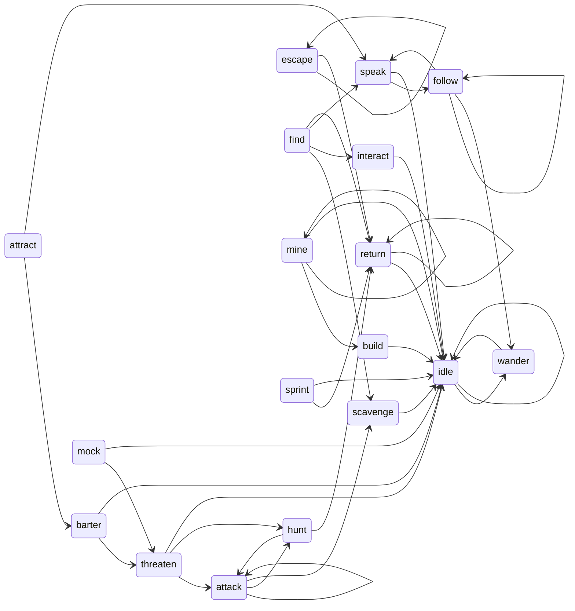

# Task: Finite Automaton Documentation

This YAML represents a finite automata and the conditions for its transitions into different nodes. 

```yaml
intentions:
  # ----------------------------------------------------------------------------------
  attack:
    - next: attack
      conditions:  
        - sprite.goal
        - sprite.goal.category == constants.Goals.TARGET.value
    - next: hunt
      conditions: 
        - not sprite.goal
        - sprite.memory.goal 
        - sprite.memory.goal.category == constants.Goals.TARGET.value
    - next: scavenge
      conditions: 
        - sprites.get(sprite.goal.name).mutators.triggers.dead
  # ----------------------------------------------------------------------------------
  barter:
    - next: threaten
      conditions:
        - sprite.goal 
        - sprite.goal.category == constants.Goals.LOOT.value
        - sprite.inventory.wallet < sprite.memory.prices.get(sprite.memory.goal.name)
        - sprite.psyche.motivation == constants.Motivations.SURVIVAL.value
    - next: idle
      conditions: 
        - not sprite.goal
  # ----------------------------------------------------------------------------------
  build:
    - next: idle
      conditions:
        - not sprite.goal
  # ----------------------------------------------------------------------------------
  escape: 
    - next: escape
      conditions: 
        - sprite.goal
        - sprites.get(sprite.goal.name)
        - sprites.get(sprite.goal.name).state.intention == constants.Intentions.ATTACK.value
    - next: return
      conditions: 
        - not sprite.goal
  # ----------------------------------------------------------------------------------
  find: 
    - next: interact
      conditions: 
        - sprite.goal
        - sprite.goal.category == constants.Goals.OBJECT.value
        - functions.is_near(sprite.position, sprite.goal.position, sprite.mutators.parameters.vision.radius)
    - next: speak
      conditions: 
        - sprite.goal
        - sprite.psyche.dialogue
        - sprite.goal.category == constants.Goals.SUBJECT.value
        - functions.is_near(sprite.position, sprite.goal.position, sprite.mutators.parameters.vision.radius)
        - sprite.memory.relationships[sprite.goal.name] in [Relationships.FRIEND.value, Relationships.FAMILY.value]
  # ----------------------------------------------------------------------------------
  follow: 
    - next: follow
      conditions:
        - sprite.goal
        - sprite.goal.category == constants.Goals.SUBJECT.value
        - not functions.is_near(sprite.position, sprite.goal.position, sprite.mutators.parameters.vision.radius)
    - next: speak
      conditions:
        - sprite.goal
        - sprite.psyche.dialogue
        - functions.is_near(sprite.position, sprite.goal.position, sprite.mutators.parameters.vision.radius)
    - next: idle
      conditions:
        - not sprite.goal
  # ----------------------------------------------------------------------------------
  hunt: 
    - next: attack
      conditions: 
        - sprite.goal
        - sprite.goal.category == constants.Goals.TARGET.value
        - functions.is_near(sprite.position, sprite.goal.position, sprite.mutators.parameters.vision.radius)
    - next: idle
      conditions:
        - not sprite.goal
  # ----------------------------------------------------------------------------------
  idle: 
    - next: wander
      conditions:
        - sprite.goal
        - sprite.goal.category == constants.Goals.POSITION.value
    - next: find
      conditions: 
        - sprite.goal
        - sprite.goal.category == constants.Goals.SUBJECT.value
    - next: idle
      conditions:
        - not sprite.goal
  # ----------------------------------------------------------------------------------
  interact:
    - next: idle
      conditions: 
        - not sprite.goal
  # ----------------------------------------------------------------------------------
  mine:
    - next: build
      conditions:
        - sprite.goal
        - sprite.goal.category == constants.Goals.LOOT.value
        - sprite.inventory.loot.get(sprite.goal.name, 0) >= 10 
    - next: mine
      conditions:
        - sprite.goal
        - sprite.goal.category == constants.Goals.LOOT.value
        - sprite.goal.name in constants.MineableAssets
        - sprite.inventory.loot.get(sprite.goal.name, 0) < 10
    - next: idle
      conditions:
        - not sprite.goal
  # ----------------------------------------------------------------------------------
  mock:
    - next: threaten
      conditions:
        - sprite.goal
        - sprite.goal.category == constants.Goals.TARGET.value
        - sprites.get(sprite.goal.name)
        - sprites.get(sprite.goal.name).state.intention == constants.Intentions.ATTACK.value
    - next: idle
      conditions:
        - not sprite.goal
  # ----------------------------------------------------------------------------------
  return:
    - next: idle
      conditions: 
        - not sprite.goal
  # ----------------------------------------------------------------------------------
  scavenge:
    - next: idle
      conditions:
        - not sprite.goal
  # ----------------------------------------------------------------------------------
  speak:
    - next: follow
      conditions: 
        - sprite.goal
        - sprite.goal.category == constants.Goals.SUBJECT.value
        - not functions.is_near(sprite.position, sprite.goal.position, sprite.mutators.parameters.action.radius)
    - next: idle
      conditions:
        - not sprite.psyche.dialogue
  # ----------------------------------------------------------------------------------
  sprint:
    - next: idle
      conditions:
        - not sprite.goal
  # ----------------------------------------------------------------------------------
  threaten:
    - next: attack
      conditions:
        - sprite.goal
        - sprite.goal.category == constants.Goals.SPRITE.value
        - functions.is_near(sprite.position, sprite.goal.position, sprite.mutators.parameters.vision.radius)
    - next: hunt
      conditions:
        - sprite.goal.category == constants.Goals.SPRITE.value
        - not functions.is_near(sprite.position, sprite.goal.position, sprite.mutators.parameters.vision.radius)
    - next: idle
      conditions:
        - not sprite.goal
  # ----------------------------------------------------------------------------------
  wander:
    - next: idle
      conditions:
        - not sprite.goal
```

This an old markdown table detailing the node connections:

```markdown
| # | Starting Intention | Reachable Intentions |
| --- | --- | --- |
| 1 | `attack` | `attack`, `hunt` |
| 2 | `barter` | `threaten`, `idle` |
| 3 | `build` | `idle` |
| 4 | `escape` | `escape`, `idle` |
| 5 | `find` | `interact`, `speak`, `follow` |
| 6 | `follow` | `follow`, `find` |
| 7 | `hunt` | `attack`, `return` |
| 8 | `idle` |  `find`, `idle` |
| 9 | `interact` | `idle` |
| 10 | `mine` | `build`, `mine`, `idle` |
| 11 | `mock` | `threaten`, `idle` |
| 12 | `return` | `find` |
| 13 | `speak` | `idle` |
| 14 | `sprint` | `idle` |
| 15 | `threaten` | `attack`, `hunt`, `idle` |
| 16 | `wander` | `idle` |
```

This is old mermaid markup detailing the node connections



Update the table and diagram to match the latest state of the automata presented in the YAML.

**Guidelines**

- Do not include information about the conditions in the diagram or table. Only include the node connections.