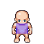

# Ontology: Overview

!!! note "Capitalization"
    Terminology is capitalized to distinguish it from its colloquial connotations.

!!! note "Angular Brackets"
    Angular brackets denote parameters.

!!! note "Orientation"
    (0,0) corresponds to the upper-left corner, with down being the positive y-direction.

!!! note "Width, Length"
    Width is a horizontal displacement, length is a vertical displacement.
    
## Assets

All Assets have an *ID* and *properties*. Most, but not all, Assets have *state*. 

Assets are divided into non-overlapping categories, known as the [Asset Hierarchy](./01-assets.md#asset-hierarchy). Different categories of Assets expand the base properties and states in various ways. In brief, the Asset categories are,

- [Crafts](./01-assets.md#crafts)
- [Cursors](./01-assets.md#cursors)
- [Effects](./01-assets.md#effects)
- [Objects](./01-assets.md#objects)
- [Sheets](./01-assets.md#sheets)
- [Sounds](./07-sounds.md)
- Resources
- [Tiles](./01-assets.md#tiles)
- [Widgets](./06-widgets.md)

Assets are placed in the `/src/assets/<category>/` directory and then registered to the Asset category index `/src/assets/<category>/main.yaml` file. The YAML index schema for each Asset configures its *properties*, i.e. the static attributes that are constant and do not change as a result of gameplay. 

The `/src/assets` directory is known as the *asset directory*.

See [Asset Schema](./appendices/01-schemas.md#property-indices) for more information on the Asset property index.

## Data

* Location: `/src/data/`

Runtime information is stored in the `/src/data/**` directory, otherwise known as the *data directory*. This information is divided into *state* and *configuration* across the `/src/data/state/*` and the `/src/data/config/*` directories, respectively. These directories are otherwise known as the *state directory* and the *configuration directory*.

### State

* Location: `/src/data/state/`

An Asset is deployed onto a Board, where it acquires its state, i.e. its dynamic attributes that are variable and change as a result of gameplay. The application ingests and stores state in the state directory.

An Asset Category has a single schema for properties that each Instance utilizes, but each individual Asset Instance has a unique State, particular to its deployment. For example, a treasure Chest is configured once by its Properties (its width, length, etc.), but each instance of a treasure Chest on a Board has a unique state (its position, content, etc.).

### Configuration

* Location: `/src/data/config`

Mechanics and other components of the game Engine (e.g. Menus, Actions, etc.) utilize configuration stored in the configuration directory. The following Engine components are configured by the files in this directory.

- [Actions](./01-assets.md#sheets)
- [Intentions](./04-intentions.md)
- [Mappings](./02-sprites.md#devices)
- [Mechanics](./05-mechanics.md)
- [Menus](./06-widgets.md#menus)
- [Recipes](./01-assets.md#recipes)
- [Scripts](./08-plots.md)

## Application 

The core components of the application are listed below in this seciton, in the rough order they are called in the course of bootstrapping.

See [Architecture documentation](./09-architecture.md) for more information.

### Loader

- Package: `app.config.loader`

The Loader is responsible for reading in the configuration files for properties and state, converting them into Python data structures.

### Factory

- Package: `app.hooks.factory`

The Factory builds Assets and other game components based on Recipes. 

### Orchestrator

- Package: `app.hooks.orchestrator`

The Orchestrator is the dependency injection system. It is responsible for converting validated data structures into application data models and supplying them to application classes.

### Registry

- Package: `libs.graphics.registry`

The Registry loads in all of the Asset files when the application bootstraps. The frames are indexed and stored in the memory. 

### Engine

- Package: `app.game.engine`

The Engine handles the core gameplay loop and framerate calculations.

### Board

- Package: `app.game.board`

The Board is the Game's "*database*". It holds all ingame Assets and Configurations during the course of the game loop and exposes them to the engine through queryable interfaces.

The state files for each Board are maintained in `/src/data/state/<board-key>/**`.

**Cradle**

The Board posseses a Cradle field for instantiating Assets through game Mechanics, e.g. `CombatMechanics` uses the Cradle to inject new Projectiles into the Board state.

### Screen

- Package: `app.game.screen`

The Screen acts as a high-level container for a Cythonized SDL rendering interface.

## Concepts

### Hitboxes

Many Assets have Hitboxes. Hitboxes are *properties*, i.e., they are static and do not change. Hitboxes have positions and dimensions. To Hitboxes static, Hitbox positions are always given relative to the Asset, i.e. treating the upper-left corner of the Asset frame as the origin. Hitbox dimensions are always absolute. The following snippet shows the hitbox schema for an LPC Sprite Frame, with the image below showing how the hitbox translates into the physical image with a blue rectangle,

```yaml
position:
    x: 21
    y: 23
dimensions:
    w: 22
    l: 21
```


/// caption
LPC Sprite Hitbox in (Walk, Down, 0) State
///

### Layers

All deployed Assets have a Layer. Layers represent a "view" where the Asset is located. When the Screen renders an entire frame, it is rendering a Layer.  

Layers on a board can be traversed through Doors. The coordinate plane of each Layer is independent of every other. For example, a Sprite may enter a Door on Layer 1 at `(x_1, y_1)` and get released on Layer 3 at `(x_2, y_2)`. For this reason, each Layer may have different dimensions.

Sprite interactions are constrained by their Layers. Because Layers are superimposed coordinates, all interaction calculations should be separated by Layer, to avoid inter-Layer collisions and interactions.

### Sprites

NPC and Enemy Sprites are undifferentiated. Conflict is driven entirely by internal Sprite data structures and the gameplay loop. The Player Sprite is the only unique Sprite in terms of the gameplay loop, insofar the Player's state is determined by polling from the Player's input device, as opposed to the [Intention Transition Matrix](./04-intentions.md#transition-matrix). However, all state changes of Sprites and the Player are communicated through the medium of [Goals and Intentions](./04-intentions.md).
