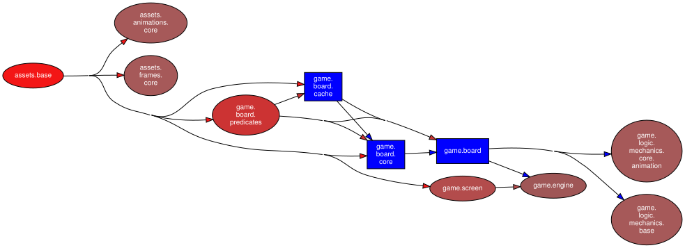
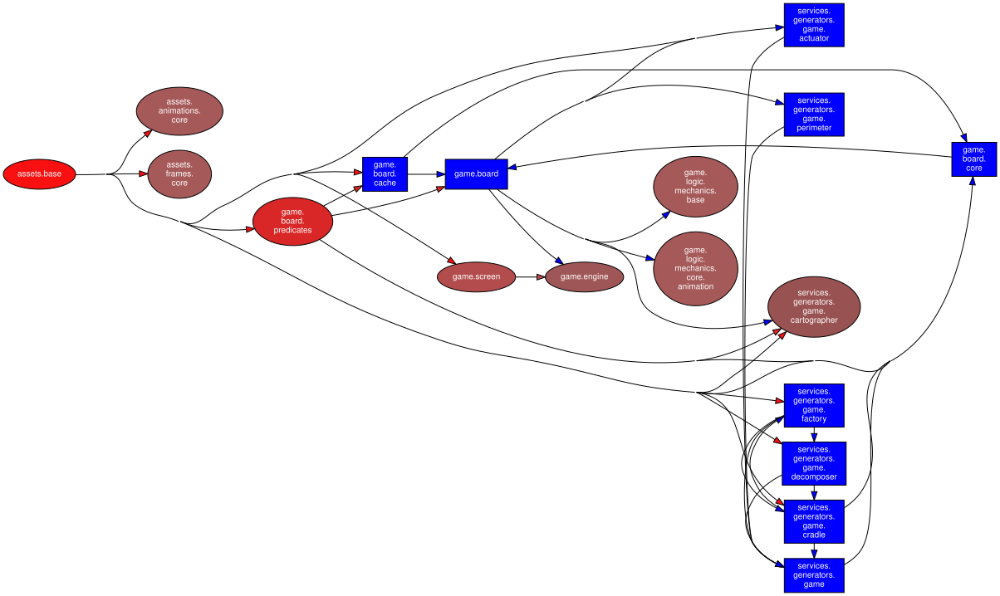
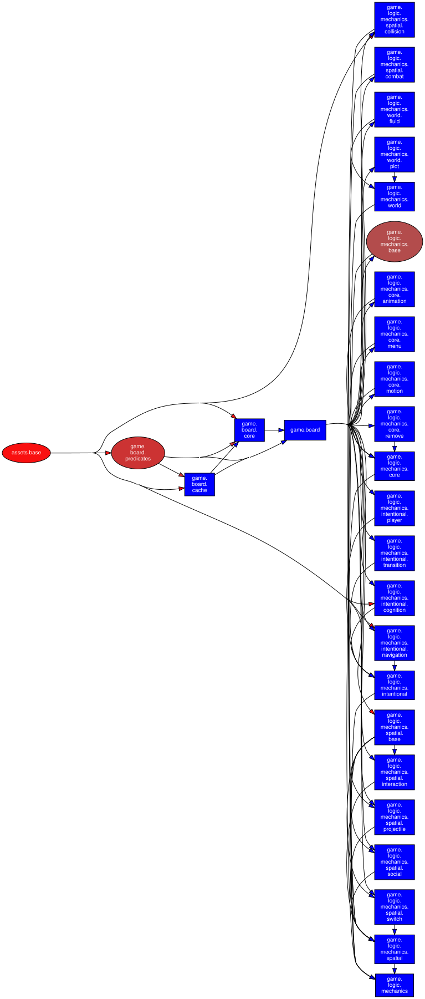
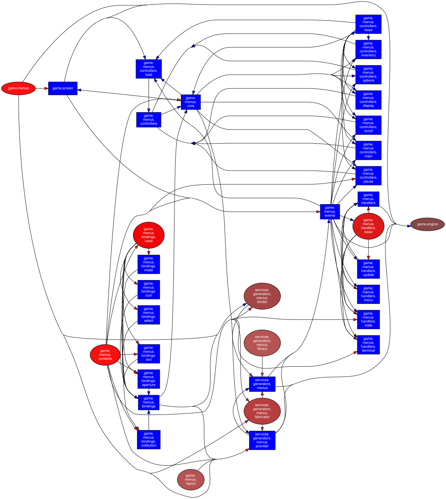
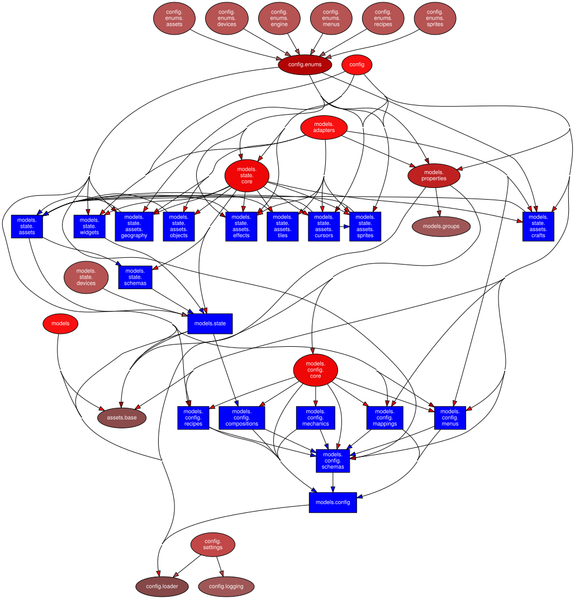
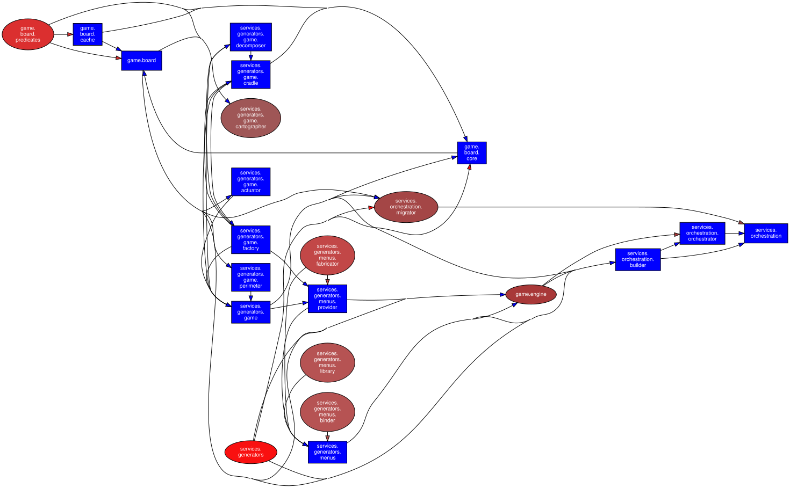

# Ontology: Appendix II - Diagrams

## Dependency Trees

### Core

/// caption
Core Application Dependency Tree
///

### Generators

/// caption
Generator Dependency Tree
///

### Mechanics

/// caption
Mechanic Dependency Tree
///

### Menus

/// caption
Menus Dependency Tree
///

### Models

/// caption
Model Dependency Tree
///

### Orchestration

/// caption
Orchestration Dependency Tree
///